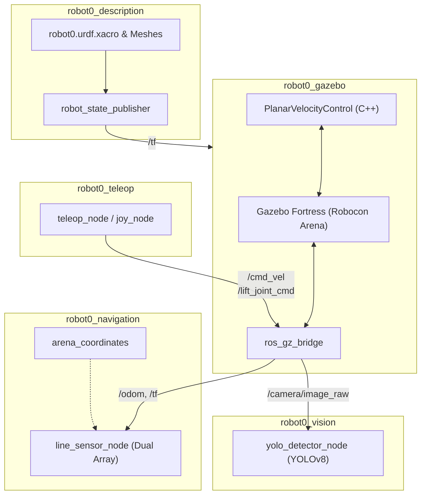

# ROS 2 Mecanum Robot Simulation (`ros-cdt`)

Dự án phát triển và mô phỏng robot di động 4 bánh Mecanum tích hợp cơ cấu tay nâng (`robot0`) sử dụng ROS 2 Humble và Gazebo Fortress (GZ Sim) trong môi trường Dev Container.

---

## Kiến trúc Hệ thống



---

## Danh mục Packages

| Package | Loại | Chức năng | Tài liệu chi tiết |
| :--- | :--- | :--- | :---: |
| **`robot0_description`** | `ament_cmake` | Mô hình 3D CAD (.stl), URDF robot, cấu hình khớp, kiểm tra TF trên RViz2 | [Xem README](src/robot0_description/README.md) |
| **`robot0_gazebo`** | `ament_cmake` | Sa bàn Robocon, cầu nối `ros_gz_bridge`, C++ Plugin và Master Bringup | [Xem README](src/robot0_gazebo/README.md) |
| **`robot0_navigation`** | `ament_python`| Mô phỏng cảm biến dò line kép, tọa độ sa bàn, script thử nghiệm gắp/thả pallet | [Xem README](src/robot0_navigation/README.md) |
| **`robot0_teleop`** | `ament_python`| Điều khiển thủ công bằng Gamepad (Deadman switch, Ga mượt), Bàn phím | [Xem README](src/robot0_teleop/README.md) |
| **`robot0_vision`** | `ament_python`| Nhận diện Pallet bằng YOLOv8 đa luồng và trích xuất tọa độ bám mục tiêu | [Xem README](src/robot0_vision/README.md) |

---

## Môi trường & Cài đặt

1. Cài đặt **Docker** và **VS Code** kèm extension **Dev Containers**.
2. Cấp quyền hiển thị GUI X11 trên máy Host (Linux):
   ```bash
   xhost +local:root
   ```
3. Mở thư mục dự án trong VS Code $\to$ Chọn **Reopen in Container**.

---

## Hướng dẫn Khởi chạy

### 1. Build Workspace
```bash
colcon build --symlink-install
source install/setup.bash
```

### 2. Khởi chạy toàn bộ hệ thống (Bringup)
Khởi động cùng lúc **Gazebo + Bridge + Teleop + Line Sensor + YOLO Vision + RViz2**:
```bash
ros2 launch robot0_gazebo all.launch.py
```

### 3. Khởi chạy các module riêng lẻ
* **Mô phỏng Gazebo cơ bản:**
  ```bash
  ros2 launch robot0_gazebo gazebo.launch.py
  ```
* **Điều khiển tay cầm Gamepad:**
  ```bash
  ros2 launch robot0_teleop joystick.launch.py
  ```
* **Mô phỏng cảm biến dò line:**
  ```bash
  ros2 launch robot0_navigation line_sensor.launch.py
  ```
* **Nhận diện hình ảnh YOLO:**
  ```bash
  ros2 launch robot0_vision yolo_detector.launch.py
  ```
* **Kiểm tra mô hình & TF tĩnh (RViz2):**
  ```bash
  ros2 launch robot0_description display.launch.py
  ```

---

## Bảng Tra cứu Topic Chính

| Topic | Kiểu Message | Mô tả chức năng |
| :--- | :--- | :--- |
| `/cmd_vel` | `geometry_msgs/msg/Twist` | Vận tốc di chuyển khung gầm robot |
| `/lift_joint_cmd` | `std_msgs/msg/Float64` | Lệnh vị trí độ cao nâng/hạ tay gắp ($0.0 \to 0.18\text{ m}$) |
| `/odom` | `nav_msgs/msg/Odometry` | Vị trí và vận tốc phản hồi từ mô phỏng |
| `/tf` | `tf2_msgs/msg/TFMessage` | Cây biến đổi hệ tọa độ robot |
| `/camera/image_raw` | `sensor_msgs/msg/Image` | Luồng hình ảnh RGB từ camera |
| `/yolo/annotated_image` | `sensor_msgs/msg/Image` | Ảnh kết quả đã vẽ Bounding Box & nhãn |
| `/yolo/target_center` | `geometry_msgs/msg/PointStamped` | Tọa độ lệch chuẩn hóa $(dx, dy)$ của mục tiêu bám |
| `/line_sensor/markers` | `visualization_msgs/msg/MarkerArray` | Hiển thị 3D mảng mắt cảm biến dò line trên RViz2 |
| `/line_sensor/lateral_error` | `std_msgs/msg/Float32` | Sai lệch tịnh tiến ngang so với vạch line |
| `/line_sensor/heading_error` | `std_msgs/msg/Float32` | Góc lệch hướng thân xe so với vạch line |
