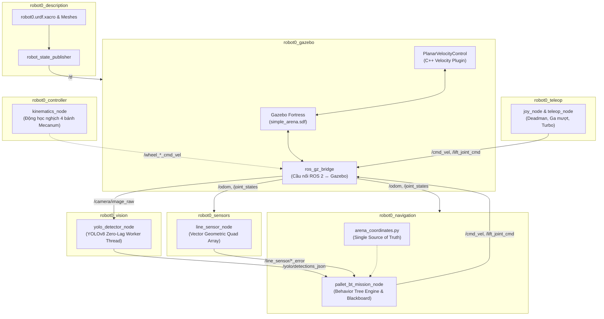

# ROS 2 Mecanum Robot Simulation
---

## 🎥 Video Demo Hoạt Động (Simulation Demo)

<div align="center">
  <a href="public/Demo.mp4" title="Nhấn để xem video gốc Full HD">
    
  </a>
  <p><em>Robot Mecanum tự hành dò line, nhận diện Pallet bằng YOLOv8 và gắp hàng lên kệ trong Gazebo & RViz2.</em></p>
</div>

> 🎬 **Xem video demo chất lượng cao:**
> * **File Video gốc (Full HD 1080p, ~3 phút):** [**`public/Demo.mp4`**](public/Demo.mp4) *(Nhấn vào link hoặc ảnh trên để mở/tải video)*
> * **Ảnh chụp sa bàn & phát hiện YOLO:** [**`public/thumbnail.png`**](public/thumbnail.png)
>
> 📌 **Các giai đoạn chính trong Video Demo:**
> 1. **Khởi chạy Master Bringup:** Đồng bộ khởi động Gazebo Fortress, mô hình URDF/Xacro, bộ điều khiển động học Mecanum, node camera YOLOv8 và RViz2.
> 2. **Điều hướng tự động & Dò line:** Hệ thống điều khiển robot bám theo sa bàn dựa trên mảng 4 cụm cảm biến quang học ảo (Quad Array).
> 3. **Nhận diện Pallet bằng AI (YOLOv8):** Luồng camera RGB xử lý thời gian thực, phát hiện nhãn Pallet (ví dụ: `cpu 0.88`) và trích xuất độ lệch tâm $(dx, dy)$ với độ trễ cực thấp.
> 4. **Visual Servoing & Nâng hạ càng:** Robot tự động căn chỉnh vị trí, tiến vào kệ hàng và điều khiển khớp trượt nâng (`lift_joint_cmd`) để lấy Pallet an toàn.

---

## 🏗️ Kiến trúc Tổng thể Hệ thống



---

## 📦 Danh mục Packages

| Package | Loại Build | Chức năng Chính | Chi tiết |
| :--- | :---: | :--- | :---: |
| **[`robot0_bringup`](src/robot0_bringup/README.md)** | `ament_cmake` | Package khởi chạy tổng thể (Master Orchestration), gom cụm node và điều phối hệ thống | [📖 Đọc tài liệu](src/robot0_bringup/README.md) |
| **[`robot0_controller`](src/robot0_controller/README.md)** | `ament_python`| Tính toán động học nghịch (Inverse Kinematics) 4 bánh Mecanum và tự động ngắt an toàn | [📖 Đọc tài liệu](src/robot0_controller/README.md) |
| **[`robot0_description`](src/robot0_description/README.md)** | `ament_cmake` | Mô hình 3D CAD (.stl), URDF/Xacro, cấu hình khớp trượt nâng và kiểm tra TF trên RViz2 | [📖 Đọc tài liệu](src/robot0_description/README.md) |
| **[`robot0_gazebo`](src/robot0_gazebo/README.md)** | `ament_cmake` | Sa bàn Robocon, cầu nối `ros_gz_bridge`, C++ Plugin mô phỏng chuyển động mặt phẳng | [📖 Đọc tài liệu](src/robot0_gazebo/README.md) |
| **[`robot0_sensors`](src/robot0_sensors/README.md)** | `ament_python`| Cảm biến dò line hình học Vector Quad Array (Trước/Sau/Trái/Phải) tần số cao 100Hz | [📖 Đọc tài liệu](src/robot0_sensors/README.md) |
| **[`robot0_navigation`](src/robot0_navigation/README.md)** | `ament_python`| Điều hướng tự hành và gắp/thả pallet theo Cây Hành Vi (**Behavior Trees**) & Blackboard | [📖 Đọc tài liệu](src/robot0_navigation/README.md) |
| **[`robot0_teleop`](src/robot0_teleop/README.md)** | `ament_python`| Điều khiển thủ công qua Gamepad (Deadman switch, Ga mượt analog, Turbo) và Bàn phím | [📖 Đọc tài liệu](src/robot0_teleop/README.md) |
| **[`robot0_vision`](src/robot0_vision/README.md)** | `ament_python`| Nhận diện Pallet bằng YOLOv8 đa luồng bất đồng bộ, trích xuất tọa độ bám mục tiêu | [📖 Đọc tài liệu](src/robot0_vision/README.md) |

---

## 💻 Môi trường Phát triển & Cài đặt

Dự án được cấu hình sẵn môi trường chuẩn thông qua **VS Code Dev Containers** và **Docker**.

### 1. Yêu cầu Hệ thống
* Hệ điều hành: Linux (Ubuntu 20.04/22.04/24.04), Windows 10/11 (WSL2), hoặc macOS.
* Đã cài đặt **Docker Desktop** / **Docker Engine** và **VS Code** kèm extension **Dev Containers**.
* Card đồ họa NVIDIA kèm **NVIDIA Container Toolkit** (tùy chọn để tăng tốc GPU).

### 2. Cấp quyền Hiển thị Giao diện Đồ họa X11 (Linux Host)
Trước khi mở container, chạy lệnh sau trên terminal của máy host để cấp quyền hiển thị Gazebo & RViz:
```bash
xhost +local:root
```

### 3. Mở Dự án trong Dev Container
1. Khởi động VS Code.
2. Mở thư mục gốc `ros-cdt`.
3. Nhấn `F1` $\to$ Chọn **Dev Containers: Reopen in Container** và đợi Docker build hoàn tất.

---

## 🚀 Hướng dẫn Biên dịch & Khởi chạy

### 1. Biên dịch Workspace
```bash
colcon build --symlink-install
source install/setup.bash
```

### 2. Khởi chạy Toàn bộ Hệ thống (Master Bringup)
Khởi động đồng thời **Gazebo Simulation + ros_gz_bridge + Kinematics Controller + Line Sensor + Teleop + YOLO Vision + RViz2**:
```bash
ros2 launch robot0_bringup bringup.launch.py
```

### 3. Tự động hóa Nhiệm vụ Gắp Pallet bằng Behavior Tree
Khởi động hệ thống kèm kịch bản tự hành tìm kiếm và lấy hàng:
```bash
# Tùy chọn gắp theo loại Pallet mong muốn:
ros2 launch robot0_navigation pallet_mission_bt.launch.py pallet:=aluminum  # Pallet Nhôm (Kệ 1, Tầng 1)
ros2 launch robot0_navigation pallet_mission_bt.launch.py pallet:=cpu       # Pallet CPU (Kệ 1, Tầng 2)
ros2 launch robot0_navigation pallet_mission_bt.launch.py pallet:=qr        # Pallet QR (Kệ 2, Tầng 1)
ros2 launch robot0_navigation pallet_mission_bt.launch.py pallet:=chip      # Pallet Chip (Kệ 2, Tầng 2)
```

### 4. Khởi chạy các Module Độc lập
* **Khởi chạy cụm Node ứng dụng (không kèm Gazebo):**
  ```bash
  ros2 launch robot0_bringup nodes.launch.py
  ```
* **Khởi chạy mô phỏng sa bàn Gazebo:**
  ```bash
  ros2 launch robot0_gazebo gazebo.launch.py
  ```
* **Kiểm tra mô hình 3D và khớp cơ khí trên RViz2:**
  ```bash
  ros2 launch robot0_description display.launch.py
  ```
* **Điều khiển bằng tay cầm Gamepad:**
  ```bash
  ros2 launch robot0_teleop joystick.launch.py
  ```
* **Chạy riêng node cảm biến dò line:**
  ```bash
  ros2 launch robot0_sensors line_sensor.launch.py
  ```
* **Chạy riêng node thị giác YOLOv8:**
  ```bash
  ros2 launch robot0_vision yolo_detector.launch.py
  ```

---

## 📡 Bảng Tra cứu Toàn bộ Topic Hệ thống

| Topic | Kiểu Message | Node Phát (Publisher) | Node Nhận (Subscriber) | Tần số | Mô tả Chức năng |
| :--- | :--- | :---: | :---: | :---: | :--- |
| `/cmd_vel` | `geometry_msgs/msg/Twist` | `teleop_node` / `pallet_bt_mission_node` | `ros_gz_bridge` / `kinematics_node` | 20-50 Hz | Vận tốc di chuyển khung gầm đa hướng ($v_x, v_y, \omega_z$) |
| `/lift_joint_cmd` | `std_msgs/msg/Float64` | `teleop_node` / `pallet_bt_mission_node` | `ros_gz_bridge` | 20 Hz | Vị trí độ cao nâng càng ($0.0 \to 0.20\text{ m}$) |
| `/odom` | `nav_msgs/msg/Odometry` | `ros_gz_bridge` | `line_sensor_node` / `pallet_bt_mission_node` | 50 Hz | Tọa độ vị trí và vận tốc phản hồi từ mô phỏng |
| `/tf` | `tf2_msgs/msg/TFMessage` | `robot_state_publisher` | RViz2 / Nav Nodes | 50 Hz | Cây biến đổi hệ tọa độ các liên kết robot |
| `/joint_states` | `sensor_msgs/msg/JointState` | `ros_gz_bridge` | `teleop_node` / `pallet_bt_mission_node` | 50 Hz | Góc quay các bánh và độ cao thực tế càng nâng |
| `/camera/image_raw` | `sensor_msgs/msg/Image` | `ros_gz_bridge` | `yolo_detector_node` | 30 Hz | Luồng hình ảnh RGB gốc từ camera trước |
| `/yolo/annotated_image` | `sensor_msgs/msg/Image` | `yolo_detector_node` | RViz2 | 30 Hz | Ảnh kết quả nhận diện đã vẽ bounding box & FPS |
| `/yolo/target_center` | `geometry_msgs/msg/PointStamped` | `yolo_detector_node` | Navigation / Visual Servoing | 30 Hz | Tọa độ lệch chuẩn hóa $(dx, dy)$ của mục tiêu bám |
| `/yolo/detections_json` | `std_msgs/msg/String` | `yolo_detector_node` | `pallet_bt_mission_node` | 30 Hz | Báo cáo danh sách vật thể phát hiện chuẩn JSON |
| `/line_sensor/lateral_error` | `std_msgs/msg/Float32` | `line_sensor_node` | Navigation Nodes | 50 Hz | Độ lệch ngang so với tim vạch line (mét) |
| `/line_sensor/heading_error` | `std_msgs/msg/Float32` | `line_sensor_node` | Navigation Nodes | 50 Hz | Góc lệch hướng so với vạch line (rad) |
| `/line_sensor/junction` | `std_msgs/msg/String` | `line_sensor_node` | Navigation Nodes | 50 Hz | Phân loại giao cắt (`CROSS`, `T_LEFT`, `T_RIGHT`, `NONE`, `LOST`) |
| `/line_sensor/markers` | `visualization_msgs/msg/MarkerArray` | `line_sensor_node` | RViz2 | 50 Hz | Hiển thị 3D mảng mắt cảm biến và mũi tên sai số |
| `/arena/map` | `nav_msgs/msg/OccupancyGrid` | `line_sensor_node` | RViz2 | 1 Hz (Latched) | Bản đồ 2D hiển thị toàn bộ vạch sa bàn và kệ hàng |

---

## 🛠️ Xử lý Sự cố Thường gặp (Troubleshooting)

1. **Lỗi không mở được giao diện GUI RViz2 / Gazebo (`Cannot connect to display`):**
   * Chạy lệnh `xhost +local:root` trên terminal máy Host.
   * Kiểm tra biến môi trường: `echo $DISPLAY` (thường là `:0` hoặc `:1`).
2. **Không nhận diện được tay cầm Joystick (`/dev/input/js0` không tồn tại):**
   * Đảm bảo tay cầm đã cắm vào máy Host và Docker đã được cấp quyền truy cập thiết bị trong `.devcontainer/devcontainer.json` (`--device=/dev/input`).
   * Kiểm tra bằng lệnh: `jstest /dev/input/js0`.
3. **Lỗi PyTorch / CUDA khi chạy YOLO:**
   * Node `yolo_detector_node` tự động chuyển sang chế độ `cpu` nếu không tìm thấy GPU NVIDIA. Để kích hoạt GPU, đảm bảo đã cài đặt `nvidia-container-toolkit` trên máy host.
