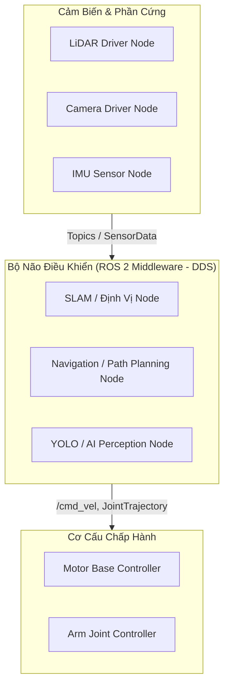
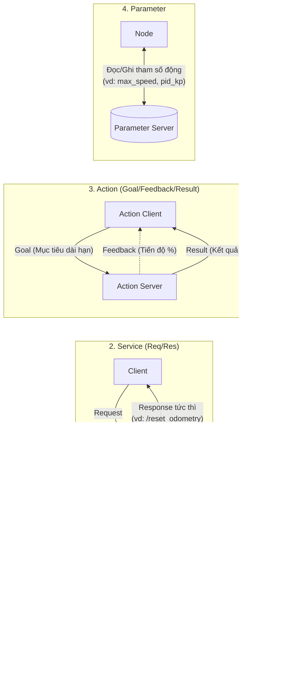
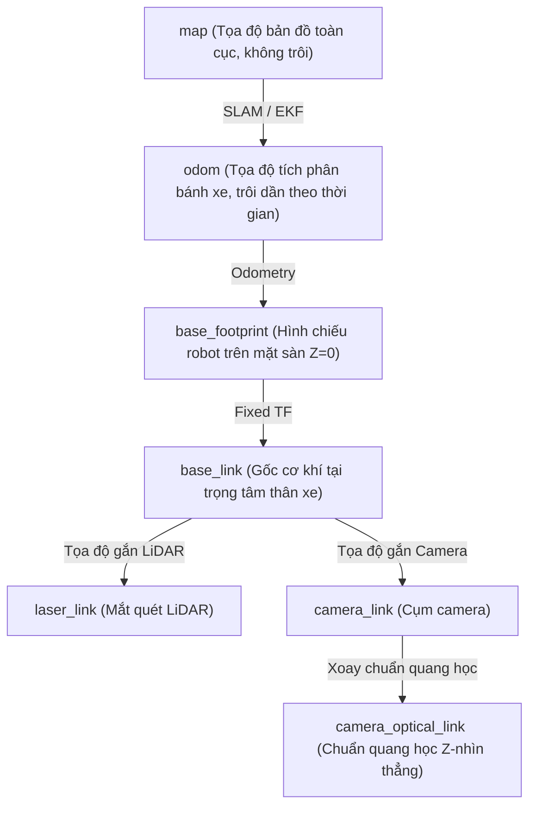

# 1. Nền Tảng & Các Khái Niệm Cốt Lõi Trong ROS 2

Tài liệu này cung cấp cái nhìn tổng quan, chuẩn xác và dễ hiểu nhất về **Robot Operating System 2 (ROS 2)** dành cho người mới bắt đầu.

---

## 🤖 1. ROS 2 Là Gì & Tại Sao Lại Cần ROS 2?

**ROS 2 (Robot Operating System 2)** không phải là một hệ điều hành độc lập như Windows hay Linux, mà là một **Bộ khung phần mềm trung gian (Robotics Middleware Framework)** cung cấp:
1. **Cơ chế truyền thông tin phân tán (Distributed Communication):** Cho phép các chương trình (viết bằng Python, C++, Rust...) chạy độc lập trên cùng một máy tính hoặc trên nhiều máy tính khác nhau qua mạng LAN/Wi-Fi có thể trao đổi dữ liệu với nhau một cách liền mạch.
2. **Hệ sinh thái công cụ mạnh mẽ:** Trực quan hóa 3D (**RViz2**), mô phỏng vật lý (**Gazebo**), ghi và phát lại dữ liệu (**ros2 bag**), vẽ đồ thị hệ thống (**rqt_graph**).
3. **Thư viện tiêu chuẩn công nghiệp:** Điều hướng tự hành (**Nav2**), điều khiển cánh tay robot (**MoveIt 2**), khung điều khiển động cơ chuẩn hóa (**ros2_control**).



---

## 🏢 2. Cấu Trúc Không Gian Làm Việc (ROS 2 Workspace)

Một **Workspace** là thư mục gốc chứa dự án ROS 2 của bạn. Khi bạn biên dịch dự án bằng công cụ `colcon`, hệ thống sẽ tự động tạo ra cấu trúc 4 thư mục tiêu chuẩn:

```text
my_robot_ws/                   # Thư mục gốc của Workspace
├── src/                       # CHỈ DUY NHẤT thư mục này chứa mã nguồn (Commit vào Git)
│   ├── robot_description/     # Package chứa file CAD, URDF
│   ├── robot_controller/      # Package điều khiển động học
│   └── robot_navigation/      # Package thuật toán tự hành
│
├── build/                     # [Tự sinh] Nơi chứa file biên dịch trung gian (.o, CMake cache)
├── install/                   # [Tự sinh] Nơi chứa file thực thi và thư viện sẵn sàng chạy
└── log/                       # [Tự sinh] Nơi lưu log nhật ký của các lần build colcon
```

### Quy trình Biên dịch & Nạp Môi trường:
1. **Biên dịch:**
   ```bash
   colcon build --symlink-install
   ```
   > [!TIP]
   > Cờ `--symlink-install` cho phép bạn chỉnh sửa các file Python, launch files, config YAML mà không cần phải chạy lại lệnh `colcon build` mỗi lần sửa!
2. **Nạp biến môi trường (Overlay):**
   ```bash
   source install/setup.bash
   ```
   *Lệnh này thông báo cho hệ điều hành biết các gói phần mềm và file thực thi trong workspace đang nằm ở đâu.*

---

## 🔄 3. Bốn Cơ Chế Giao Tiếp Cốt Lõi Trong ROS 2

Để các Node có thể phối hợp nhịp nhàng, ROS 2 cung cấp 4 mô hình trao đổi dữ liệu:



### Bảng So Sánh & Hướng Dẫn Chọn Lựa:

| Cơ Chế | Tính Chất | Chiều Giao Tiếp | Khi Nào Nên Sử Dụng? | Ví Dụ Thực Tế |
| :--- | :--- | :---: | :--- | :--- |
| **Topic** | Không đồng bộ (Asynchronous), phát liên tục | $1 \to N$ hoặc $N \to N$ | Truyền luồng dữ liệu cảm biến, lệnh vận tốc liên tục | `/cmd_vel`, `/odom`, `/camera/image_raw`, `/scan` |
| **Service** | Đồng bộ / Bất đồng bộ, hỏi-đáp nhanh | $1 \to 1$ | Gọi hàm từ xa, cấu hình trạng thái, tác vụ hoàn thành dưới $1\text{ s}$ | `/set_camera_exposure`, `/trigger_motor_calibration`, `/reset_map` |
| **Action** | Bất đồng bộ kèm phản hồi tiến độ, có thể Hủy (Cancel) | $1 \to 1$ | Tác vụ tốn thời gian (vài giây đến vài phút), cần theo dõi tiến độ | `NavigateToPose` (Nav2), `FollowPath`, `ExecuteArmTrajectory` |
| **Parameter** | Đọc/Ghi biến cấu hình động thời gian thực | Nội bộ Node $\leftrightarrow$ Bên ngoài | Tinh chỉnh tham số thuật toán mà không cần biên dịch lại code | `wheel_radius`, `confidence_threshold`, `max_linear_speed` |

---

## 🛡️ 4. Chất Lượng Dịch Vụ (Quality of Service - QoS)

Trong ROS 2, các kết nối Topic sử dụng giao thức DDS với chính sách **QoS** linh hoạt để phù hợp với từng loại dữ liệu mạng:

### 1. Độ tin cậy (Reliability):
* **`RELIABLE` (Mặc định):** Đảm bảo tin nhắn không bị mất (tự động gửi lại nếu lỗi mạng, tương tự TCP). Dùng cho: Lệnh điều khiển, trạng thái hệ thống, tọa độ mục tiêu.
* **`BEST_EFFORT`:** Gửi đi và không kiểm tra lại (tương tự UDP), ưu tiên độ trễ cực thấp. Dùng cho: Luồng ảnh camera độ phân giải cao, LiDAR, cảm biến tần số cao ($100\text{ Hz}$).

### 2. Độ lưu trữ cho Node đến sau (Durability):
* **`VOLATILE` (Mặc định):** Subscriber chỉ nhận được tin nhắn phát ra *sau khi* nó bắt đầu lắng nghe.
* **`TRANSIENT_LOCAL` (Latched Topic):** Publisher sẽ lưu giữ tin nhắn mới nhất trong bộ nhớ đệm; bất kỳ Subscriber nào khởi động sau đều nhận được ngay tin nhắn này. Dùng cho: Bản đồ tĩnh (`/map`), mô tả robot (`/robot_description`).

> [!WARNING]
> Hai Node chỉ có thể giao tiếp được với nhau nếu **QoS của Subscriber tương thích với QoS của Publisher**! Nếu Publisher phát `BEST_EFFORT` mà Subscriber đòi `RELIABLE`, kết nối sẽ bị từ chối trong im lặng (không nhận được dữ liệu).

---

## 📐 5. Cây Biến Đổi Hệ Tọa Độ (TF2 Transformation Tree)

Trong một robot, mỗi bộ phận (bánh xe, laser, camera, càng nâng) đều có một hệ trục tọa độ riêng (gọi là **Frame**). 

**Thư viện TF2** giúp quản lý và tự động biến đổi vị trí của một điểm bất kỳ từ hệ tọa độ này sang hệ tọa độ khác theo thời gian thực:



### Chuẩn Quốc Tế REP-105 cho Robot Di Động:
* `map`: Hệ tọa độ thế giới cố định (World Frame). Tọa độ $(0, 0)$ là điểm gốc bản đồ.
* `odom`: Hệ tọa độ đo đạc chuyển động cục bộ. Tính liên tục, không bị nhảy bước nhưng có sai số trôi dạt (drift).
* `base_link`: Gốc gắn liền với thân robot. Di chuyển cùng robot.
* `sensor_link`: Gốc gắn tại vị trí thực của từng cảm biến trên thân xe.
