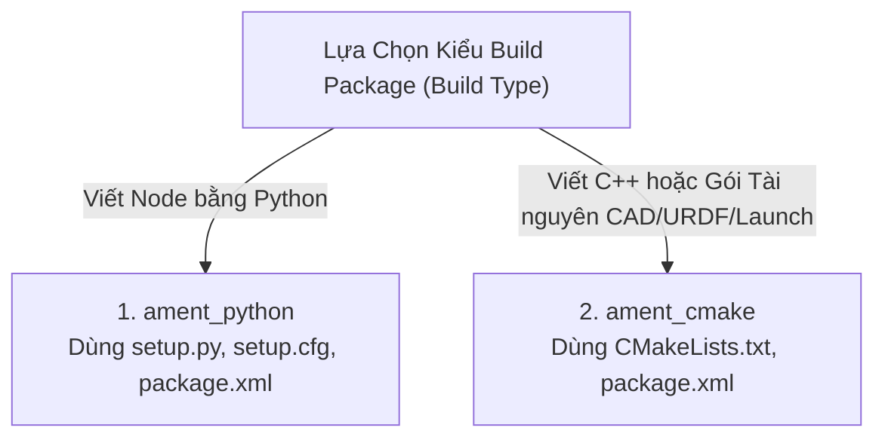

# 2. Giải Phẫu Cấu Trúc Package & Tác Dụng Từng File Thư Mục

Trong ROS 2, mã nguồn không nằm rải rác mà được gom nhóm thành các **Package (Gói phần mềm)**. Mỗi package đại diện cho một module chức năng cụ thể (ví dụ: mô tả robot, điều khiển động học, xử lý thị giác, hoặc sa bàn mô phỏng).

---

## 🏗️ 1. Hai Loại Package Chính: `ament_python` vs `ament_cmake`

Khi tạo một package trong ROS 2, bạn cần chọn 1 trong 2 kiểu build:



---

## 🐍 2. Cấu Trúc Gói Python (`ament_python`)

Dành cho các node viết bằng Python (như `robot0_controller`, `robot0_vision`, `robot0_navigation`).

### Sơ đồ thư mục:
```text
my_python_pkg/
├── package.xml                 # Khai báo thông tin gói & các thư viện phụ thuộc (Dependencies)
├── setup.py                    # Khai báo cách cài đặt mã nguồn Python & file thực thi
├── setup.cfg                   # Cấu hình đường dẫn cài đặt script cho setuptools
├── resource/
│   └── my_python_pkg           # File rỗng đánh dấu gói (Marker file) cho hệ thống ament
├── my_python_pkg/              # Thư mục chứa mã nguồn Python thực tế
│   ├── __init__.py             # Đánh dấu đây là một Python Package
│   ├── my_custom_node.py       # File mã nguồn Node Python
│   └── helper_lib.py           # Thư viện toán học hoặc thuật toán bổ trợ
├── launch/                     # [Tùy chọn] Thư mục chứa các file launch .py
│   └── my_robot.launch.py
└── config/                     # [Tùy chọn] Thư mục chứa file tham số .yaml
    └── params.yaml
```

### Chi tiết các file cốt lõi:

#### A. File `package.xml`
File định danh thông tin gói định dạng XML (chuẩn format 3):
```xml
<?xml version="1.0"?>
<?xml-model href="http://download.ros.org/schema/package_format3.xsd" schematypens="http://www.w3.org/2001/XMLSchema"?>
<package format="3">
  <name>my_python_pkg</name>
  <version>1.0.0</version>
  <description>Gói điều khiển động học robot viết bằng Python</description>
  <maintainer email="dev@example.com">Tên Tác Giả</maintainer>
  <license>Apache-2.0</license>

  <!-- Công cụ build cốt lõi -->
  <buildtool_depend>ament_python</buildtool_depend>

  <!-- Các thư viện ROS 2 phụ thuộc -->
  <depend>rclpy</depend>
  <depend>geometry_msgs</depend>
  <depend>nav_msgs</depend>
  <depend>std_msgs</depend>

  <export>
    <build_type>ament_python</build_type>
  </export>
</package>
```

#### B. File `setup.py`
File cấu hình cực kỳ quan trọng giúp chuyển đổi mã nguồn Python thành câu lệnh thực thi có thể chạy qua `ros2 run`:
```python
import os
from glob import glob
from setuptools import find_packages, setup

package_name = 'my_python_pkg'

setup(
    name=package_name,
    version='1.0.0',
    packages=find_packages(exclude=['test']),
    data_files=[
        # 1. Cài đặt file định danh package marker vào share/ament_index
        ('share/ament_index/resource_index/packages', ['resource/' + package_name]),
        # 2. Cài đặt file package.xml vào share/<package_name>
        ('share/' + package_name, ['package.xml']),
        # 3. Cài đặt toàn bộ file launch vào share/<package_name>/launch
        (os.path.join('share', package_name, 'launch'), glob('launch/*.launch.py')),
        # 4. Cài đặt file config yaml vào share/<package_name>/config
        (os.path.join('share', package_name, 'config'), glob('config/*.yaml')),
    ],
    install_requires=['setuptools'],
    zip_safe=True,
    maintainer='Tên Tác Giả',
    maintainer_email='dev@example.com',
    description='Gói điều khiển động học robot',
    license='Apache-2.0',
    tests_require=['pytest'],
    entry_points={
        # Đăng ký lệnh thực thi: ros2 run <package_name> <executable_name>
        'console_scripts': [
            'my_node = my_python_pkg.my_custom_node:main',
        ],
    },
)
```

> [!IMPORTANT]
> Mục `entry_points -> console_scripts` có cú pháp: `'tên_lệnh_chạy = tên_thư_mục.tên_file:hàm_main'`. Nhờ dòng này, bạn mới có thể gõ `ros2 run my_python_pkg my_node` trên terminal!

---

## ⚙️ 3. Cấu Trúc Gói C++ & Tài Nguyên (`ament_cmake`)

Dành cho các node hiệu năng cao C++, Gazebo Plugin, hoặc các gói chứa tài nguyên CAD/URDF/Launch (như `robot0_description`, `robot0_gazebo`, `robot0_bringup`).

### Sơ đồ thư mục:
```text
my_cpp_or_asset_pkg/
├── package.xml                 # Khai báo thông tin gói & dependencies
├── CMakeLists.txt              # Kịch bản biên dịch CMake của ROS 2
├── include/my_cpp_pkg/         # [Nếu có C++] File Header (.hpp, .h)
│   └── my_controller.hpp
├── src/                        # [Nếu có C++] File Source (.cpp)
│   └── my_controller.cpp
├── urdf/                       # [Gói Description] File mô tả robot Xacro/URDF
│   └── robot.urdf.xacro
├── meshes/                     # [Gói Description] File mô hình 3D (.stl, .dae)
│   ├── base_link.stl
│   └── wheel.stl
├── worlds/                     # [Gói Simulation] File thế giới Gazebo (.sdf)
│   └── arena.sdf
├── launch/                     # Thư mục file launch
│   └── display.launch.py
└── config/                     # Thư mục file tham số YAML & RViz config
    └── robot_config.yaml
```

### Chi tiết file `CMakeLists.txt` chuẩn:
```cmake
cmake_minimum_required(VERSION 3.8)
project(my_cpp_or_asset_pkg)

if(CMAKE_COMPILER_IS_GNUCXX OR CMAKE_CXX_COMPILER_ID MATCHES "Clang")
  add_compile_options(-Wall -Wextra -Wpedantic)
endif()

# 1. Tìm các package ROS 2 phụ thuộc
find_package(ament_cmake REQUIRED)
find_package(rclcpp REQUIRED)
find_package(geometry_msgs REQUIRED)

# 2. [Nếu có C++] Biên dịch file thực thi hoặc Plugin
# add_executable(my_cpp_node src/my_controller.cpp)
# ament_target_dependencies(my_cpp_node rclcpp geometry_msgs)
# install(TARGETS my_cpp_node DESTINATION lib/${PROJECT_NAME})

# 3. Cài đặt các thư mục tài nguyên (Launch, URDF, Meshes, Config, Worlds) vào thư mục share
install(
  DIRECTORY launch config urdf meshes worlds rviz
  DESTINATION share/${PROJECT_NAME}
)

# 4. Đóng gói ament
ament_package()
```

---

## 📁 4. Bảng Tóm Tắt Tác Dụng Của Từng Thư Mục Con

| Thư Mục | Tác Dụng | Chứa Gì Bên Trong? |
| :--- | :--- | :--- |
| `launch/` | Gom nhóm và khởi chạy đồng thời nhiều node | Các file Python `.launch.py` |
| `config/` | Lưu trữ các biến cấu hình thuật toán | Các file cấu hình YAML `.yaml` |
| `urdf/` | Mô tả cấu trúc hình học, khớp nối và vật lý robot | Các file `.urdf`, `.xacro` |
| `meshes/` | Chứa hình dạng 3D chi tiết xuất từ phần mềm CAD (SolidWorks, Fusion 360) | File `.stl`, `.dae`, `.obj` |
| `worlds/` | Môi trường mô phỏng không gian 3D của Gazebo | Các file `.sdf`, `.world` |
| `rviz/` | Lưu cấu hình giao diện hiển thị các layer đồ họa của RViz2 | Các file cấu hình `.rviz` |
| `resource/` | File đánh dấu định danh gói cho hệ sinh thái Python | Thường là 1 file rỗng mang tên package |
| `src/` | Nơi chứa mã nguồn C++ hoặc Plugin C++ | File `.cpp` |
| `include/` | Nơi chứa các file định nghĩa Header C++ | File `.hpp`, `.h` |

---

## ⚡ 5. Lệnh Tạo Package Nhanh Bằng Dòng Lệnh (CLI)

Để tạo một package mới đúng chuẩn mà không cần gõ tay từng file:

* **Tạo gói Python:**
  ```bash
  cd ~/my_ws/src
  ros2 pkg create --build-type ament_python --node-name my_node my_python_pkg --dependencies rclpy geometry_msgs std_msgs
  ```

* **Tạo gói C++:**
  ```bash
  cd ~/my_ws/src
  ros2 pkg create --build-type ament_cmake --node-name my_node my_cpp_pkg --dependencies rclcpp geometry_msgs std_msgs
  ```
