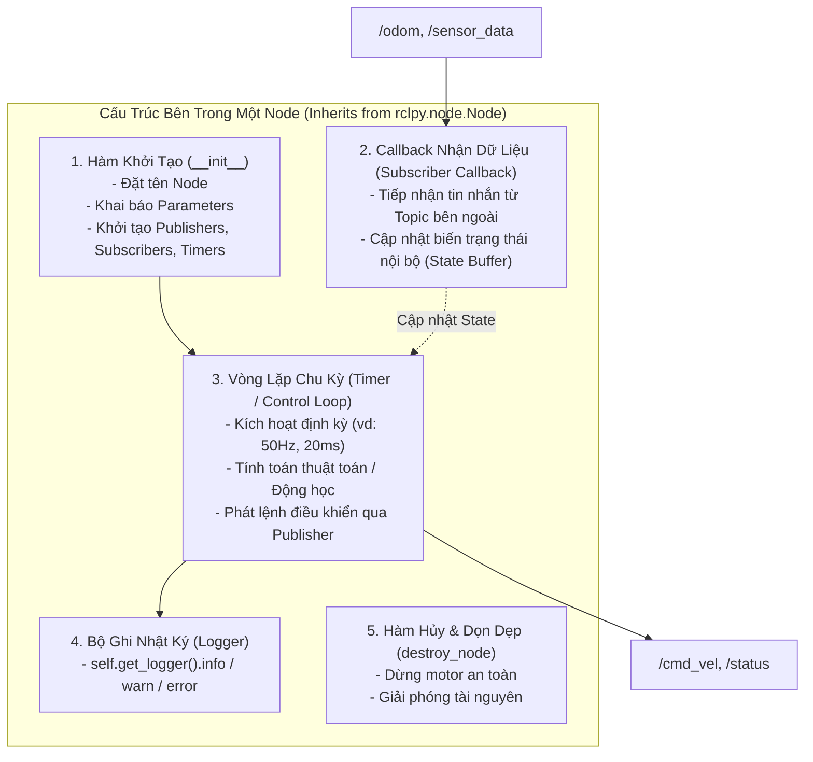

# 3. Giải Phẫu Cấu Trúc & Vòng Đời Của Một Node Chuẩn

Trong ROS 2, **Node** là đơn vị xử lý mã nguồn cơ bản nhất. Mỗi Node là một tiến trình (Process) độc lập đảm nhận một nhiệm vụ chuyên biệt.

Tài liệu này sẽ "mổ xẻ" chi tiết từng thành phần cấu tạo của một Node chuẩn hóa, giải thích rõ cơ chế hoạt động và cung cấp bộ khung mẫu (Template) chuẩn công nghiệp.

---

## 🔬 1. Sơ Đồ Cấu Tạo Của Một Node Tiêu Chuẩn



---

## 🐍 2. Mẫu Mã Nguồn Python Node Chuẩn Công Nghiệp (`rclpy`)

Dưới đây là một template mẫu hoàn chỉnh, có chú thích chi tiết từng dòng code:

```python
#!/usr/bin/env python3
# -*- coding: utf-8 -*-

"""
Template Node Chuẩn Hóa cho ROS 2 Python.
Ví dụ: Node nhận lệnh vận tốc và tính toán điều khiển motor.
"""

import time
import rclpy
from rclpy.node import Node
from geometry_msgs.msg import Twist
from std_msgs.msg import Float32, Bool


class StandardRobotNode(Node):
    def __init__(self):
        # 1. Khởi tạo Node với tên định danh duy nhất trong hệ thống ROS 2
        super().__init__('standard_robot_node')

        # -------------------------------------------------------------
        # 2. Khai Báo Tham Số Động (ROS Parameters)
        # -------------------------------------------------------------
        self.declare_parameter('max_speed', 1.0)           # Vận tốc tối đa (m/s)
        self.declare_parameter('control_rate_hz', 50.0)    # Tần số vòng lặp (Hz)
        self.declare_parameter('robot_name', 'robot0')

        # Đọc giá trị tham số
        self.max_speed = float(self.get_parameter('max_speed').value)
        rate_hz = float(self.get_parameter('control_rate_hz').value)
        self.robot_name = str(self.get_parameter('robot_name').value)

        # -------------------------------------------------------------
        # 3. Khởi Tạo Publishers (Phát dữ liệu ra Topic)
        # -------------------------------------------------------------
        # create_publisher(Kiểu_Message, 'Tên_Topic', Độ_Sâu_Hàng_Đợi)
        self.status_pub = self.create_publisher(Float32, '/robot/current_speed', 10)
        self.safety_pub = self.create_publisher(Bool, '/robot/safety_alert', 10)

        # -------------------------------------------------------------
        # 4. Khởi Tạo Subscribers (Lắng nghe dữ liệu từ Topic)
        # -------------------------------------------------------------
        # create_subscription(Kiểu_Message, 'Tên_Topic', Hàm_Callback, QoS_Depth)
        self.cmd_sub = self.create_subscription(
            Twist,
            '/cmd_vel',
            self.cmd_vel_callback,
            10
        )

        # -------------------------------------------------------------
        # 5. Biến Trạng Thái Nội Bộ (State Variables)
        # -------------------------------------------------------------
        self.target_vx = 0.0
        self.target_wz = 0.0
        self.last_command_time = time.time()

        # -------------------------------------------------------------
        # 6. Khởi Tạo Timer Loop (Vòng lặp tính toán chu kỳ)
        # -------------------------------------------------------------
        timer_period = 1.0 / rate_hz if rate_hz > 0 else 0.02
        self.control_timer = self.create_timer(timer_period, self.control_loop)

        # Ghi log thông báo khởi động thành công
        self.get_logger().info(
            f"Node '{self.get_name()}' đã khởi động! (Rate: {rate_hz}Hz, MaxSpeed: {self.max_speed}m/s)"
        )

    def cmd_vel_callback(self, msg: Twist):
        """
        Callback được kích hoạt NGAY LẬP TỨC khi có tin nhắn mới trên /cmd_vel.
        Nguyên tắc: Chỉ ghi nhận dữ liệu vào biến, KHÔNG tính toán nặng tại đây!
        """
        self.target_vx = float(msg.linear.x)
        self.target_wz = float(msg.angular.z)
        self.last_command_time = time.time()

    def control_loop(self):
        """
        Vòng lặp điều khiển chính (Control Loop) chạy định kỳ theo Timer.
        Nơi thực hiện thuật toán, tính toán động học và publish dữ liệu.
        """
        now = time.time()

        # Kiểm tra an toàn: Nếu mất tín hiệu quá 0.5s -> Dừng khẩn cấp (Watchdog)
        if now - self.last_command_time > 0.5:
            self.target_vx = 0.0
            self.target_wz = 0.0

        # Giới hạn vận tốc theo tham số max_speed
        clamped_vx = max(-self.max_speed, min(self.max_speed, self.target_vx))

        # Xuất dữ liệu ra Topic
        speed_msg = Float32()
        speed_msg.data = float(clamped_vx)
        self.status_pub.publish(speed_msg)

    def destroy_node(self):
        """Hàm dọn dẹp trước khi tắt Node."""
        self.get_logger().warn("Đang dừng Node và ngắt động cơ an toàn...")
        # Gửi lệnh dừng khẩn cấp
        stop_msg = Float32()
        stop_msg.data = 0.0
        self.status_pub.publish(stop_msg)
        super().destroy_node()


def main(args=None):
    # 1. Khởi tạo môi trường ROS 2
    rclpy.init(args=args)

    # 2. Tạo đối tượng Node
    node = StandardRobotNode()

    # 3. Chạy vòng lặp lắng nghe sự kiện (Spinning)
    try:
        rclpy.spin(node)
    except KeyboardInterrupt:
        # Bắt phím Ctrl + C để dừng mượt mà
        pass
    finally:
        # 4. Hủy node và đóng ROS 2
        node.destroy_node()
        if rclpy.ok():
            rclpy.shutdown()


if __name__ == '__main__':
    main()
```

---

## ⚙️ 3. Mẫu Mã Nguồn C++ Node Tương Đương (`rclcpp`)

Dành cho các tác vụ đòi hỏi hiệu năng cao và độ trễ cực thấp:

```cpp
#include <chrono>
#include <memory>
#include "rclcpp/rclcpp.hpp"
#include "geometry_msgs/msg/twist.hpp"
#include "std_msgs/msg/float32.hpp"

using namespace std::chrono_literals;

class StandardRobotCppNode : public rclcpp::Node
{
public:
  StandardRobotCppNode() : Node("standard_robot_cpp_node")
  {
    // Khai báo Parameter
    this->declare_parameter("max_speed", 1.0);
    this->max_speed_ = this->get_parameter("max_speed").as_double();

    // Publisher & Subscriber
    speed_pub_ = this->create_publisher<std_msgs::msg::Float32>("/robot/current_speed", 10);
    cmd_sub_ = this->create_subscription<geometry_msgs::msg::Twist>(
      "/cmd_vel", 10,
      std::bind(&StandardRobotCppNode::cmd_callback, this, std::placeholders::_1)
    );

    // Timer Loop 50Hz (20ms)
    timer_ = this->create_wall_timer(
      20ms, std::bind(&StandardRobotCppNode::control_loop, this)
    );

    RCLCPP_INFO(this->get_logger(), "C++ Node khởi động thành công!");
  }

private:
  void cmd_callback(const geometry_msgs::msg::Twist::SharedPtr msg)
  {
    target_vx_ = msg->linear.x;
  }

  void control_loop()
  {
    auto speed_msg = std_msgs::msg::Float32();
    speed_msg.data = static_cast<float>(target_vx_);
    speed_pub_->publish(speed_msg);
  }

  double max_speed_{1.0};
  double target_vx_{0.0};
  rclcpp::Publisher<std_msgs::msg::Float32>::SharedPtr speed_pub_;
  rclcpp::Subscription<geometry_msgs::msg::Twist>::SharedPtr cmd_sub_;
  rclcpp::TimerBase::SharedPtr timer_;
};

int main(int argc, char * argv[])
{
  rclcpp::init(argc, argv);
  auto node = std::make_shared<StandardRobotCppNode>();
  rclcpp::spin(node);
  rclcpp::shutdown();
  return 0;
}
```

---

## ⚠️ 4. Các Sai Lầm Phổ Biến Cần Tránh Khi Viết Node

1. **Xử lý tác vụ quá nặng hoặc gọi `time.sleep()` trong Subscriber Callback:**
   * *Hậu quả:* Làm nghẽn hàng đợi (Queue), các tin nhắn mới bị delay nghiêm trọng hoặc bị đánh rơi.
   * *Khắc phục:* Đưa dữ liệu vào biến đệm và để Timer Loop hoặc Worker Thread riêng xử lý.
2. **Hardcode tham số cấu hình trong mã nguồn:**
   * *Khắc phục:* Luôn dùng `declare_parameter()` để có thể tinh chỉnh tham số qua file YAML hoặc CLI mà không cần sửa code.
3. **Quên xử lý khối `finally: shutdown()`:**
   * *Hậu quả:* Tiến trình bị treo dưới nền (Zombie process), cổng kết nối không được giải phóng.
