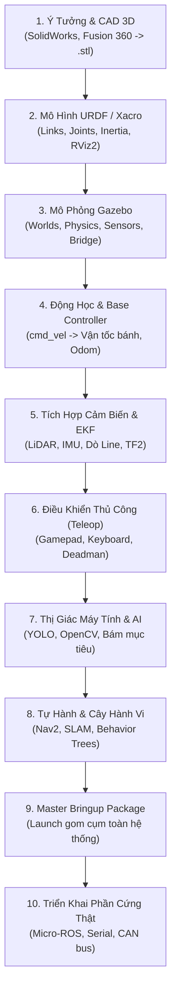

# 4. Quy Trình 10 Bước Xây Dựng Dự Án Robot Hoàn Chỉnh Từ Số 0

Tài liệu này đóng vai trò là **Cẩm nang Phương hướng Thực chiến (Universal Blueprint)**, hướng dẫn bạn từng bước xây dựng một hệ thống Robot tự hành hoàn chỉnh từ bản vẽ ý tưởng cho đến khi vận hành thực tế.

---

## 🗺️ Quy Trình 10 Bước Chuẩn Hóa (10-Stage Pipeline)



---

## 🛠️ Chi Tiết Từng Bước Thực Hiện

### 🔹 Bước 1: Lên Ý Tưởng Cơ Khí & Xuất File CAD 3D
1. **Lựa chọn cấu hình động học (Kinematic Configuration):**
   * **2 Bánh Vi Sai (Differential Drive):** Đơn giản, chi phí thấp (TurtleBot, Roomba).
   * **4 Bánh Mecanum / 3 Bánh Omni:** Di chuyển đa hướng tức thì, dạt ngang linh hoạt (AGV nhà kho, Robocon).
   * **4 Bánh Lái Ackermann:** Xe ô tô tự hành ngoài trời.
   * **Cánh Tay Robot (Manipulator):** Khớp xoay chuỗi (Revolute joints).
2. **Xuất mô hình 3D sang định dạng chuẩn:**
   * Xuất từng cụm chi tiết (Khung xe, Bánh xe, Càng nâng, Cảm biến) ra file định dạng `.stl` hoặc `.dae`.
   * **Lưu ý quan trọng:** Đặt gốc tọa độ $(0, 0, 0)$ của từng file mesh trùng đúng với tâm trục xoay của khớp đó.

---

### 🔹 Bước 2: Xây Dựng Mô Hình URDF / Xacro (`my_robot_description`)
1. Tạo package `ament_cmake` chứa URDF.
2. Viết file Xacro mô tả:
   * **Links:** Khối lượng ($m$), ma trận quán tính ($I_{xx}, I_{yy}, I_{zz}$), mô hình hiển thị (`<visual>`), và mô hình va chạm giản lược (`<collision>` dạng box hoặc cylinder để tối ưu physics).
   * **Joints:** Khớp cố định (`fixed`), khớp xoay liên tục (`continuous`), hoặc khớp trượt (`prismatic`).
3. Tạo file `display.launch.py` để kiểm tra cây tọa độ TF trên RViz2 cùng giao diện kéo thanh trượt `joint_state_publisher_gui`.

---

### 🔹 Bước 3: Thiết Lập Môi Trường Mô Phỏng Vật Lý (`my_robot_gazebo`)
1. Thiết kế sa bàn / thế giới 3D (`.sdf`) bằng Gazebo Fortress / Ignition.
2. Gắn các Plugin cảm biến và động cơ:
   * Gắn Plugin camera (`/camera/image_raw`).
   * Gắn Plugin laser scanner (`/scan`).
   * Gắn Plugin điều khiển chuyển động (`PlanarVelocityControl` hoặc `DiffDrive`).
3. Cấu hình cầu nối dữ liệu `ros_gz_bridge` để chuyển đổi qua lại giữa topic Gazebo và ROS 2.

---

### 🔹 Bước 4: Viết Bộ Tính Động Học Khung Gầm (`my_robot_controller`)
1. Tạo package `ament_python`.
2. Viết node `kinematics_node.py`:
   * Đọc lệnh `/cmd_vel` (`Twist`).
   * Áp dụng công thức động học nghịch để tính vận tốc góc $\omega_i$ của từng bánh xe.
   * Tính toán tích phân vị trí bánh xe để xuất topic `/odom` và phát tán biến đổi `odom` $\to$ `base_footprint`.
   * Tích hợp cơ chế Watchdog tự động ngắt motor khi mất tín hiệu quá $0.5\text{ s}$.

---

### 🔹 Bước 5: Tích Hợp Cảm Biến & Dung Hợp Dữ Liệu (`my_robot_sensors`)
1. Cấu hình driver cảm biến (LiDAR 2D, IMU 9-DOF, Cảm biến dò line quang học, Siêu âm).
2. Thiết lập đúng Frame ID cho từng cảm biến tương ứng với vị trí trong URDF.
3. Sử dụng package `robot_localization` (Extended Kalman Filter) để dung hợp dữ liệu `/odom` và `/imu/data` giúp loại bỏ hiện tượng trôi bánh xe (Wheel slip drift).

---

### 🔹 Bước 6: Điều Khiển Thủ Công An Toàn (`my_robot_teleop`)
1. Tạo giao diện điều khiển qua Gamepad (Xbox, Logitech F710) hoặc Bàn phím.
2. Thiết kế cơ chế an toàn:
   * **Deadman Switch:** Bắt buộc giữ nút an toàn khi chạy.
   * **Active Auto-Brake:** Xuất lệnh dừng $0.0\text{ m/s}$ ngay khi nhả tay cầm.
   * **Ga mượt (Analog Gain):** Dùng cò `LT`/`RT` để tinh chỉnh dải tốc độ.

---

### 🔹 Bước 7: Thị Giác Máy Tính & Nhận Thức Môi Trường (`my_robot_vision`)
1. Tích hợp AI / Deep Learning nhận diện đối tượng thời gian thực:
   * Sử dụng mô hình **YOLOv8 / YOLOv11** nhận diện vật thể, chướng ngại vật, hoặc mã QR / Pallet.
2. Tối ưu hóa kiến trúc xử lý:
   * Dùng **Decoupled Worker Thread** (luồng xử lý AI chạy nền độc lập với hàng đợi ROS 2) để chống nghẽn và loại bỏ độ trễ tích lũy.
   * Xuất tọa độ lệch tâm $(dx, dy)$ phục vụ bám mục tiêu tự động (Visual Servoing).

---

### 🔹 Bước 8: Điều Hướng Tự Động & Ra Quyết Định (`my_robot_navigation`)
Tùy theo yêu cầu bài toán, lựa chọn 1 trong các phương án:
1. **SLAM & Nav2:** Khi robot hoạt động trong môi trường tự do không định sẵn (Lập bản đồ bằng Cartographer/SLAM Toolbox, định vị bằng AMCL, dẫn đường qua Costmaps).
2. **Line Tracking & Grid Intersections:** Khi robot hoạt động trong nhà máy theo vạch kẻ định hướng.
3. **Cây Hành Vi (Behavior Trees):** Khi robot cần thực hiện các nhiệm vụ phức tạp nhiều bước (vd: Tự tìm kệ hàng $\to$ Quét AI $\to$ Gắp hàng $\to$ Vận chuyển đến đích $\to$ Trở về sạc pin).

---

### 🔹 Bước 9: Đóng Gói Hệ Thống Master Bringup (`my_robot_bringup`)
1. Tạo package tổng thể `my_robot_bringup`.
2. Viết file `bringup.launch.py` gom toàn bộ các launch file của các subsystem trên:
   ```bash
   # Khởi động toàn bộ robot chỉ với 1 câu lệnh duy nhất:
   ros2 launch my_robot_bringup bringup.launch.py
   ```

---

### 🔹 Bước 10: Triển Khai Lên Phần Cứng Thật (Physical Deployment)
1. Giữ nguyên toàn bộ các package cấp cao (`controller`, `teleop`, `vision`, `navigation`).
2. Thay thế `ros_gz_bridge` của Gazebo bằng Driver phần cứng thực tế:
   * **Micro-ROS (ESP32 / STM32):** Nhận `/cmd_vel` và phát xung PWM/CAN điều khiển Driver động cơ thực, đọc Encoder và xuất `/joint_states`.
   * **Giao tiếp Serial / UART / CAN Bus:** Kết nối máy tính nhúng (Raspberry Pi 5, Jetson Orin) với bo mạch công suất.
