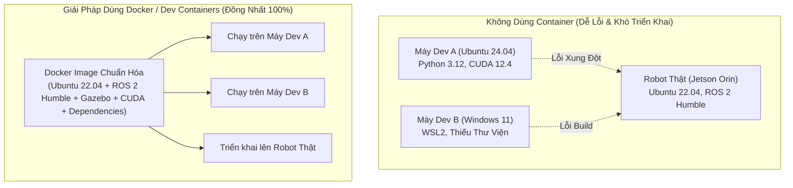
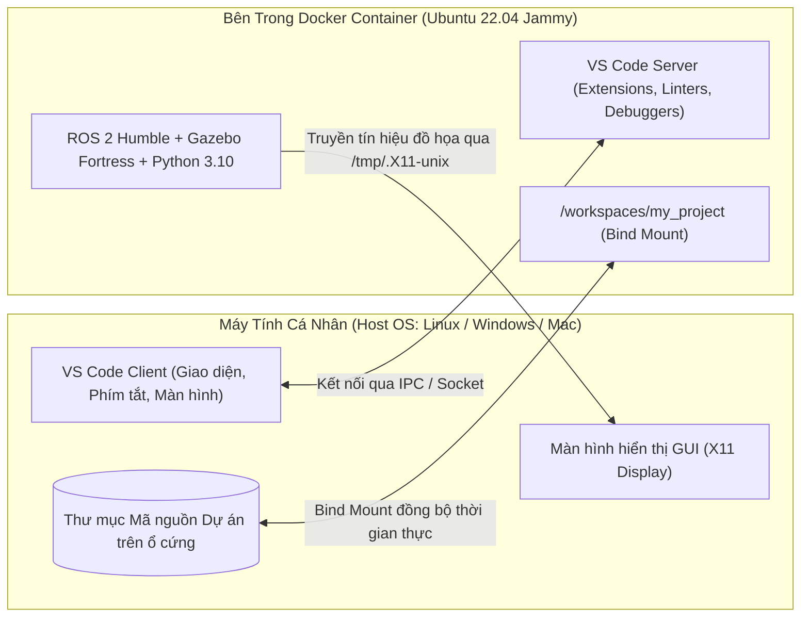

# 6. Cẩm Nang Sử Dụng Docker & Dev Containers Trong ROS 2

Tài liệu này giải thích chi tiết về **Container hóa (Containerization)** trong Robotics, cách thức hoạt động của **VS Code Dev Containers**, giải phẫu các file cấu hình Docker, và hướng dẫn từng bước thiết lập môi trường chuẩn cho bất kỳ dự án ROS 2 nào.

---

## 🐳 1. Tại Sao Lại Cần Dùng Docker & Container Trong Robotics?

Phát triển Robot với ROS 2 thường đi kèm với các thách thức lớn về môi trường:
* **Xung đột phiên bản (Dependency Hell):** ROS 2 Humble yêu cầu Ubuntu 22.04; nếu máy tính của bạn dùng Ubuntu 24.04, 20.04, Windows hay macOS, bạn không thể cài đặt trực tiếp bản native.
* **Vấn đề "Chạy trên máy tôi nhưng lỗi trên máy bạn":** Khác biệt về phiên bản Python, OpenCV, CUDA, PyTorch hoặc CMake khiến code bị lỗi khi chuyển sang máy thành viên khác trong nhóm hoặc chuyển lên máy tính nhúng của robot thật.
* **Làm bẩn hệ điều hành Host:** Cài đặt hàng chục thư viện ROS và C++ có thể làm rối loạn môi trường máy tính cá nhân của bạn.



**Lợi ích của Docker:**
1. **Môi trường độc lập & Tái tạo 100% (Reproducibility):** Đóng gói toàn bộ hệ điều hành, ROS 2, Gazebo, thư viện AI vào 1 file cấu hình duy nhất. Bất kỳ ai clone dự án về đều có môi trường giống hệt nhau chỉ sau 1 cú click.
2. **Hỗ trợ Đa Nền Tảng:** Chạy mượt mà trên **Linux**, **Windows (WSL2)**, và **macOS**.
3. **Triển khai thẳng lên Robot Thật:** Image bạn dùng để mô phỏng có thể nạp thẳng lên máy tính nhúng (NVIDIA Jetson, Raspberry Pi, x86 IPC) của robot thực tế.

---

## ⚡ 2. Cơ Chế Hoạt Động Của VS Code Dev Containers

**VS Code Dev Containers** là công cụ kết hợp hoàn hảo giữa giao diện lập trình trực quan của VS Code và môi trường cô lập của Docker:



* **Mã nguồn lưu an toàn trên máy Host:** Mã nguồn nằm trên máy thật của bạn và được gắn kết nối (Bind Mount) vào bên trong container. Bạn chỉnh sửa file trong VS Code thì file trên máy Host được lưu tức thì.
* **Mọi công cụ chạy trong Container:** Terminal, lệnh `colcon build`, Python interpreter, C++ compiler, `ros2 run`, Gazebo, RViz2 đều chạy bên trong container.

---

## 📂 3. Giải Phẫu Thư Mục Cấu Hình `.devcontainer/`

Một dự án ROS 2 sử dụng Dev Container thường có thư mục `.devcontainer/` chứa 2 file cốt lõi:

```text
my_project/
└── .devcontainer/
    ├── Dockerfile          # Kịch bản cài đặt hệ điều hành, ROS 2, packages và thư viện AI
    └── devcontainer.json   # Cấu hình phần cứng, cổng hiển thị X11, GPU, USB và tiện ích VS Code
```

### 1. File `Dockerfile`
Chịu trách nhiệm build ra hệ điều hành và cài sẵn các gói phần mềm cần thiết:

```dockerfile
# 1. Base Image chính thức của Open Robotics (ROS 2 Humble trên Ubuntu 22.04)
FROM osrf/ros:humble-desktop-jammy

# 2. Tạo tài khoản người dùng 'vscode' không quyền root để bảo mật và tránh xung đột quyền file
ARG USERNAME=vscode
ARG USER_UID=1000
ARG USER_GID=${USER_UID}

# 3. Cài đặt các gói hệ thống và thư viện ROS 2 bổ trợ
RUN apt-get update && apt-get install -y --no-install-recommends \
    build-essential cmake git \
    mesa-utils libgl1-mesa-dri \
    ros-humble-ros-gz \
    ros-humble-navigation2 \
    ros-humble-robot-state-publisher \
    ros-humble-joint-state-publisher-gui \
    ros-humble-teleop-twist-keyboard \
    python3-pip python3-colcon-common-extensions \
    joystick evtest sudo \
    && rm -rf /var/lib/apt/lists/*

# 4. Cài đặt các thư viện Python (AI / Thị giác / Động học)
RUN pip3 install --no-cache-dir "numpy<2.0.0" opencv-python ultralytics

# 5. Cấp quyền truy cập thiết bị phần cứng (USB Serial, Camera, Gamepad) và quyền sudo
RUN groupadd --gid ${USER_GID} ${USERNAME} \
    && useradd --uid ${USER_UID} --gid ${USER_GID} -m -s /bin/bash ${USERNAME} \
    && usermod -aG dialout,video,input ${USERNAME} \
    && echo "${USERNAME} ALL=(ALL) NOPASSWD:ALL" > /etc/sudoers.d/${USERNAME}

USER ${USERNAME}
WORKDIR /workspaces/my_project

# 6. Tự động source môi trường ROS 2 mỗi khi mở terminal mới
RUN echo 'source /opt/ros/humble/setup.bash' >> /home/${USERNAME}/.bashrc
```

---

### 2. File `devcontainer.json`
Chịu trách nhiệm liên kết Docker Container với phần cứng máy Host:

```json
{
  "name": "ROS 2 Humble Robotics Environment",
  "build": {
    "dockerfile": "Dockerfile"
  },
  "remoteUser": "vscode",
  "privileged": true,
  "runArgs": [
    "--network=host",       // Sử dụng cùng mạng với Host để DDS truyền tin không bị chặn
    "--ipc=host",           // Chia sẻ bộ nhớ cho GUI đồ họa mượt mà
    "--gpus=all"            // Cấp toàn quyền sử dụng GPU NVIDIA cho AI & Gazebo
  ],
  "mounts": [
    // 1. Cho phép mở cửa sổ Gazebo / RViz2 lên màn hình máy Host qua socket X11
    "source=/tmp/.X11-unix,target=/tmp/.X11-unix,type=bind",
    // 2. Cho phép nhận diện Gamepad (/dev/input) và cổng nạp vi điều khiển (/dev/ttyUSB)
    "source=/dev,target=/dev,type=bind"
  ],
  "containerEnv": {
    "DISPLAY": "${localEnv:DISPLAY}",
    "NVIDIA_VISIBLE_DEVICES": "all",
    "NVIDIA_DRIVER_CAPABILITIES": "all",
    "QT_X11_NO_MITSHM": "1"
  },
  "customizations": {
    "vscode": {
      "extensions": [
        "ms-iot.vscode-ros",
        "ms-vscode.cpptools",
        "ms-python.python",
        "ms-vscode.cmake-tools"
      ]
    }
  }
}
```

---

## 🚀 4. Hướng Dẫn Sử Dụng Từng Bước (Step-by-Step Guide)

### Bước 1: Cài đặt công cụ nền tảng trên máy Host
1. Cài đặt **Docker Desktop** (trên Windows/macOS) hoặc **Docker Engine** (trên Linux).
2. Cài đặt **VS Code** và cài extension **Dev Containers** (`ms-vscode-remote.remote-containers`).
3. *(Nếu máy có card rời NVIDIA trên Linux)*: Cài đặt `nvidia-container-toolkit`.

### Bước 2: Cấp quyền hiển thị X11 (Chỉ dành cho Linux Host)
Mỗi khi khởi động lại máy tính Linux, trước khi mở container, hãy mở terminal máy host và gõ:
```bash
xhost +local:root
```
*(Lệnh này cấp quyền cho Docker Container truyền dữ liệu đồ họa hiển thị RViz2/Gazebo lên màn hình máy tính của bạn).*

### Bước 3: Mở dự án trong Dev Container
1. Khởi động VS Code $\to$ Chọn **File $\to$ Open Folder...** $\to$ Chọn thư mục dự án `ros-cdt`.
2. VS Code sẽ hiển thị thông báo góc dưới bên phải: *"Folder contains a Dev Container configuration container. Reopen to run in container"*.
3. Bấm **Reopen in Container** (Hoặc nhấn phím `F1` $\to$ Gõ `Dev Containers: Reopen in Container`).
4. Lần đầu tiên chạy, Docker sẽ tự động tải các image và cài đặt môi trường (mất khoảng 3-5 phút). Sau khi hoàn thành, bạn đã ở trong môi trường ROS 2 hoàn hảo!

---

## 🛠️ 5. Các Thao Tác Thường Dùng Với Dev Containers

| Thao Tác | Cách Thực Hiện Trong VS Code |
| :--- | :--- |
| **Mở Terminal mới trong Container** | Nhấn tổ hợp phím `` Ctrl + ` `` hoặc menu **Terminal $\to$ New Terminal** |
| **Biên dịch lại Container (Khi sửa Dockerfile)** | Nhấn `F1` $\to$ Chọn `Dev Containers: Rebuild Container` |
| **Thoát Container về máy Host** | Nhấn vào góc xanh dưới cùng bên trái $\to$ Chọn `Reopen Folder Locally` |
| **Kiểm tra đồ họa 3D trong container** | Gõ `glxgears` hoặc `nvidia-smi` trong terminal container |
| **Kiểm tra tay cầm Gamepad** | Gõ `jstest /dev/input/js0` trong terminal container |

---

## 🤖 6. Triển Khai Container Lên Robot Phần Cứng Thật (Physical Deployment)

Khi bạn muốn mang code từ máy tính phát triển nạp lên **Robot Thật** (ví dụ: máy tính nhúng NVIDIA Jetson Orin hoặc Raspberry Pi 5 trên xe):

1. **Build Docker Image thành file độc lập:**
   ```bash
   docker build -t my_robot_image:v1.0 -f .devcontainer/Dockerfile .
   ```
2. **Khởi chạy container trên Robot phần cứng:**
   ```bash
   docker run -it --rm \
     --net=host \
     --ipc=host \
     --privileged \
     --gpus=all \
     -v /dev:/dev \
     -v /workspaces/my_project:/workspaces/my_project \
     my_robot_image:v1.0 \
     bash -c "source /opt/ros/humble/setup.bash && ros2 launch robot0_bringup bringup.launch.py"
   ```

---

## ⚠️ 7. Xử Lý Các Sự Cố Thường Gặp (Troubleshooting)

### 1. Lỗi: `Cannot connect to display` / RViz2 và Gazebo không mở được cửa sổ
* **Nguyên nhân:** Máy host Linux chưa mở quyền socket X11.
* **Khắc phục:** Mở một terminal trên **máy Host** (không phải trong VS Code container) và chạy lệnh:
  ```bash
  xhost +local:root
  ```

### 2. Lỗi: Container không nhận card GPU NVIDIA (`nvidia-smi` báo lỗi)
* **Khắc phục:** Kiểm tra xem máy host đã cài NVIDIA Container Toolkit chưa:
  ```bash
  sudo apt-get install -y nvidia-container-toolkit
  sudo systemctl restart docker
  ```

### 3. Lỗi: Không nhận tay cầm Gamepad (`/dev/input/js0` không tìm thấy)
* **Khắc phục:** Đảm bảo bạn đã cắm tay cầm vào cổng USB máy host *trước* khi mở container. Trong `devcontainer.json` cần có dòng `"source=/dev,target=/dev,type=bind"` và `"privileged": true`.
