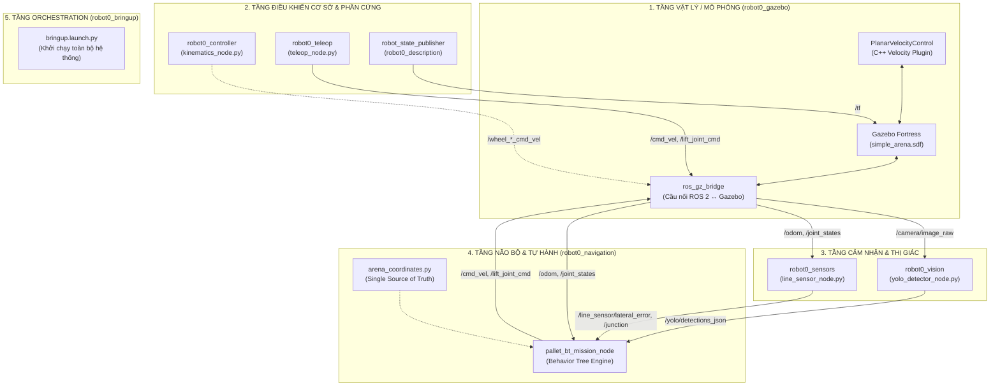
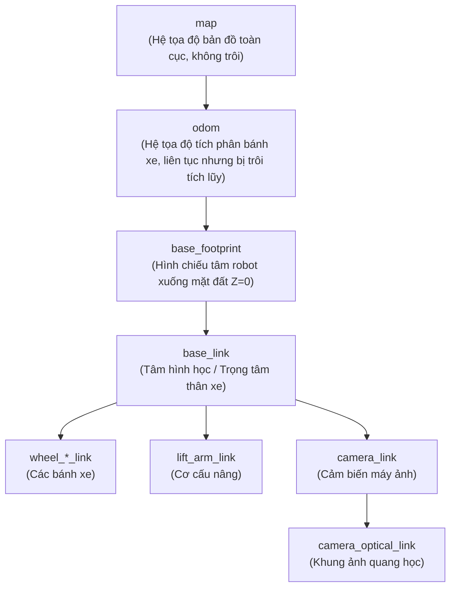
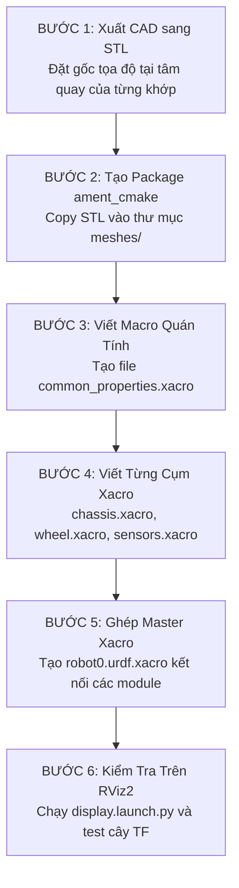
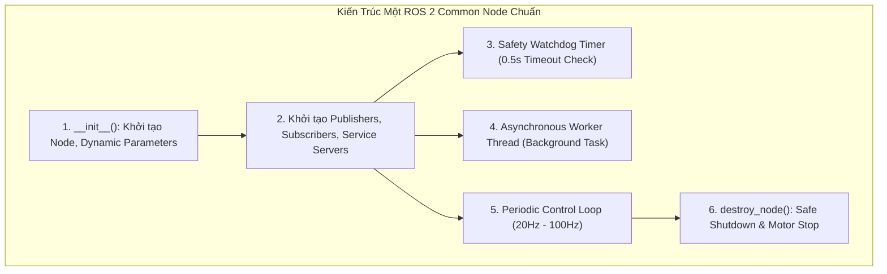
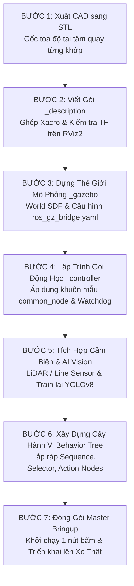

# 07. Cẩm Nang Kế Thừa & Tái Cấu Trúc Dự Án Robot ROS 2 Cho Người Mới Bắt Đầu

> **Mục tiêu tài liệu**: Hướng dẫn một thành viên mới (Junior / Newbie) chưa có kinh nghiệm có thể **kế thừa, hiểu rõ từng dòng code/file cấu hình**, và **tự tay xây dựng lại toàn bộ hệ thống từ con số 0** cho một loại robot hoặc nhiệm vụ hoàn toàn khác.
>
> **Trọng tâm tài liệu**: Đi sâu vào thiết kế gói mô hình **`*_description` (Xacro/URDF/TF)**, mô phỏng **`*_gazebo` (SDF/Bridge/Plugin)**, cấu trúc **`common_node` chuẩn công nghiệp**, và giải thích triết lý **Tại sao chọn giải pháp này mà không chọn giải pháp khác (Why THIS and NOT THAT)**.

---

## 🧭 MỤC LỤC TỔNG QUAN

1. [Tư Duy Kiến Trúc & Triết Lý Thiết Kế (Design Philosophy)](#1-tư-duy-kiến-trúc--triết-lý-thiết-kế-design-philosophy)
   - 1.1. Tại sao phải chia nhiều Package và nhiều Node?
   - 1.2. Bảng so sánh các quyết định kỹ thuật then chốt (Why THIS and NOT THAT)
2. [Sơ Đồ Luồng Dữ Liệu & Giao Tiếp Hệ Thống (System Dataflow)](#2-sơ-đồ-luồng-dữ-liệu--giao-tiếp-hệ-thống-system-dataflow)
3. [Chuyên Đề 1: Giải Phẫu & Xây Dựng Gói `*_description` Từ Con Số 0](#3-chuyên-đề-1-giải-phẫu--xây-dựng-gói-_description-từ-con-số-0)
   - 3.1. Xacro vs URDF Thuần: Tại sao Xacro là bắt buộc?
   - 3.2. Cây tọa độ TF và các chuẩn quốc tế (REP-103 & REP-105)
   - 3.3. Ma trận quán tính (Inertia Matrix): Công thức và ý nghĩa sống còn trong vật lý
   - 3.4. Cấu trúc module hóa file Xacro chuẩn
   - 3.5. Quy trình 6 bước xây dựng gói `_description` từ bản vẽ CAD
4. [Chuyên Đề 2: Giải Phẫu & Xây Dựng Gói `*_gazebo` (Mô Phỏng Vật Lý)](#4-chuyên-đề-2-giải-phẫu--xây-dựng-gói-_gazebo-mô-phỏng-vật-lý)
   - 4.1. Gazebo Fortress (GZ Sim) vs Gazebo Classic: Bước chuyển giao công nghệ
   - 4.2. Cầu nối `ros_gz_bridge`: Cấu hình YAML vs Hardcode
   - 4.3. Viết Gazebo C++ System Plugin: Khi nào cần can thiệp tầng vật lý?
   - 4.4. Quy trình 5 bước dựng Sa bàn (World SDF) & Tích hợp Robot
5. [Chuyên Đề 3: Thiết Kế Một `common_node` Chuẩn Công Nghiệp](#5-chuyên-đề-3-thiết-kế-một-common_node-chuẩn-công-nghiệp)
   - 5.1. Bộ khung hoàn chỉnh của một Node chuẩn (Boilerplate Architecture)
   - 5.2. Quản lý Parameters động (Dynamic Parameters)
   - 5.3. Cơ chế Watchdog Safety Timer & Ngắt khẩn cấp
   - 5.4. Chiến lược cấu hình Quality of Service (QoS)
   - 5.5. Xử lý đa luồng (Multi-threading / Worker Thread) chống nghẽn GIL
6. [Chuyên Đề 4: Tổng Quan Các Gói Ứng Dụng Trong Dự Án](#6-chuyên-đề-4-tổng-quan-các-gói-ứng-dụng-trong-dự-án)
   - 6.1. `robot0_controller`: Toán học động học nghịch (Inverse Kinematics)
   - 6.2. `robot0_teleop`: Bộ lọc tay cầm Gamepad & Ga mượt
   - 6.3. `robot0_sensors`: Cảm biến hình học Vector Quad Array 100Hz
   - 6.4. `robot0_vision`: YOLOv8 Zero-Lag Asynchronous Worker Thread
   - 6.5. `robot0_navigation`: Kiến trúc Cây Hành Vi (Behavior Tree) & Blackboard
   - 6.6. `robot0_bringup`: Master Orchestration
7. [Quy Trình 7 Bước Xây Dựng Lại Toàn Bộ Dự Án Cho Robot / Nhiệm Vụ Mới](#7-quy-trình-7-bước-xây-dựng-lại-toàn-bộ-dự-án-cho-robot--nhiệm-vụ-mới)
8. [Sổ Tay Xử Lý Sự Cố (10 Lỗi Kinh Điển & Cách Khắc Phục Nhanh)](#8-sổ-tay-xử-lý-sự-cố-10-lỗi-kinh-điển--cách-khắc-phục-nhanh)

---

## 1. TƯ DUY KIẾN TRÚC & TRIẾT LÝ THIẾT KẾ (DESIGN PHILOSOPHY)

### 1.1. Tại sao phải chia nhiều Package và nhiều Node?

Khi bắt đầu với lập trình robot, người mới thường có xu hướng viết tất cả logic vào **một file Python hoặc C++ duy nhất**: vừa đọc cảm biến, vừa tính toán động học bánh xe, vừa chạy AI camera, vừa gửi xung động cơ. Trong môi trường thực tế, cách tiếp cận này gặp phải 3 rủi ro nghiêm trọng:
1. **Lỗi dây chuyền (Single Point of Failure)**: Nếu mô hình AI nhận diện camera bị treo 200ms do tải nặng, toàn bộ vòng lặp điều khiển động cơ bị khựng lại khiến robot đâm vào tường.
2. **Không tận dụng được CPU đa nhân (Multi-core Concurrency)**: Python có cơ chế khóa thông dịch toàn cục GIL (*Global Interpreter Lock*). Nếu chạy 1 tiến trình đơn, toàn bộ thuật toán chỉ chạy trên 1 nhân CPU duy nhất dù máy tính có 8 hay 16 nhân.
3. **Mất khả năng tái sử dụng (Zero Reusability)**: Khi bạn đổi từ xe 4 bánh Mecanum sang xe 2 bánh vi sai, bạn phải đập đi viết lại toàn bộ code xử lý bản đồ và camera.

Trong ROS 2, hệ thống được thiết kế theo 3 nguyên tắc:
* **Tính Module hóa (Modularity)**: Mỗi Node là một tiến trình hệ điều hành độc lập (OS Process), đảm nhận một vai trò duy nhất.
* **Trừu tượng hóa phần cứng (Hardware Abstraction)**: Thuật toán cấp cao chỉ làm việc qua các Topic tiêu chuẩn (`/cmd_vel`, `/odom`, `/scan`, `/joint_states`). Việc thuật toán chạy trên mô phỏng Gazebo hay trên phần cứng thật ngoài đời là hoàn toàn trong suốt.
* **Nguồn dữ liệu duy nhất (Single Source of Truth)**: Tọa độ, kích thước xe, cấu hình không được viết cứng (hardcode) trong mã nguồn mà quản lý qua file cấu hình `.yaml` hoặc file tham số Xacro.

---

### 1.2. Bảng so sánh các quyết định kỹ thuật then chốt (Why THIS and NOT THAT)

| Vấn Đề Kỹ Thuật | Lựa Chọn Trong Dự Án | Lựa Chọn Thay Thế | Tại Sao Chọn Giải Pháp Này? (Ưu điểm vượt trội) |
| :--- | :--- | :--- | :--- |
| **Mô tả Robot** | **Xacro** (`.xacro`) | URDF Thuần (`.urdf`) | Xacro hỗ trợ biến số, phép tính toán học `${...}`, macro tái sử dụng code (viết 1 lần tạo 4 bánh xe), và tách file thành nhiều module con. URDF thuần bắt buộc copy-paste hàng nghìn dòng XML lặp lại. |
| **Mô phỏng 3D** | **Gazebo Fortress (GZ Sim)** | Gazebo Classic (`gazebo9/11`) | Gazebo Classic đã kết thúc vòng đời hỗ trợ (EOL). Gazebo Fortress sử dụng kiến trúc Entity Component System (ECS) hiện đại, hỗ trợ GPU rendering, chạy đa luồng tối ưu và là chuẩn dài hạn cho ROS 2 Humble. |
| **Cầu nối Sim - ROS** | **`ros_gz_bridge` (YAML Config)** | Viết Node Bridge Custom bằng C++ | File cấu hình YAML cho phép định nghĩa hướng truyền (`GZ_TO_ROS`, `ROS_TO_GZ`), kiểu dữ liệu 2 bên một cách trực quan, không cần viết code chuyển đổi message hay compile lại. |
| **Ra quyết định Tự hành** | **Behavior Trees (BT)** | Finite State Machine (FSM) / Nested If-Else | FSM khi số lượng trạng thái tăng lên sẽ sinh ra "ma trận chuyển đổi" bùng nổ độ phức tạp (O(N^2)). Behavior Tree có tính module hóa cao, dễ dàng thêm/bớt/đổi thứ tự hành vi mà không ảnh hưởng nhánh khác. |
| **Ngôn ngữ Lập trình** | **Python** (`ament_python`) & **C++** (`ament_cmake`) | Toàn bộ C++ hoặc Toàn bộ Python | Sử dụng **C++** cho tầng mô phỏng vật lý và plugin Gazebo đòi hỏi hiệu năng tính toán cao; sử dụng **Python** cho thuật toán logic, thị giác AI, cây hành vi để tối ưu tốc độ thử nghiệm và linh hoạt. |
| **Kiểu Build Package** | **`ament_cmake`** cho tài nguyên / C++ | `ament_python` cho tất cả | Các gói chứa file 3D mesh, URDF, launch tổng thể bắt buộc dùng `ament_cmake` để thư viện `ament_index` tìm kiếm đường dẫn tài nguyên chuẩn xác trên hệ thống. |

---

## 2. SƠ ĐỒ LUỒNG DỮ LIỆU & GIAO TIẾP HỆ THỐNG (SYSTEM DATAFLOW)



---

## 3. CHUYÊN ĐỀ 1: GIẢI PHẪU & XÂY DỰNG GÓI `*_description` TỪ CON SỐ 0

Gói `*_description` là **nền móng đầu tiên** của bất kỳ dự án robot nào. Nếu mô hình mô tả sai, toàn bộ các khâu sau (tính toán TF, mô phỏng vật lý, định vị, lập quỹ đạo) đều sẽ sai lệch.

### 3.1. Xacro vs URDF Thuần: Tại sao Xacro là bắt buộc?

* **URDF Thuần (Unified Robot Description Format)**: Là chuẩn XML thô của ROS.
  * *Nhược điểm*: Không có biến số, không có hàm, không có macro. Nếu robot có 4 bánh xe giống hệt nhau, bạn phải viết 4 khối XML dài 200 dòng giống nhau. Nếu đổi bán kính bánh xe từ 5cm sang 6cm, bạn phải sửa tay ở 20 vị trí khác nhau trong file.
* **Xacro (XML Macros)**: Là ngôn ngữ tiền xử lý mở rộng cho URDF.
  * Hỗ trợ khai báo hằng số: `<xacro:property name="wheel_radius" value="0.0487" />`
  * Hỗ trợ phép tính toán học: `${wheel_radius * 2}` hoặc `${wheelbase / 2}`
  * Hỗ trợ Macro tái sử dụng: Viết khuôn mẫu `mecanum_wheel` 1 lần, gọi 4 lần với các tham số khác nhau:
    ```xml
    <xacro:mecanum_wheel prefix="fl" x_reflect="1"  y_reflect="1"  />
    <xacro:mecanum_wheel prefix="fr" x_reflect="1"  y_reflect="-1" />
    <xacro:mecanum_wheel prefix="rl" x_reflect="-1" y_reflect="1"  />
    <xacro:mecanum_wheel prefix="rr" x_reflect="-1" y_reflect="-1" />
    ```
  * Hỗ trợ cấu trúc module: Lệnh `<xacro:include filename="..." />` cho phép chia nhỏ robot thành từng cụm cơ khí.

---

### 3.2. Cây tọa độ TF và các chuẩn quốc tế (REP-103 & REP-105)

Hệ thống tọa độ trong ROS 2 phải tuân thủ nghiêm ngặt hai tiêu chuẩn kỹ thuật quốc tế:

#### A. Chuẩn Hệ Trục Tọa Độ & Đơn Vị (REP-103):
* **Hệ đơn vị tiêu chuẩn (SI)**: Chiều dài đo bằng **Mét (m)**, góc đo bằng **Radian (rad)**, khối lượng đo bằng **Kilogram (kg)**, thời gian đo bằng **Giây (s)**.
* **Quy tắc bàn tay phải (Right-Hand Rule)**:
  * Trục $X$: Hướng về phía trước của robot (Forward).
  * Trục $Y$: Hướng sang phía bên trái của robot (Left).
  * Trục $Z$: Hướng thẳng đứng lên trên (Up).
* **Quy ước Camera Quang học (Optical Frame)**:
  * Trục quang học của cảm biến máy ảnh theo chuẩn đồ họa máy tính/OpenCV là: Trục $Z$ đâm thẳng ra ngoài ống kính, trục $X$ sang phải, trục $Y$ hướng xuống dưới.
  * Vì vậy, luôn luôn cần một liên kết `camera_optical_link` liên kết với `camera_link` thông qua phép quay:
    $$	ext{Roll} = -rac{\pi}{2}, \quad 	ext{Pitch} = 0, \quad 	ext{Yaw} = -rac{\pi}{2}$$

#### B. Cây Tọa Độ Không Gian Cho Mobile Robot (REP-105):



> **Tại sao cần cả `base_footprint` và `base_link`?**
> * `base_footprint`: Có cao độ $Z = 0$ cố định trên mặt sàn, đại diện cho vị trí 2D của robot trên bản đồ. Các thuật toán định vị và lập kế hoạch đường đi (Nav2) hoạt động trên frame này để tránh sai số cao độ.
> * `base_link`: Gắn liền với khung xe thực tế (thường nằm ở cao độ $Z = 0.05	ext{m}$ đến $0.15	ext{m}$ cách mặt đất).

---

### 3.3. Ma trận quán tính (Inertia Matrix): Công thức và ý nghĩa sống còn trong vật lý

Trong Gazebo, nếu bạn khai báo khối lượng $m > 0$ nhưng để trống thẻ `<inertial>` hoặc gán giá trị bằng 0, động cơ vật lý (ODE / Bullet / DART) sẽ gặp lỗi chia cho 0 trong ma trận động lực học Newton-Euler, dẫn đến hiện tượng **Exploding Physics** (robot bị nảy bắn ra khỏi không gian hoặc rơi tự do xuyên qua mặt sàn).

Ma trận mô-men quán tính 3D đối xứng:
$$\mathbf{I} = egin{bmatrix} I_{xx} & I_{xy} & I_{xz} \ I_{yx} & I_{yy} & I_{yz} \ I_{zx} & I_{zy} & I_{zz} \end{bmatrix}$$

#### Công thức toán học chuẩn cho các hình học cơ bản:

1. **Khối hộp chữ nhật (Box)** có khối lượng $m$, kích thước $x, y, z$:
   $$I_{xx} = rac{1}{12} m (y^2 + z^2), \quad I_{yy} = rac{1}{12} m (x^2 + z^2), \quad I_{zz} = rac{1}{12} m (x^2 + y^2)$$

2. **Khối trụ tròn (Cylinder)** có khối lượng $m$, bán kính $r$, chiều dài $h$ theo trục $Z$:
   $$I_{xx} = I_{yy} = rac{1}{12} m (3r^2 + h^2), \quad I_{zz} = rac{1}{2} m r^2$$

3. **Khối cầu (Sphere)** có khối lượng $m$, bán kính $r$:
   $$I_{xx} = I_{yy} = I_{zz} = rac{2}{5} m r^2$$

Các công thức trên được đóng gói sẵn trong file [`common_properties.xacro`](file:///home/vuquan/edu/ros-cdt/src/robot0_description/urdf/common_properties.xacro) dưới dạng Macro để tái sử dụng mọi nơi.

---

### 3.4. Cấu trúc module hóa file Xacro chuẩn

Một gói `_description` chuyên nghiệp luôn được tổ chức theo cấu trúc sau:

```text
src/robot0_description/
├── CMakeLists.txt                  # Cài đặt thư mục vào install/share
├── package.xml                     # Khai báo dependency: urdf, xacro, robot_state_publisher
├── launch/
│   └── display.launch.py           # Launch file khởi chạy RViz2 và joint sliders
├── meshes/                         # File lưới 3D STL xuất từ phần mềm CAD
│   ├── base_link.stl
│   ├── wheel_left.stl, wheel_right.stl
│   └── lift_arm.stl...
├── rviz/
│   └── display.rviz                # Cấu hình lưu sẵn góc nhìn và các display trong RViz2
└── urdf/
    ├── common_properties.xacro     # Vật liệu, màu sắc và công thức quán tính
    ├── chassis.xacro               # Thân vỏ, base_footprint, base_link
    ├── wheel.xacro                 # Macro sinh bánh xe và khớp quay
    ├── lift.xacro                  # Cơ cấu chấp hành (càng nâng / tay gắp)
    ├── camera.xacro                # Cảm biến thị giác / Lidar / IMU
    ├── robot0.gazebo.xacro         # Thuộc tính ma sát (mu1, mu2) và Gazebo plugins
    └── robot0.urdf.xacro           # Master file gom tất cả các file trên lại
```

---

### 3.5. Quy trình 6 bước xây dựng gói `_description` từ bản vẽ CAD



1. **Bước 1 (CAD Export)**: Mở phần mềm CAD (SolidWorks/Fusion 360). Tạo hệ tọa độ Coordinate System tại tâm khớp quay của chi tiết. Khi xuất STL, chọn đúng Coordinate System này và chọn đơn vị là **Meters**.
2. **Bước 2 (Package Init)**:
   ```bash
   cd src/
   ros2 pkg create --build-type ament_cmake myrobot_description --dependencies urdf xacro robot_state_publisher joint_state_publisher_gui rviz2
   mkdir -p myrobot_description/{urdf,meshes,launch,rviz}
   ```
3. **Bước 3 (Inertial & Materials)**: Viết file `common_properties.xacro` định nghĩa màu sắc và macro tính quán tính.
4. **Bước 4 (Component Modeling)**: Viết các file bộ phận. Mỗi `link` gồm đủ 3 thẻ: `<visual>` (hình dáng hiển thị), `<collision>` (hình dáng tính va chạm), và `<inertial>` (khối lượng và quán tính).
5. **Bước 5 (Assembly)**: Gom toàn bộ vào file `myrobot.urdf.xacro`.
6. **Bước 6 (Verification)**: Chạy `ros2 launch myrobot_description display.launch.py` để kéo thanh trượt thử nghiệm chuyển động của các khớp.

---

## 4. CHUYÊN ĐỀ 2: GIẢI PHẪU & XÂY DỰNG GÓI `*_gazebo` (MÔ PHỎNG VẬT LÝ)

### 4.1. Gazebo Fortress (GZ Sim) vs Gazebo Classic: Bước chuyển giao công nghệ

| Tiêu Chí So Sánh | Gazebo Classic (`gazebo_ros_pkgs`) | Gazebo Fortress / GZ Sim (`ros_gz`) |
| :--- | :--- | :--- |
| **Trạng thái hỗ trợ** | Đã EOL (End-of-life), dừng phát triển | Chuẩn chính thức lâu dài của Open Robotics & ROS 2 |
| **Kiến trúc phần mềm** | Đơn khối (Monolithic), luồng đơn | Hướng thực thể **ECS (Entity Component System)**, đa luồng |
| **Giao thức truyền tin** | Trực tiếp nạp mã nguồn ROS 2 vào tiến trình Gazebo | Tách rời: Gazebo dùng `gz-transport`, nối sang ROS 2 qua `ros_gz_bridge` |
| **Hiệu năng & Tài nguyên** | Nặng, dễ crash khi nhiều cảm biến | Nhẹ, tối ưu hóa bộ nhớ, hỗ trợ rendering GPU tách biệt |

---

### 4.2. Cầu nối `ros_gz_bridge`: Cấu hình YAML vs Hardcode

Để ROS 2 và Gazebo hiểu nhau, `ros_gz_bridge` đóng vai trò là bộ chuyển dịch kiểu dữ liệu 2 chiều. Thay vì khai báo lệnh bridge dài hàng chục dòng trên terminal, dự án sử dụng **file cấu hình YAML tập trung** [`config/ros_gz_bridge.yaml`](file:///home/vuquan/edu/ros-cdt/src/robot0_gazebo/config/ros_gz_bridge.yaml):

```yaml
# Ví dụ cấu hình ánh xạ 2 chiều trong ros_gz_bridge.yaml

# 1. Chiều ROS 2 -> Gazebo: Điều khiển vận tốc xe
- ros_topic_name: "/cmd_vel"
  gz_topic_name: "/cmd_vel"
  ros_type_name: "geometry_msgs/msg/Twist"
  gz_type_name: "ignition.msgs.Twist"
  direction: ROS_TO_GZ

# 2. Chiều Gazebo -> ROS 2: Dữ liệu Odometry
- ros_topic_name: "/odom"
  gz_topic_name: "/odom"
  ros_type_name: "nav_msgs/msg/Odometry"
  gz_type_name: "ignition.msgs.Odometry"
  direction: GZ_TO_ROS

# 3. Chiều Gazebo -> ROS 2: Luồng hình ảnh Camera
- ros_topic_name: "/camera/image_raw"
  gz_topic_name: "/camera/image_raw"
  ros_type_name: "sensor_msgs/msg/Image"
  gz_type_name: "ignition.msgs.Image"
  direction: GZ_TO_ROS
```

---

### 4.3. Viết Gazebo C++ System Plugin: Khi nào cần can thiệp tầng vật lý?

* **Khi nào KHÔNG cần viết plugin custom?**
  * Xe 2 bánh vi sai thông thường: Dùng plugin có sẵn `ignition-gazebo-diff-drive-system`.
  * Khớp trượt/quay đơn giản: Dùng plugin có sẵn `ignition-gazebo-joint-position-controller-system`.
* **Khi nào BẮT BUỘC viết plugin C++ custom?**
  * Bánh Mecanum / Omni: Bánh Mecanum gồm hàng chục con lăn nhỏ đặt nghiêng 45 độ. Trong mô phỏng, việc tính toán va chạm tiếp xúc của từng con lăn cực kỳ tốn tài nguyên và thường gây trượt bánh không kiểm soát.
  * *Giải pháp*: Dự án viết plugin C++ [`PlanarVelocityControl.cpp`](file:///home/vuquan/edu/ros-cdt/src/robot0_gazebo/src/PlanarVelocityControl.cpp) kế thừa `ISystemPreUpdate` của Gazebo: Lắng nghe `/cmd_vel` và gán trực tiếp vận tốc mặt phẳng ($v_x, v_y, \omega_z$) lên khung xe, đồng thời giữ nguyên thành phần vận tốc trục $Z$ để đảm bảo trọng lực tự nhiên.

---

### 4.4. Quy trình 5 bước dựng Sa bàn (World SDF) & Tích hợp Robot

1. **Tạo World SDF (`worlds/my_world.sdf`)**:
   * Khai báo physics engine (DART/ODE), step time ($0.001	ext{s}$ tương đương $1000	ext{Hz}$).
   * Khai báo nguồn sáng mặt trời (Sun) và mặt phẳng sàn (Ground plane).
2. **Thêm Chướng ngại vật / Kệ hàng**: Dùng thẻ `<include><uri>model://my_model</uri></include>`.
3. **Cấu hình Cầu nối Bridge (`config/ros_gz_bridge.yaml`)**: Khai báo danh sách topic cần giao tiếp.
4. **Viết Launch File (`launch/gazebo.launch.py`)**:
   * Khởi chạy process Gazebo Fortress với file world.
   * Chạy node `ros_gz_sim create` để spawn mô hình robot từ xacro vào thế giới ảo.
   * Khởi chạy node `parameter_bridge` nạp file YAML cấu hình bridge.
5. **Chạy thử nghiệm**:
   ```bash
   ros2 launch myrobot_gazebo gazebo.launch.py
   ```

---

## 5. CHUYÊN ĐỀ 3: THIẾT KẾ MỘT `common_node` CHUẨN CÔNG NGHIỆP

Mọi Node xử lý trong một hệ thống robot hoàn chỉnh đều phải tuân theo một khuôn mẫu kiến trúc đồng nhất. Dưới đây là thiết kế chuẩn mực (**Production-Ready Node Blueprint**) áp dụng cho mọi bài toán:



### 5.1. Mã nguồn Mẫu Hoàn Chỉnh (`common_node_template.py`)

```python
#!/usr/bin/env python3
# -*- coding: utf-8 -*-

# Production-Ready ROS 2 Node Template (Universal Common Node Pattern).
# Áp dụng đầy đủ: OOP, Dynamic Parameters, Safety Watchdog, QoS, Multi-threading, Clean Shutdown.

import threading
import time
from typing import Optional

import rclpy
from rclpy.node import Node
from rclpy.qos import QoSProfile, ReliabilityPolicy, HistoryPolicy, DurabilityPolicy
from geometry_msgs.msg import Twist
from std_msgs.msg import Float32, String


class UniversalCommonNode(Node):
    def __init__(self, node_name: str = 'universal_common_node'):
        super().__init__(node_name)

        # ----------------------------------------------------------------------
        # 1. KHAI BÁO DYNAMIC PARAMETERS (Có kiểu dữ liệu và giá trị mặc định)
        # ----------------------------------------------------------------------
        self.declare_parameter('control_rate_hz', 50.0)
        self.declare_parameter('watchdog_timeout_sec', 0.5)
        self.declare_parameter('max_linear_speed', 1.0)
        self.declare_parameter('enable_safety_lock', True)

        # Lấy giá trị tham số
        self.rate_hz = float(self.get_parameter('control_rate_hz').value)
        self.timeout_sec = float(self.get_parameter('watchdog_timeout_sec').value)
        self.max_speed = float(self.get_parameter('max_linear_speed').value)
        self.safety_lock = bool(self.get_parameter('enable_safety_lock').value)

        # ----------------------------------------------------------------------
        # 2. CẤU HÌNH QUALITY OF SERVICE (QoS)
        # ----------------------------------------------------------------------
        # QoS cho dữ liệu lệnh điều khiển (Cần tin cậy tuyệt đối)
        self.cmd_qos = QoSProfile(
            reliability=ReliabilityPolicy.RELIABLE,
            history=HistoryPolicy.KEEP_LAST,
            depth=10
        )
        # QoS cho dữ liệu cảm biến tần số cao (Chấp nhận mất frame nếu mạng bận)
        self.sensor_qos = QoSProfile(
            reliability=ReliabilityPolicy.BEST_EFFORT,
            history=HistoryPolicy.KEEP_LAST,
            depth=1
        )

        # ----------------------------------------------------------------------
        # 3. PUBLISHERS & SUBSCRIBERS
        # ----------------------------------------------------------------------
        self.cmd_pub = self.create_publisher(Twist, '/cmd_vel', self.cmd_qos)
        self.status_pub = self.create_publisher(String, '~/status', 10)

        self.cmd_sub = self.create_subscription(
            Twist,
            '/input_cmd_vel',
            self._cmd_callback,
            self.cmd_qos
        )

        # ----------------------------------------------------------------------
        # 4. QUẢN LÝ TRẠNG THÁI NỘI BỘ & WATCHDOG AN TOÀN
        # ----------------------------------------------------------------------
        self._last_cmd_timestamp = 0.0
        self._is_active = False
        self._lock = threading.Lock()
        self._target_cmd = Twist()

        # ----------------------------------------------------------------------
        # 5. VÒNG LẶP CHÍNH (PERIODIC TIMER LOOP)
        # ----------------------------------------------------------------------
        timer_period = 1.0 / self.rate_hz if self.rate_hz > 0 else 0.02
        self.timer = self.create_timer(timer_period, self._main_control_loop)

        # ----------------------------------------------------------------------
        # 6. ASYNCHRONOUS BACKGROUND WORKER THREAD (Nếu có tác vụ nặng/AI/I/O)
        # ----------------------------------------------------------------------
        self._worker_running = True
        self._worker_thread = threading.Thread(target=self._background_worker, daemon=True)
        self._worker_thread.start()

        self.get_logger().info(f'Node [{self.get_name()}] đã khởi chạy thành công ở tần số {self.rate_hz}Hz.')

    def _cmd_callback(self, msg: Twist) -> None:
        # Callback nhận lệnh: Cập nhật timestamp để reset watchdog timer.
        with self._lock:
            self._target_cmd = msg
            self._last_cmd_timestamp = time.time()
            self._is_active = True

    def _main_control_loop(self) -> None:
        # Vòng lặp điều khiển chính chạy đều đặn theo tần số cài đặt.
        now = time.time()

        with self._lock:
            # KIỂM TRA AN TOÀN: Nếu quá thời gian timeout mà không có lệnh mới -> DỪNG XE
            if self._is_active and (now - self._last_cmd_timestamp > self.timeout_sec):
                self.get_logger().warn(f'Mất tín hiệu điều khiển quá {self.timeout_sec}s! Kích hoạt phanh khẩn cấp.')
                self._target_cmd = Twist()  # Đặt toàn bộ vận tốc về 0.0
                self._is_active = False

            # Thực thi phát lệnh điều khiển
            self.cmd_pub.publish(self._target_cmd)

    def _background_worker(self) -> None:
        # Luồng phụ chạy độc lập, không làm nghẽn (block) vòng lặp điều khiển chính.
        while self._worker_running:
            # Thực hiện các tác vụ tốn thời gian (ghi file, tính toán AI, gọi socket...)
            time.sleep(1.0)

    def destroy_node(self) -> None:
        # Dọn dẹp tài nguyên và phát lệnh dừng an toàn trước khi Node tắt.
        self.get_logger().info('Đang tắt Node, phát lệnh dừng an toàn (Zero Velocity)...')
        self._worker_running = False
        try:
            stop_msg = Twist()
            self.cmd_pub.publish(stop_msg)
        except Exception:
            pass
        super().destroy_node()
```

---

### 5.2. Chiến lược cấu hình Quality of Service (QoS)

| Tình Huống Sử Dụng | Reliability | History & Depth | Durability | Lý Do Kỹ Thuật |
| :--- | :--- | :--- | :--- | :--- |
| **Lệnh Vận Tốc (`/cmd_vel`)** | `RELIABLE` | `KEEP_LAST`, depth=10 | `VOLATILE` | Không được phép mất gói tin điều khiển động cơ. |
| **Camera (`/camera/image_raw`)** | `BEST_EFFORT` | `KEEP_LAST`, depth=1 | `VOLATILE` | Luồng ảnh 30Hz; nếu mạng bận thì bỏ qua frame cũ để nhận ngay frame mới nhất. |
| **Cảm Biến Dò Line (`/line_sensor`)** | `BEST_EFFORT` | `KEEP_LAST`, depth=1 | `VOLATILE` | Dữ liệu 100Hz; frame mới nhất luôn có giá trị điều khiển cao nhất. |
| **Bản Đồ Tĩnh (`/map`)** | `RELIABLE` | `KEEP_LAST`, depth=1 | `TRANSIENT_LOCAL` | Bản đồ chỉ phát 1 lần; node mới bật lên sau vẫn nhận được bản đồ (Latched Topic). |

---

## 6. CHUYÊN ĐỀ 4: TỔNG QUAN CÁC GÓI ỨNG DỤNG TRONG DỰ ÁN

| Package | Ngôn Ngữ / Kiểu Build | Trách Nhiệm Cốt Lõi |
| :--- | :---: | :--- |
| **[`robot0_description`](file:///home/vuquan/edu/ros-cdt/src/robot0_description)** | `ament_cmake` | Chứa file lưới 3D STL, cây liên kết Xacro, chuẩn hóa TF và cấu hình hiển thị RViz2. |
| **[`robot0_gazebo`](file:///home/vuquan/edu/ros-cdt/src/robot0_gazebo)** | `ament_cmake` | Mô phỏng vật lý sa bàn, cấu hình `ros_gz_bridge.yaml` và C++ Velocity Plugin. |
| **[`robot0_controller`](file:///home/vuquan/edu/ros-cdt/src/robot0_controller)** | `ament_python` | Tính toán động học nghịch 4 bánh Mecanum và bộ đếm thời gian an toàn tự ngắt. |
| **[`robot0_teleop`](file:///home/vuquan/edu/ros-cdt/src/robot0_teleop)** | `ament_python` | Đọc tay cầm Gamepad, nút an toàn Deadman (LB), chế độ Turbo cò analog (RT). |
| **[`robot0_sensors`](file:///home/vuquan/edu/ros-cdt/src/robot0_sensors)** | `ament_python` | Mô phỏng 4 thanh cảm biến dò line hình học Vector Quad Array siêu nhẹ chạy ở 100Hz. |
| **[`robot0_vision`](file:///home/vuquan/edu/ros-cdt/src/robot0_vision)** | `ament_python` | Mô hình YOLOv8 đa luồng bất đồng bộ, Direct NumPy conversion (Zero Lag Frame Drop). |
| **[`robot0_navigation`](file:///home/vuquan/edu/ros-cdt/src/robot0_navigation)** | `ament_python` | Điều hướng tự hành bằng Cây Hành Vi (Behavior Tree Engine) và Blackboard chia sẻ dữ liệu. |
| **[`robot0_bringup`](file:///home/vuquan/edu/ros-cdt/src/robot0_bringup)** | `ament_cmake` | Khởi động toàn bộ 100% hệ thống mô phỏng và phần mềm chỉ bằng 1 câu lệnh duy nhất. |

---

## 7. QUY TRÌNH 7 BƯỚC XÂY DỰNG LẠI TOÀN BỘ DỰ ÁN CHO ROBOT / NHIỆM VỤ MỚI

Khi nhận một bài toán mới (Ví dụ: **Xe 2 bánh vi sai tự hành khử khuẩn bệnh viện** hoặc **Xe 4 bánh Ackermann tự lái ngoài trời**), hãy làm đúng theo 7 bước sau:



1. **Bước 1**: Xuất các chi tiết chuyển động từ CAD sang file `.stl` với hệ đơn vị mét.
2. **Bước 2**: Tạo package `_description`, viết file Xacro định nghĩa các liên kết và kiểm tra cây tọa độ TF trên RViz2 bằng `display.launch.py`.
3. **Bước 3**: Tạo package `_gazebo`, dựng sa bàn thế giới thực tế ảo và ánh xạ các topic I/O qua `ros_gz_bridge.yaml`.
4. **Bước 4**: Tạo package `_controller`, kế thừa khuôn mẫu `common_node` để viết công thức động học chuyển đổi `/cmd_vel` thành vận tốc góc của từng bánh xe.
5. **Bước 5**: Tích hợp cảm biến cần thiết (Lidar 2D / Camera RGBD) và huấn luyện mô hình YOLOv8 nhận diện các đối tượng của đề tài mới.
6. **Bước 6**: Vẽ sơ đồ cây hành vi (Behavior Tree), phân chia thành các Action Node và Condition Node trong `_navigation`.
7. **Bước 7**: Viết file `bringup.launch.py` gom toàn bộ hệ thống lại. Khi triển khai lên xe thật, chỉ cần thay thế gói `_gazebo` bằng Node Driver giao tiếp vi điều khiển phần cứng thực tế (qua Micro-ROS hoặc Serial).

---

## 8. SỔ TAY XỬ LÝ SỰ CỐ (10 LỖI KINH ĐIỂN & CÁCH KHẮC PHỤC NHANH)

| STT | Triệu Chứng Lỗi | Nguyên Nhân Gốc Rễ | Cách Xử Lý Nhanh |
| :---: | :--- | :--- | :--- |
| **1** | `Cannot connect to display` khi mở RViz/Gazebo | Docker Container chưa được cấp quyền truy cập máy chủ hiển thị đồ họa X11 | Chạy lệnh `xhost +local:root` trên terminal máy Host. |
| **2** | `Package 'xyz' not found` sau khi build | Chưa nạp file biến môi trường của workspace sau khi biên dịch | Chạy lệnh `source install/setup.bash`. |
| **3** | Sửa file Python nhưng chạy lại không thấy code đổi | Quên không thêm cờ symlink khi build gói Python | Luôn luôn build bằng lệnh: `colcon build --symlink-install`. |
| **4** | Robot trong Gazebo bị nảy bắn lên trời hoặc rơi tự do | Ma trận quán tính trong `<inertial>` bằng 0 hoặc kích thước/khối lượng bất hợp lý | Dùng các macro tính quán tính trong `common_properties.xacro`. |
| **5** | Topic có phát dữ liệu nhưng Node nhận không thấy gì | Không tương thích chuẩn **QoS** (Ví dụ bên phát dùng `Best Effort`, bên nhận dùng `Reliable`) | Đổi QoS bên nhận về `Best Effort` hoặc dùng `qos_profile_sensor_data`. |
| **6** | RViz2 báo lỗi đỏ: `No transform from [link_a] to [base_link]` | Cây TF bị đứt đoạn do sai tên `parent link` trong URDF hoặc chưa chạy `robot_state_publisher` | Kiểm tra cây TF bằng lệnh: `ros2 run tf2_tools view_frames`. |
| **7** | Không nhận tay cầm Gamepad (`/dev/input/js0` không tồn tại) | Chưa cắm tay cầm trước khi mở container hoặc chưa mount thiết bị trong `devcontainer.json` | Cắm lại tay cầm và kiểm tra bằng lệnh: `jstest /dev/input/js0`. |
| **8** | Node YOLO bị giật lag, video bị trễ 2-3 giây | Xử lý ảnh tuần tự trực tiếp trong callback nhận tin nhắn của ROS | Tách luồng Worker Thread bất đồng bộ và cơ chế drop frame cũ như trong `robot0_vision`. |
| **9** | Đổi file cấu hình `.yaml` nhưng khi launch không nhận | Chưa khai báo cài đặt thư mục `config/` trong `setup.py` hoặc `CMakeLists.txt` | Khai báo `data_files` trong `setup.py` để copy thư mục `config/` vào `install/`. |
| **10**| Robot tự hành không bao giờ dừng lại khi đến gần đích | Ngưỡng sai số chấp nhận (`tolerance`) đặt quá nhỏ (ví dụ $0.001	ext{m}$) | Nâng ngưỡng dung sai lên mức thực tế khả thi ($0.01	ext{m} 	o 0.02	ext{m}$). |

---

> 🎓 **Lời nhắn gửi đến người kế thừa**: 
> Hãy tự tin mở từng file trong thư mục `src/`, đọc từng chú thích và bắt đầu bằng việc thay đổi nhỏ một vài thông số. Bạn sẽ nhanh chóng làm chủ toàn bộ hệ thống ROS 2 này!
