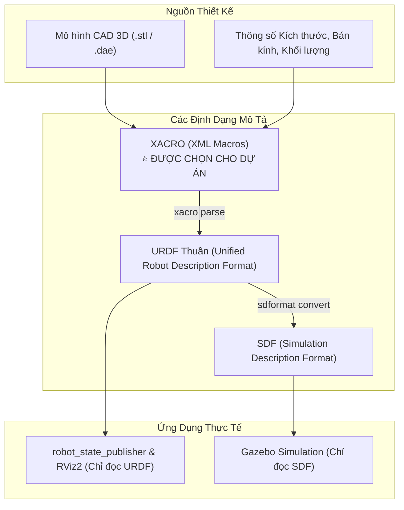
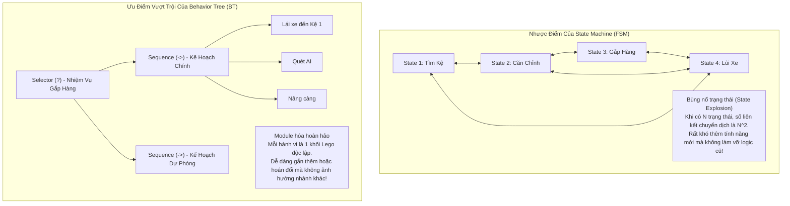
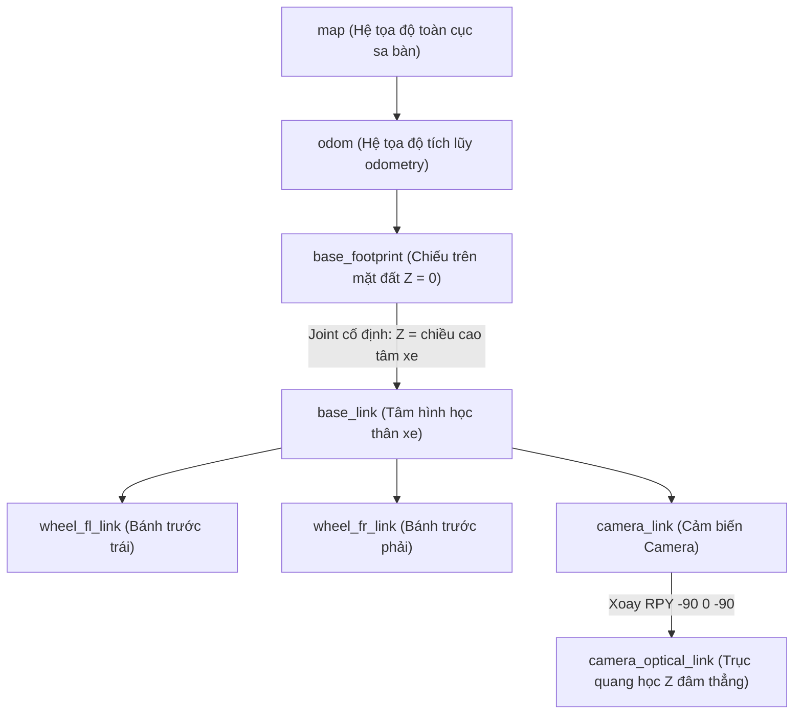
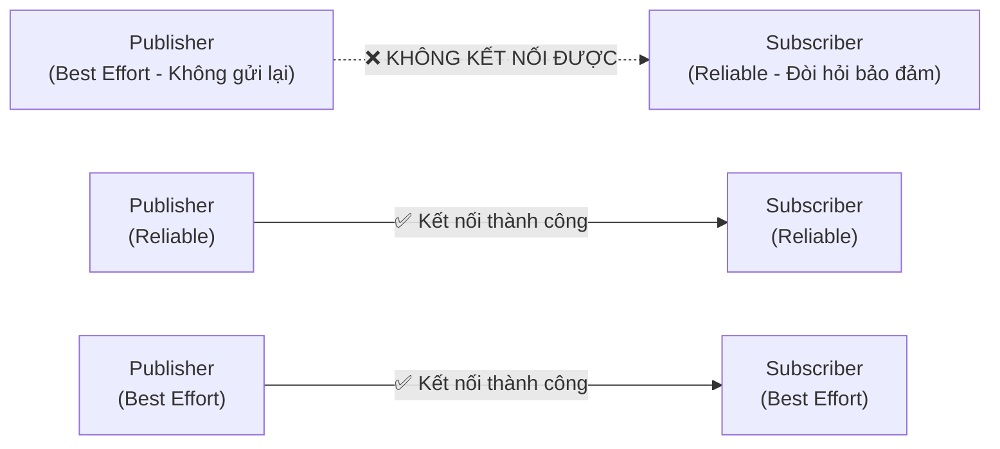

# 08. Chuyên Sâu Kiến Trúc: Description, Gazebo & Thiết Kế Common Node Chuẩn

> **Mục tiêu**: Giúp kỹ sư và thành viên mới nắm vững bản chất tầng sâu của các package cốt lõi (`*_description`, `*_gazebo`), hiểu rõ **"Tại sao chọn công nghệ này mà không chọn cái khác?"**, và biết cách tự tay xây dựng một **Common Node** chuẩn công nghiệp từ con số 0.

---

## 🧭 MỤC LỤC NỘI DUNG

1. [So Sánh Kiến Trúc: Tại Sao Dùng Công Nghệ Này Thay Vì Cái Khác?](#1-so-sánh-kiến-trúc-tại-sao-dùng-công-nghệ-này-thay-vì-cái-khác)
   - [1.1. Xacro vs URDF Thuần vs SDF](#11-xacro-vs-urdf-thuần-vs-sdf)
   - [1.2. Gazebo Fortress vs Gazebo Classic (11) vs Webots vs Isaac Sim](#12-gazebo-fortress-vs-gazebo-classic-11-vs-webots-vs-isaac-sim)
   - [1.3. ros_gz_bridge vs gazebo_ros_pkgs cũ vs ros2_control](#13-ros_gz_bridge-vs-gazebo_ros_pkgs-cũ-vs-ros2_control)
   - [1.4. Behavior Trees vs Finite State Machine (FSM) vs Procedural Script](#14-behavior-trees-vs-finite-state-machine-fsm-vs-procedural-script)
2. [Xây Dựng Package `*_description` Từng Bước (CAD $\to$ URDF/Xacro $\to$ RViz2)](#2-xây-dựng-package-_description-từng-bước-cad--urdfxacro--rviz2)
   - [2.1. Cấu trúc Chuẩn của một Gói Mô Tả Robot](#21-cấu-trúc-chuẩn-của-một-gói-mô-tả-robot)
   - [2.2. Hệ Tọa Độ & Cây Biến Đổi TF (REP-105: base_footprint vs base_link)](#22-hệ-tọa-độ--cây-biến-đổi-tf-rep-105-base_footprint-vs-base_link)
   - [2.3. Bảng Phân Loại 6 Khớp Cơ Khí (Joint Types)](#23-bảng-phân-loại-6-khớp-cơ-khí-joint-types)
   - [2.4. Bản Chất Vật Lý Quán Tính (Inertia Matrix) & Các Macro Chuẩn](#24-bản-chất-vật-lý-quán-tính-inertia-matrix--các-macro-chuẩn)
   - [2.5. Tối Ưu Lưới 3D: Visual Mesh vs Collision Mesh](#25-tối-ưu-lưới-3d-visual-mesh-vs-collision-mesh)
   - [2.6. Tích Hợp Cảm Biến & Thẻ `<gazebo>` trong Xacro](#26-tích-hợp-cảm-biến--thẻ-gazebo-trong-xacro)
3. [Xây Dựng Package `*_gazebo` Từng Bước (Simulation, World & Bridge)](#3-xây-dựng-package-_gazebo-từng-bước-simulation-world--bridge)
   - [3.1. Giải Phẫu Cấu Trúc File Thế Giới (`.sdf`)](#31-giải-phẫu-cấu-trúc-file-thế-giới-sdf)
   - [3.2. Cầu Nối Hai Chiều `ros_gz_bridge.yaml`](#32-cầu-nối-hai-chiều-ros_gz_bridgeyaml)
   - [3.3. Giải Phẫu Gazebo C++ System Plugin (`PlanarVelocityControl.cpp`)](#33-giải-phẫu-gazebo-c-system-plugin-planarvelocitycontrolcpp)
   - [3.4. Viết Launch File Mô Phỏng Chuẩn (`gazebo.launch.py`)](#34-viết-launch-file-mô-phỏng-chuẩn-gazebolaunchpy)
4. [Mẫu Thiết Kế Node Chuẩn Công Nghiệp (Common Node Architecture)](#4-mẫu-thiết-kế-node-chuẩn-công-nghiệp-common-node-architecture)
   - [4.1. Tại Sao Bắt Buộc Phải Kế Thừa Lớp `Node`?](#41-tại-sao-bắt-buộc-phải-kế-thừa-lớp-node)
   - [4.2. Quản Lý Tham Số Động (Dynamic Parameters)](#42-quản-lý-tham-số-động-dynamic-parameters)
   - [4.3. Timers vs `time.sleep()` (Hiểm Họa Treo Executor)](#43-timers-vs-timesleep-hiểm-họa-treo-executor)
   - [4.4. Cấu Hình Chất Lượng Dịch Vụ (QoS Policies) Chống Mất Gói](#44-cấu-hình-chất-lượng-dịch-vụ-qos-policies-chống-mất-gói)
   - [4.5. Các Mẫu An Toàn: Watchdog Timer & Graceful Shutdown](#45-các-mẫu-an-toàn-watchdog-timer--graceful-shutdown)
   - [4.6. Code Mẫu Boilerplate Python Node Đầy Đủ](#46-code-mẫu-boilerplate-python-node-đầy-đủ)

---

## ⚖️ 1. SO SÁNH KIẾN TRÚC: TẠI SAO DÙNG CÔNG NGHỆ NÀY THAY VÌ CÁI KHÁC?

Khi bắt đầu một dự án Robot, người mới thường thắc mắc: *"Tại sao phải dùng Xacro phức tạp mà không viết luôn file URDF?", "Tại sao không dùng Gazebo Classic cũ dễ cài hơn?", "Tại sao phải dùng Behavior Tree thay vì viết if-else?"*. Dưới đây là câu trả lời mang tính kỹ thuật sâu sắc.

---

### 1.1. Xacro vs URDF Thuần vs SDF



| Tiêu Chí So Sánh | URDF Thuần (`.urdf`) | SDF Thuần (`.sdf`) | **XACRO (`.urdf.xacro`) (Dự án chọn)** |
| :--- | :--- | :--- | :--- |
| **Tính Module Hóa** | ❌ Kém: Tất cả thân xe, bánh, cảm biến phải dồn vào 1 file duy nhất hàng nghìn dòng. | ❌ Kém: Khó chia nhỏ và tái sử dụng linh kiện giữa các robot. | ✅ **Xuất sắc**: Dùng `<xacro:include>` chia nhỏ theo từng cụm cơ khí (`chassis`, `wheel`, `lift`, `camera`). |
| **Tái Sử Dụng Mã (DRY)** | ❌ Không có: Xe 4 bánh phải copy-paste nguyên khối code bánh xe 4 lần. | ❌ Không có: Lặp lại code định nghĩa các link giống nhau. | ✅ **Có Macro (`<xacro:macro>`)**: Chỉ viết định nghĩa bánh xe 1 lần, gọi lại 4 lần với các tham số khác nhau. |
| **Biến Số & Phép Toán** | ❌ Không hỗ trợ: Mọi tọa độ phải tính tay ngoài giấy rồi điền số cứng (hardcode). | ❌ Không hỗ trợ tính toán toán học trong file. | ✅ **Hỗ trợ đầy đủ**: Khai báo biến `<xacro:property name="wheel_r" value="0.05"/>` và tính toán trực tiếp `${wheel_r * 2 * pi}`. |
| **Khả năng Tương Thích** | ⚠️ Chỉ dùng cho ROS (RViz2), Gazebo đọc bị hạn chế một số thuộc tính. | ⚠️ Chỉ dùng cho Gazebo, **ROS 2 và RViz2 không đọc được trực tiếp SDF**. | ✅ **Cầu nối hoàn hảo**: ROS 2 biên dịch Xacro thành URDF (cho RViz2) và Gazebo tự động chuyển đổi sang SDF (cho vật lý). |

> 📌 **Kết luận**: Dùng **Xacro** là chuẩn mực bắt buộc trong ROS 2 vì giúp giảm 70% số dòng code, loại bỏ lỗi lặp code (Don't Repeat Yourself - DRY) và cho phép sửa kích thước toàn bộ robot chỉ bằng cách đổi 1 biến số.

---

### 1.2. Gazebo Fortress vs Gazebo Classic (11) vs Webots vs Isaac Sim

| Tiêu Chí | Gazebo Classic (Gazebo 11) | Webots | NVIDIA Isaac Sim | **Gazebo Fortress / GZ Sim (Dự án chọn)** |
| :--- | :--- | :--- | :--- | :--- |
| **Kiến Trúc Phần Mềm** | Kiến trúc nguyên khối cũ (Monolithic), dễ bị nghẽn CPU khi nhiều cảm biến. | Gọn nhẹ, tập trung nghiên cứu học thuật. | Đồ họa siêu thực RTX Ray-Tracing, phục vụ AI & RL cao cấp. | **Kiến trúc phân tán Micro-services (Ignition Framework), Client-Server tách biệt hoàn toàn.** |
| **Hỗ Trợ ROS 2** | Dựa vào plugin `gazebo_ros_pkgs` cũ, hay xung đột luồng và crash khi ROS 2 tắt. | Hỗ trợ qua `webots_ros2`. | Hỗ trợ ROS 2 qua Omniverse Bridge. | **Hỗ trợ chính thức (Official Tier 1) trên ROS 2 Humble/Iron/Jazzy qua `ros_gz_bridge`.** |
| **Yêu Cầu Phần Cứng** | Trung bình (Chạy được trên CPU không GPU). | Nhẹ (Chạy tốt trên laptop phổ thông). | **Cực nặng**: Bắt buộc GPU NVIDIA RTX (VRAM $\ge 8\text{GB}$). | **Linh hoạt**: Chạy mượt trên GPU tầm trung và có chế độ Headless không giao diện cho máy ảo CI/CD. |
| **Tính Tương Lai** | ⛔ **Đã ngừng phát triển (End of Life - 2025)**. | Đang phát triển. | Đang phát triển mạnh. | 🚀 **Là nền tảng tương lai dài hạn của Open Robotics**. |

> 📌 **Kết luận**: **Gazebo Fortress** được chọn vì đây là thế hệ mô phỏng mới nhất, được Open Robotics thiết kế riêng cho ROS 2 với kiến trúc phân tách rõ ràng và độ ổn định cao.

---

### 1.3. `ros_gz_bridge` vs `gazebo_ros_pkgs` cũ vs `ros2_control`

1. **Tại sao không dùng `gazebo_ros_pkgs` kiểu cũ?**
   * Trong Gazebo Classic, ROS và Gazebo chạy chung trong một tiến trình (Process) qua các plugin C++ monolithic. Khi một bên gặp lỗi (ví dụ camera tràn RAM), cả hệ thống ROS 2 và Gazebo cùng sập theo.
   * `ros_gz_bridge` tách biệt Gazebo thành 1 process độc lập giao tiếp qua **Ignition Transport**, ROS 2 chạy process riêng qua **DDS**. Cầu nối trung gian độc lập hoàn toàn giúp hệ thống ổn định tuyệt đối.
2. **Khi nào dùng `ros_gz_bridge.yaml` và khi nào dùng `ros2_control`?**
   * **`ros_gz_bridge` (Đơn giản, Nhẹ, Nhanh - Dự án hiện tại dùng)**: Cấu hình nhanh qua file YAML, truyền trực tiếp Topic vận tốc `/cmd_vel` và nhận `/odom`, `/joint_states`. Rất thích hợp cho mô phỏng mức hệ thống, xe tự hành AGV/AMR, thuật toán AI và thi đấu Robot.
   * **`ros2_control` (Mức phần cứng sâu)**: Dùng khi bạn cần mô phỏng sâu đến vòng điều khiển PID dòng điện/mô-men xoắn của từng động cơ phần cứng hoặc điều khiển cánh tay robot nhiều bậc tự do cần giao tiếp qua giao thức thời gian thực (Real-time `hardware_interface`).

---

### 1.4. Behavior Trees vs Finite State Machine (FSM) vs Procedural Script



> 📌 **Kết luận**: Behavior Tree giải quyết triệt để sự phức tạp của FSM trong các bài toán robot tự hành:
> * **Composability (Tính ghép nối)**: Bạn có thể viết 1 Action `NavigateToPoseAction` và tái sử dụng nó ở 10 vị trí khác nhau trên cây mà không phải viết lại code.
> * **Reactive Execution**: Cây được duyệt (Tick) liên tục (ví dụ 20 lần/giây), nếu đang lái xe mà cảm biến phát hiện chướng ngại vật phía trước, cây có thể lập tức hủy hành vi hiện tại và kích hoạt nhánh tránh vật cản ngay trong 50ms.

---

## 🛠️ 2. XÂY DỰNG PACKAGE `*_description` TỪNG BƯỚC (CAD $\to$ URDF/Xacro $\to$ RViz2)

---

### 2.1. Cấu trúc Chuẩn của một Gói Mô Tả Robot
Một package `_description` chuẩn ROS 2 phải có cấu trúc như sau:

```text
myrobot_description/
├── CMakeLists.txt              # Chỉ thị cài đặt thư mục share
├── package.xml                 # Khai báo dependency: urdf, xacro, robot_state_publisher
├── launch/
│   └── display.launch.py       # Launch file kiểm tra TF & mô hình trên RViz2
├── meshes/                     # Chứa các file CAD 3D dạng STL hoặc DAE
│   ├── chassis.stl
│   └── wheel.stl
├── rviz/
│   └── display.rviz            # Cấu hình lưu góc nhìn và hiển thị của RViz2
└── urdf/
    ├── common_properties.xacro # Màu sắc vật liệu & Macro tính ma trận quán tính
    ├── chassis.xacro           # Khung gầm base_footprint & base_link
    ├── wheels.xacro            # Macro định nghĩa các bánh xe
    ├── sensors.xacro           # Gắn camera, lidar, imu
    └── myrobot.urdf.xacro      # Master file include toàn bộ các file trên
```

---

### 2.2. Hệ Tọa Độ & Cây Biến Đổi TF (REP-105: `base_footprint` vs `base_link`)

Một trong những sai lầm phổ biến nhất của người mới là **chỉ tạo `base_link` mà bỏ qua `base_footprint`**.



* **`base_footprint`**: Là điểm gốc của robot **nằm sát trên mặt phẳng sàn nhà ($Z = 0$)**. Thuật toán lập quỹ đạo chuyển động 2D (Nav2, Local Planner) bắt buộc sử dụng khung này để tính toán đường đi trên mặt phẳng mà không bị sai lệch cao độ.
* **`base_link`**: Là tâm hình học hoặc tâm khối lượng của thân xe (nằm cách mặt đất một khoảng bằng bán kính bánh xe $Z = R$).
* **Đoạn mã Xacro chuẩn để liên kết 2 khung này**:
```xml
  <!-- 1. Gốc tọa độ 2D mặt sàn -->
  <link name="base_footprint" />

  <!-- 2. Khớp nối cố định nâng lên tâm thân xe -->
  <joint name="base_footprint_joint" type="fixed">
    <parent link="base_footprint" />
    <child link="base_link" />
    <origin xyz="0 0 0.05" rpy="0 0 0" /> <!-- 0.05m là khoảng sáng gầm xe -->
  </joint>

  <!-- 3. Thân xe vật lý -->
  <link name="base_link">
    <!-- Visual, Collision, Inertial -->
  </link>
```

---

### 2.3. Bảng Phân Loại 6 Khớp Cơ Khí (Joint Types)

| Loại Khớp (`type`) | Bậc Tự Do (DOF) | Chiều Chuyển Động | Ứng Dụng Thực Tế Trong Robot |
| :--- | :---: | :--- | :--- |
| **`fixed`** | 0 | Không chuyển động (Khóa cứng). | Nối cảm biến (Camera, LiDAR), khung gầm phụ vào `base_link`. |
| **`continuous`** | 1 | Xoay tròn vô hạn quanh 1 trục (không có giới hạn góc). | Bánh xe dẫn động (Bánh vi sai, bánh Mecanum, bánh Omni). |
| **`revolute`** | 1 | Xoay có giới hạn góc (ví dụ: $-90^\circ \to +90^\circ$). | Khớp khuỷu tay robot, góc đánh lái bánh trước xe Ackermann. |
| **`prismatic`** | 1 | Trượt tịnh tiến dọc theo 1 trục (có giới hạn khoảng cách). | Cơ cấu trục nâng càng (Forklift), xi-lanh khí nén, ray trượt. |
| **`planar`** | 2 | Di chuyển tự do trên mặt phẳng 2D ($X, Y$). | Robot lướt trên đệm khí hoặc mô phỏng chuyển động mặt phẳng. |
| **`floating`** | 6 | Di chuyển và xoay tự do trong không gian 3D. | Mô phỏng Drone bay trên không hoặc tàu lặn dưới nước. |

---

### 2.4. Bản Chất Vật Lý Quán Tính (Inertia Matrix) & Các Macro Chuẩn

Trong mô phỏng Gazebo, động cơ vật lý (ODE, Bullet, DART) giải phương trình vi phân chuyển động Newton-Euler:
$$F = m \cdot a, \quad \tau = I \cdot \alpha + \omega \times (I \cdot \omega)$$
Nếu bạn để trống thẻ `<inertial>` hoặc đặt $I_{xx} = I_{yy} = I_{zz} = 0$, ma trận quán tính không khả nghịch, phương trình chia cho 0 sinh ra số `NaN`, **robot sẽ lập tức nổ tung hoặc biến mất khỏi màn hình mô phỏng**.

Dưới đây là 3 macro chuẩn được viết trong file `common_properties.xacro`:

```xml
<?xml version="1.0"?>
<robot xmlns:xacro="http://www.ros.org/wiki/xacro">

  <!-- 1. Quán tính Khối Hộp Chữ Nhật (Thân xe, Khối Pallet, Hộp pin) -->
  <xacro:macro name="box_inertia" params="m x y z">
    <inertial>
      <mass value="${m}"/>
      <inertia ixx="${(m/12.0) * (y*y + z*z)}" ixy="0.0" ixz="0.0"
               iyy="${(m/12.0) * (x*x + z*z)}" iyz="0.0"
               izz="${(m/12.0) * (x*x + y*y)}"/>
    </inertial>
  </xacro:macro>

  <!-- 2. Quán tính Khối Trụ Tròn (Bánh xe, Con lăn, Động cơ) -->
  <xacro:macro name="cylinder_inertia" params="m r h">
    <inertial>
      <mass value="${m}"/>
      <inertia ixx="${(m/12.0) * (3*r*r + h*h)}" ixy="0.0" ixz="0.0"
               iyy="${(m/12.0) * (3*r*r + h*h)}" iyz="0.0"
               izz="${(m/2.0) * (r*r)}"/>
    </inertial>
  </xacro:macro>

  <!-- 3. Quán tính Khối Cầu (Bánh bi cầu Caster) -->
  <xacro:macro name="sphere_inertia" params="m r">
    <inertial>
      <mass value="${m}"/>
      <inertia ixx="${(2.0/5.0) * m * r*r}" ixy="0.0" ixz="0.0"
               iyy="${(2.0/5.0) * m * r*r}" iyz="0.0"
               izz="${(2.0/5.0) * m * r*r}"/>
    </inertial>
  </xacro:macro>

</robot>
```

---

### 2.5. Tối Ưu Lưới 3D: Visual Mesh vs Collision Mesh

* **`<visual>` (Hiển thị)**: Dùng file mesh `.stl` hoặc `.dae` chi tiết cao xuất từ CAD để con người nhìn thấy robot đẹp mắt trên RViz2/Gazebo.
* **`<collision>` (Tính toán va chạm vật lý)**: **TUYỆT ĐỐI KHÔNG DÙNG MESH PHỨC TẠP CHO COLLISION**.
  * Nếu một bánh xe dùng collision mesh chứa 50,000 tam giác, động cơ vật lý phải kiểm tra va chạm của 50,000 mặt phẳng ở mỗi bước tính toán $1\text{ms} \to$ Làm tụt FPS mô phỏng nghiêm trọng.
  * **Giải pháp chuẩn**: Trong thẻ `<collision>`, luôn thay bằng hình học cơ bản như `<cylinder radius="..." length="..."/>` hoặc `<box size="..."/>`.

```xml
<link name="wheel_link">
  <!-- Hiển thị đẹp mắt -->
  <visual>
    <origin xyz="0 0 0" rpy="0 0 0"/>
    <geometry>
      <mesh filename="package://myrobot_description/meshes/wheel.stl" scale="0.001 0.001 0.001"/>
    </geometry>
    <material name="dark_gray"/>
  </visual>

  <!-- Va chạm hình học đơn giản: Cực nhẹ cho CPU -->
  <collision>
    <origin xyz="0 0 0" rpy="${pi/2} 0 0"/>
    <geometry>
      <cylinder radius="0.05" length="0.04"/>
    </geometry>
  </collision>

  <xacro:cylinder_inertia m="0.3" r="0.05" h="0.04"/>
</link>
```

---

### 2.6. Tích Hợp Cảm Biến & Thẻ `<gazebo>` trong Xacro

Để Gazebo nhận diện một Link là Cảm biến (Camera/Lidar), ta thêm thẻ `<gazebo reference="tên_link">`:

```xml
<gazebo reference="camera_link">
  <sensor name="rgb_camera" type="camera">
    <always_on>true</always_on>
    <update_rate>30.0</update_rate> <!-- Tần số phát 30 FPS -->
    <camera>
      <horizontal_fov>1.089</horizontal_fov> <!-- Góc nhìn ngang ~62.4 độ -->
      <image>
        <width>640</width>
        <height>480</height>
        <format>R8G8B8</format>
      </image>
      <clip>
        <near>0.05</near>
        <far>8.0</far>
      </clip>
    </camera>
    <topic>/camera/image_raw</topic>
  </sensor>
</gazebo>
```

---

## 🌐 3. XÂY DỰNG PACKAGE `*_gazebo` TỪNG BƯỚC (SIMULATION, WORLD & BRIDGE)

---

### 3.1. Giải Phẫu Cấu Trúc File Thế Giới (`.sdf`)
File thế giới `worlds/simple_arena.sdf` định nghĩa không gian vật lý:

```xml
<?xml version="1.0" ?>
<sdf version="1.8">
  <world name="simple_arena">
    
    <!-- 1. Cấu hình thời gian và động cơ vật lý -->
    <physics name="1ms" type="ignored">
      <max_step_size>0.001</max_step_size> <!-- Bước nhảy thời gian 1ms (1000Hz) -->
      <real_time_factor>1.0</real_time_factor> <!-- Chạy đúng thời gian thực 1:1 -->
    </physics>

    <!-- 2. Nguồn ánh sáng mặt trời -->
    <light type="directional" name="sun">
      <cast_shadows>true</cast_shadows>
      <pose>0 0 10 0 0 0</pose>
      <diffuse>0.8 0.8 0.8 1</diffuse>
      <specular>0.2 0.2 0.2 1</specular>
      <direction>-0.5 0.1 -0.9</direction>
    </light>

    <!-- 3. Mặt sàn sa bàn thi đấu -->
    <model name="ground_plane">
      <static>true</static> <!-- Vật thể tĩnh không bị trọng lực rơi -->
      <link name="link">
        <collision name="collision">
          <geometry><plane><normal>0 0 1</normal><size>10 10</size></plane></geometry>
        </collision>
        <visual name="visual">
          <geometry><plane><normal>0 0 1</normal><size>10 10</size></plane></geometry>
          <material>
            <ambient>0.8 0.8 0.8 1</ambient>
            <diffuse>0.8 0.8 0.8 1</diffuse>
          </material>
        </visual>
      </link>
    </model>

    <!-- 4. Nhúng các mô hình kệ và pallet hàng -->
    <include>
      <uri>model://storage_rack</uri>
      <name>rack_1</name>
      <pose>-1.65 0.64 0 0 0 0</pose>
    </include>

  </world>
</sdf>
```

---

### 3.2. Cầu Nối Hai Chiều `ros_gz_bridge.yaml`
Để ROS 2 và Gazebo hiểu nhau, file `config/ros_gz_bridge.yaml` định nghĩa danh sách các topic:

```yaml
# 1. Đồng bộ thời gian mô phỏng (Gazebo -> ROS 2)
- ros_topic_name: "/clock"
  gz_topic_name: "/clock"
  ros_type_name: "rosgraph_msgs/msg/Clock"
  gz_type_name: "ignition.msgs.Clock"
  direction: GZ_TO_ROS

# 2. Lệnh vận tốc điều khiển xe (ROS 2 -> Gazebo)
- ros_topic_name: "/cmd_vel"
  gz_topic_name: "/cmd_vel"
  ros_type_name: "geometry_msgs/msg/Twist"
  gz_type_name: "ignition.msgs.Twist"
  direction: ROS_TO_GZ

# 3. Tọa độ phản hồi Odometry (Gazebo -> ROS 2)
- ros_topic_name: "/odom"
  gz_topic_name: "/odom"
  ros_type_name: "nav_msgs/msg/Odometry"
  gz_type_name: "ignition.msgs.Odometry"
  direction: GZ_TO_ROS

# 4. Luồng ảnh Camera (Gazebo -> ROS 2)
- ros_topic_name: "/camera/image_raw"
  gz_topic_name: "/camera/image_raw"
  ros_type_name: "sensor_msgs/msg/Image"
  gz_type_name: "ignition.msgs.Image"
  direction: GZ_TO_ROS
```

---

### 3.3. Giải Phẫu Gazebo C++ System Plugin (`PlanarVelocityControl.cpp`)
Plugin này kế thừa 2 interface của Gazebo: `ISystemConfigure` (khởi tạo) và `ISystemPreUpdate` (chạy mỗi chu kỳ vật lý):

```cpp
namespace robot0_gazebo
{
class PlanarVelocityControl : public ignition::gazebo::System,
                             public ignition::gazebo::ISystemConfigure,
                             public ignition::gazebo::ISystemPreUpdate
{
  void Configure(const ignition::gazebo::Entity &_entity, ...) override
  {
    // Lấy đối tượng link gốc của robot và đăng ký nhận topic /cmd_vel
    this->canonicalLink = ignition::gazebo::Link(this->model.CanonicalLink(_ecm));
    this->node.Subscribe("/cmd_vel", &PlanarVelocityControl::OnCmdVel, this);
  }

  void PreUpdate(const ignition::gazebo::UpdateInfo &_info, ...) override
  {
    if (_info.paused) return;
    std::lock_guard<std::mutex> lock(this->mutex);

    // Áp đặt vận tốc tịnh tiến X, Y và vận tốc quay Yaw Z theo lệnh /cmd_vel
    // Giữ nguyên vận tốc Z hiện tại để trọng lực vẫn kéo xe chạm đất tự nhiên
    ignition::math::Vector3d cmdLin(this->targetLinear.X(), this->targetLinear.Y(), currentLinVel.Z());
    this->canonicalLink.SetLinearVelocity(_ecm, cmdLin);

    ignition::math::Vector3d cmdAng(currentAngVel.X(), currentAngVel.Y(), this->targetAngular.Z());
    this->canonicalLink.SetAngularVelocity(_ecm, cmdAng);
  }
};
}
```

---

## 🧩 4. MẪU THIẾT KẾ NODE CHUẨN CÔNG NGHIỆP (COMMON NODE ARCHITECTURE)

---

### 4.1. Tại Sao Bắt Buộc Phải Kế Thừa Lớp `Node`?
```python
# ❌ CÁCH VIẾT SAI (Procedural Script):
import rclpy
rclpy.init()
node = rclpy.create_node('bad_node')
# Khó quản lý biến, không thể đóng gói thành thư viện, không mở rộng được.

# ✅ CÁCH VIẾT CHUẨN (Object-Oriented Node):
from rclpy.node import Node
class MyCommonNode(Node):
    def __init__(self):
        super().__init__('my_common_node')
        # Tự đóng gói tài nguyên, quản lý vòng đời và đa luồng an toàn
```

---

### 4.2. Quản Lý Tham Số Động (Dynamic Parameters)
Tuyệt đối không hardcode các hệ số như tốc độ tối đa, ngưỡng khoảng cách. Khai báo tham số giúp bạn có thể thay đổi cấu hình trực tiếp từ file `.yaml` hoặc lệnh `ros2 param set` mà không cần biên dịch lại code:

```python
# Khai báo tham số kèm giá trị mặc định
self.declare_parameter('max_speed', 0.5)
self.declare_parameter('wheel_radius', 0.05)

# Đọc giá trị
self.max_speed = self.get_parameter('max_speed').value
```

---

### 4.3. Timers vs `time.sleep()` (Hiểm Họa Treo Executor)
* **Tuyệt đối không dùng `time.sleep()` bên trong hàm callback**.
* Trong ROS 2, một `SingleThreadedExecutor` chịu trách nhiệm quay vòng xử lý tất cả các callback. Nếu bạn gọi `time.sleep(1.0)` trong một subscriber, **toàn bộ các subscriber và timer khác của Node sẽ bị đóng băng (block) hoàn toàn trong 1 giây đó**.
* **Giải pháp chuẩn**: Luôn sử dụng `self.create_timer(period, self.timer_callback)` để định kỳ chạy logic không nghẽn.

---

### 4.4. Cấu Hình Chất Lượng Dịch Vụ (QoS Policies) Chống Mất Gói

Một trong những lỗi phổ biến nhất khiến Subscriber không nhận được tin nhắn là **lệch cấu hình QoS giữa Publisher và Subscriber**:



* **Dữ liệu điều khiển quan trọng (`/cmd_vel`, `/goal_pose`)**: Dùng `ReliabilityPolicy.RELIABLE` (đảm bảo 100% tin nhắn đến đích).
* **Dữ liệu cảm biến tần số cao (`/camera/image_raw`, `/scan`, `/odom`)**: Dùng `ReliabilityPolicy.BEST_EFFORT` hoặc `qos_profile_sensor_data` (ưu tiên độ trễ thấp, mất 1 frame ảnh không sao, không cần gửi lại).
* **Dữ liệu bản đồ/tọa độ tĩnh (`/map`, `/arena/coordinates`)**: Dùng `DurabilityPolicy.TRANSIENT_LOCAL` (Latched Topic - node mới bật lên vẫn nhận được dữ liệu cũ đã phát trước đó).

---

### 4.5. Các Mẫu An Toàn: Watchdog Timer & Graceful Shutdown

1. **Watchdog Timer (Chó canh an toàn)**:
   * Nếu node điều khiển bị mất kết nối mạng hoặc máy tính điều khiển từ xa bị sập nguồn, xe thật có thể sẽ tiếp tục giữ vận tốc cũ và lao vào tường.
   * Node phải lưu mốc thời gian `last_cmd_time = time.time()`. Trong Timer loop, nếu `time.time() - last_cmd_time > 0.5s`, tự động phanh dừng xe ngay lập tức.
2. **Graceful Shutdown (Tắt máy an toàn)**:
   * Khi người dùng bấm `Ctrl+C`, Node phải bắt tín hiệu và phát lệnh `linear.x = 0, angular.z = 0` trước khi tiến trình bị hủy hoàn toàn.

---

### 4.6. Code Mẫu Boilerplate Python Node Đầy Đủ (Template Sẵn Sàng Kế Thừa)

Bạn có thể sao chép trực tiếp mẫu code dưới đây để bắt đầu viết bất kỳ Node chức năng mới nào:

```python
#!/usr/bin/env python3
# -*- coding: utf-8 -*-

'''
Mẫu Node ROS 2 Chuẩn Công Nghiệp (Production-Grade Common Node Template).
Bao gồm: Dynamic Parameters, QoS Sensor Profile, Thread-Safe Locks, Watchdog Safety & Cleanup.
'''

import threading
import time
import rclpy
from rclpy.node import Node
from rclpy.qos import QoSProfile, ReliabilityPolicy, HistoryPolicy
from geometry_msgs.msg import Twist
from std_msgs.msg import String, Float32


class CommonRobotNode(Node):
    def __init__(self):
        super().__init__('common_robot_node')

        # 1. Khai báo Parameters & Đọc cấu hình
        self.declare_parameter('control_rate_hz', 50.0)
        self.declare_parameter('watchdog_timeout_sec', 0.5)
        self.declare_parameter('max_linear_speed', 1.0)

        self.control_rate = float(self.get_parameter('control_rate_hz').value)
        self.watchdog_timeout = float(self.get_parameter('watchdog_timeout_sec').value)
        self.max_speed = float(self.get_parameter('max_linear_speed').value)

        # 2. Khởi tạo Khóa Đồng Bộ (Thread Lock) & Trạng Thái Nội Tại
        self._state_lock = threading.Lock()
        self.last_heartbeat_time = time.time()
        self.current_target_speed = 0.0

        # 3. Cấu hình QoS cho Cảm Biến & Điều Khiển
        sensor_qos = QoSProfile(
            reliability=ReliabilityPolicy.BEST_EFFORT,
            history=HistoryPolicy.KEEP_LAST,
            depth=1
        )

        # 4. Tạo Publishers & Subscribers
        self.cmd_pub = self.create_publisher(Twist, '/cmd_vel', 10)
        self.status_pub = self.create_publisher(String, '/robot_status', 10)

        self.sub_feedback = self.create_subscription(
            Float32,
            '/sensor_feedback',
            self.sensor_callback,
            sensor_qos
        )

        # 5. Tạo Vòng Lặp Điều Khiển (Timer Loop)
        timer_period = 1.0 / self.control_rate
        self.timer = self.create_timer(timer_period, self.control_loop)

        self.get_logger().info(f'Node [{self.get_name()}] đã khởi động thành công ở tần số {self.control_rate}Hz!')

    def sensor_callback(self, msg: Float32):
        '''Callback nhận dữ liệu cảm biến (Non-blocking).'''
        with self._state_lock:
            self.current_target_speed = float(msg.data)
            self.last_heartbeat_time = time.time()

    def control_loop(self):
        '''Vòng lặp điều khiển chính chạy tuần hoàn theo Timer.'''
        now = time.time()

        with self._state_lock:
            time_since_last_msg = now - self.last_heartbeat_time
            target_v = self.current_target_speed

        # Watchdog Safety: Tự động phanh nếu quá thời gian timeout
        cmd = Twist()
        if time_since_last_msg > self.watchdog_timeout:
            cmd.linear.x = 0.0
            cmd.angular.z = 0.0
            self.get_logger().warn('Watchdog kích hoạt: Mất tín hiệu điều khiển -> Tự động dừng xe!', throttle_duration_sec=2.0)
        else:
            # Giới hạn tốc độ an toàn (Clamping)
            cmd.linear.x = max(-self.max_speed, min(self.max_speed, target_v))
            cmd.angular.z = 0.0

        self.cmd_pub.publish(cmd)

    def stop_robot(self):
        '''Phát lệnh dừng khẩn cấp trước khi tắt Node.'''
        stop_cmd = Twist()
        self.cmd_pub.publish(stop_cmd)
        self.get_logger().info('Đã phát lệnh dừng an toàn (0.0 m/s) trước khi tắt tiến trình.')


def main(args=None):
    rclpy.init(args=args)
    node = CommonRobotNode()

    try:
        rclpy.spin(node)
    except KeyboardInterrupt:
        node.get_logger().info('Nhận tín hiệu ngắt bàn phím (Ctrl+C).')
    finally:
        node.stop_robot()
        node.destroy_node()
        rclpy.shutdown()


if __name__ == '__main__':
    main()
```

---

> 💡 **Tóm Tắt Khắc Cốt Ghi Tâm**:
> 1. Dùng **Xacro** để mô hình hóa robot thành các module cơ khí độc lập, dùng macro cho quán tính và bánh xe.
> 2. Luôn định nghĩa cả **`base_footprint`** (trên mặt sàn) và **`base_link`** (trọng tâm xe) theo chuẩn REP-105.
> 3. Cấu hình **`ros_gz_bridge`** qua file YAML và chú ý đồng bộ đúng chuẩn **QoS**.
> 4. Trong Node ROS 2, **luôn dùng Timer thay vì `time.sleep()`**, quản lý tham số động qua Parameter và cài đặt Watchdog an toàn cho mọi cơ cấu chuyển động.
