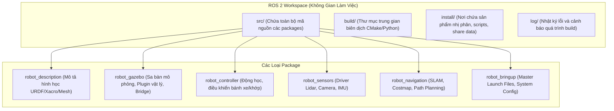
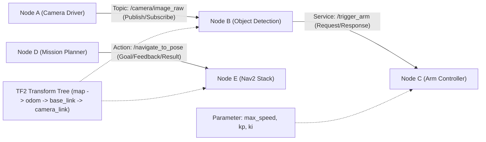
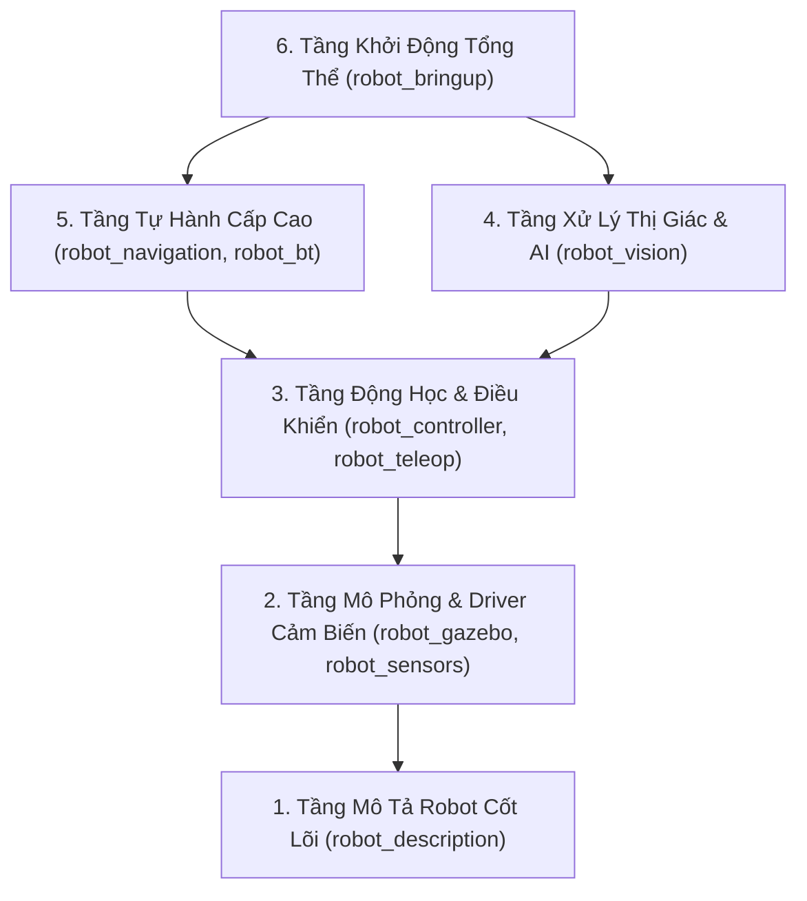
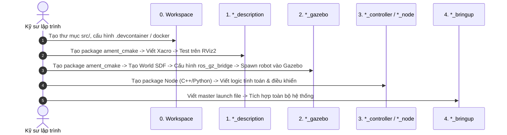

# 09. Hướng Dẫn Từng Bước Xây Dựng Dự Án ROS 2 & Cấu Trúc Gói Chuẩn (From Scratch)

> **Mục tiêu tài liệu**: 
> 1. Phân tích tường tận các **thành phần cốt lõi** cấu thành nên một dự án ROS 2 hoàn chỉnh.
> 2. Cung cấp quy trình xây dựng dự án **từng bước (Step-by-Step Roadmap)** từ thư mục trống đến khi robot vận hành.
> 3. Hướng dẫn chi tiết cách dựng package **Robot Description** (`*_description`) và package **Gazebo Simulation** (`*_gazebo`): *Cần làm gì trước, làm gì sau, cái gì Bắt buộc (Mandatory) - Tùy chọn (Optional) - Nên thêm vào (Recommended)*.
> 4. Cung cấp hai ví dụ hoàn chỉnh về gói **"Hello World"** cơ bản nhất bằng cả **C++ (`ament_cmake`)** và **Python (`ament_python`)**, giải thích chi tiết từng dòng trong file cấu hình build.

---

## 🧭 MỤC LỤC NỘI DUNG

1. [Phân Tích Các Thành Phần Cơ Bản Của Một Dự Án ROS 2](#1-phân-tích-các-thành-phần-cơ-bản-của-một-dự-án-ros-2)
   - [1.1. Không Gian Làm Việc (ROS 2 Workspace) & Cơ Chế Overlay/Underlay](#11-không-gian-làm-việc-ros-2-workspace--cơ-chế-overlayunderlay)
   - [1.2. Đơn Vị Tổ Chức Mã Nguồn: Package & Hai Kiểu Build](#12-đơn-vị-tổ-chức-mã-nguồn-package--hai-kiểu-build)
   - [1.3. Các Thực Thể Runtime Cốt Lõi (Nodes, Topics, Services, Actions, Params, TF2)](#13-các-thực-thể-runtime-cốt-lõi-nodes-topics-services-actions-params-tf2)
   - [1.4. Hệ Sinh Thái Các Gói Trong Dự Án Robot Hoàn Chỉnh (Kiến Trúc 6 Lớp)](#14-hệ-sinh-thái-các-gói-trong-dự-án-robot-hoàn-chỉnh-kiến-trúc-6-lớp)
2. [Quy Trình Chuẩn Xây Dựng Dự Án ROS 2 Từng Bước](#2-quy-trình-chuẩn-xây-dựng-dự-án-ros-2-từng-bước)
3. [Xây Dựng Package Robot Description (`*_description`)](#3-xây-dựng-package-robot-description-_description)
   - [3.1. Cấu Trúc Thư Mục Chuẩn](#31-cấu-trúc-thư-mục-chuẩn)
   - [3.2. Quy Trình Triển Khai Từng Bước](#32-quy-trình-triển-khai-từng-bước)
   - [3.3. Phân Loại: Bắt Buộc - Tùy Chọn - Nên Thêm Vào](#33-phân-loại-bắt-buộc---tùy-chọn---nên-thêm-vào)
4. [Xây Dựng Package Gazebo Simulation (`*_gazebo` / `*_sim`)](#4-xây-dựng-package-gazebo-simulation-_gazebo--_sim)
   - [4.1. Cấu Trúc Thư Mục Chuẩn](#41-cấu-trúc-thư-mục-chuẩn)
   - [4.2. Quy Trình Triển Khai Từng Bước](#42-quy-trình-triển-khai-từng-bước)
   - [4.3. Phân Loại: Bắt Buộc - Tùy Chọn - Nên Thêm Vào](#43-phân-loại-bắt-buộc---tùy-chọn---nên-thêm-vào)
5. [Ví Dụ Thực Hành: Package "Hello World" Cơ Bản Nhất](#5-ví-dụ-thực-hành-package-hello-world-cơ-bản-nhất)
   - [5.1. Package C++ Chuẩn (`ament_cmake`)](#51-package-c-chuẩn-ament_cmake)
   - [5.2. Package Python Chuẩn (`ament_python`)](#52-package-python-chuẩn-ament_python)
   - [5.3. Bảng So Sánh Lựa Chọn C++ vs Python](#53-bảng-so-sánh-lựa-chọn-c-vs-python)
6. [Bảng Checklist Toàn Diện Khi Bắt Đầu Dự Án](#6-bảng-checklist-toàn-diện-khi-bắt-đầu-dự-án)

---

## 🏗️ 1. PHÂN TÍCH CÁC THÀNH PHẦN CƠ BẢN CỦA MỘT DỰ ÁN ROS 2

Một dự án ROS 2 không phải là một file mã nguồn đơn lẻ mà là một hệ thống phân tán (Distributed System) gồm nhiều module phối hợp với nhau thông qua mạng truyền thông DDS (Data Distribution Service).



---

### 1.1. Không Gian Làm Việc (ROS 2 Workspace) & Cơ Chế Overlay/Underlay

Một Workspace là một thư mục gốc chứa các gói ROS 2 mà bạn đang phát triển. Workspace tiêu chuẩn luôn gồm 4 thư mục chính:

1. **`src/` (Source Space):**
   * Nơi duy nhất bạn viết mã nguồn, tạo packages, thêm file URDF, mesh, config, launch.
   * Đây là thư mục duy nhất cần được quản lý bằng Git (Version Control).
2. **`build/` (Build Space):**
   * Chứa các file cấu hình và nhị phân trung gian được tạo ra bởi `cmake`, `make`, hoặc `setuptools`.
   * Thư mục này do công cụ `colcon` tự động tạo ra và **không được commit lên Git**.
3. **`install/` (Install Space):**
   * Chứa kết quả sau cùng sau khi build: file nhị phân thực thi, thư viện chia sẻ (`.so`), scripts Python, file cấu hình, mesh, file launch đã được cài đặt vào đúng đường dẫn của hệ thống.
   * Để môi trường nhận biết các gói trong workspace, ta phải nạp lệnh: `source install/setup.bash`.
4. **`log/` (Logging Space):**
   * Lưu lại chi tiết log của từng lượt chạy lệnh `colcon build` để gỡ lỗi khi biên dịch thất bại.

#### Cơ chế Underlay vs Overlay:
* **Underlay (Tầng nền tảng):** Là môi trường ROS 2 mặc định cài đặt từ hệ điều hành (`/opt/ros/jazzy/` hoặc `/opt/ros/humble/`). Khi bạn chạy `source /opt/ros/<distro>/setup.bash`, hệ thống nạp các gói chuẩn (`rclcpp`, `rclpy`, `nav2`, `ros_gz_sim`,...).
* **Overlay (Tầng ứng dụng đè lên):** Là workspace cá nhân của bạn. Khi bạn chạy `source install/setup.bash`, hệ thống sẽ ưu tiên các gói trong workspace của bạn trước. Nếu có gói trùng tên với Underlay, ROS 2 sẽ dùng phiên bản trong Overlay.

---

### 1.2. Đơn Vị Tổ Chức Mã Nguồn: Package & Hai Kiểu Build

Package là đơn vị đóng gói nhỏ nhất có thể build và chia sẻ được trong ROS 2. Mỗi package **bắt buộc** phải có một file `package.xml` để khai báo danh tính (tên, phiên bản, tác giả, giấy phép, dependencies).

Tùy vào mục đích sử dụng, ROS 2 chia làm 2 kiểu build chính:

| Tiêu chí | `ament_cmake` | `ament_python` |
| :--- | :--- | :--- |
| **Ngôn ngữ chính** | C++, C, hoặc Gói tài nguyên thuần (URDF, Launch, Meshes) | Python thuần (`.py`) |
| **Công cụ cấu hình** | `CMakeLists.txt` + `package.xml` | `setup.py` + `setup.cfg` + `package.xml` |
| **Hiệu năng & Tài nguyên** | Cực nhanh, tiêu tốn ít CPU/RAM, tối ưu cho xử lý ảnh, Lidar, điều khiển thời gian thực | Viết nhanh, linh hoạt, phù hợp AI/ML, logic cấp cao, Behavior Tree |
| **Cơ chế cập nhật code** | Bắt buộc `colcon build` sau mỗi lần sửa mã nguồn | Dùng `colcon build --symlink-install` để sửa code chạy ngay không cần build lại |

---

### 1.3. Các Thực Thể Runtime Cốt Lõi

Khi một hệ thống ROS 2 hoạt động, các phần tử sau sẽ tương tác theo mô hình tính toán đồ thị (Computation Graph):



1. **Node (Nút xử lý):** Tiến trình độc lập thực hiện một nhiệm vụ chuyên biệt (đọc cảm biến, xử lý ảnh, tính động học).
2. **Topic (Kênh truyền thông điệp 1 chiều):** Giao tiếp bất đồng bộ n-n (Publish / Subscribe) dạng dòng dữ liệu liên tục (`/cmd_vel`, `/scan`, `/odom`).
3. **Service (Dịch vụ 2 chiều đồng bộ):** Giao tiếp dạng Hỏi - Đáp (Request / Response 1-1), dùng cho các tác vụ ngắn hạn (ví dụ: bật/tắt động cơ, reset odometry).
4. **Action (Hành động có phản hồi tiến độ):** Dành cho các tác vụ tốn thời gian (Goal $\to$ Feedback $\to$ Result), có khả năng hủy lệnh giữa chừng (ví dụ: di chuyển robot tới tọa độ $(x, y)$).
5. **Parameter (Tham số cấu hình):** Các biến số có thể đọc/ghi từ ngoài mà không cần sửa code (ví dụ: `wheel_radius`, `max_linear_velocity`, `pid_kp`).
6. **TF2 (Cây biến đổi tọa độ không gian):** Quản lý quan hệ vị trí và hướng xoay (Transform) giữa các bộ phận của robot và thế giới thực theo thời gian.

---

### 1.4. Hệ Sinh Thái Các Gói Trong Dự Án Robot Hoàn Chỉnh (Kiến Trúc 6 Lớp)

Một dự án robot chuyên nghiệp thường được chia thành 6 lớp package tách biệt:



1. **`*_description` (Model Layer):** Định nghĩa cấu trúc hình học, khớp nối, ma trận quán tính, vị trí gắn cảm biến và file 3D mesh của robot.
2. **`*_gazebo` / `*_sim` (Simulation Layer):** Môi trường vật lý 3D, sa bàn bản đồ thế giới, cấu hình cầu nối tín hiệu giữa Gazebo và ROS 2 (`ros_gz_bridge`).
3. **`*_controller` & `*_teleop` (Control Layer):** Tính toán ma trận động học (Forward/Inverse Kinematics), chuyển lệnh vận tốc `/cmd_vel` thành tốc độ từng bánh xe, điều khiển bàn phím/tay cầm Gamepad.
4. **`*_sensors` & `*_vision` (Perception Layer):** Driver phần cứng thực tế (RPLidar, Realsense Camera, IMU) và các node xử lý AI/CV (YOLO, OpenCV, nhận diện ArUco).
5. **`*_navigation` (Autonomy Layer):** Bản đồ hóa SLAM, định vị AMCL, lập kế hoạch quỹ đạo di chuyển (Nav2) và cây hành vi ra quyết định (Behavior Trees).
6. **`*_bringup` (Integration Layer):** Chứa các file launch tổng hợp để khởi động toàn bộ hệ thống bằng một dòng lệnh duy nhất.

---

## 🚀 2. QUY TRÌNH CHUẨN XÂY DỰNG DỰ ÁN ROS 2 TỪNG BƯỚC

Để không bị bối rối hoặc mất phương hướng, bạn hãy tuân thủ quy trình 5 bước theo sơ đồ sau:



---

## 🤖 3. XÂY DỰNG PACKAGE ROBOT DESCRIPTION (`*_description`)

Package description là **viên gạch đầu tiên** của bất kỳ dự án robot nào. Nó cung cấp mô hình hình học toán học mà tất cả các package khác (RViz, Gazebo, Nav2, MoveIt) đều phụ thuộc vào.

---

### 3.1. Cấu Trúc Thư Mục Chuẩn

Package này **bắt buộc** dùng kiểu build `ament_cmake` vì nó thuần túy chứa các tài nguyên XML/Xacro, 3D Mesh và Launch files:

```text
robot0_description/
├── CMakeLists.txt              # Cài đặt các thư mục urdf, meshes, launch, rviz vào share/
├── package.xml                 # Khai báo depend: urdf, xacro, robot_state_publisher
├── urdf/                       # Thư mục chứa toàn bộ mã nguồn mô tả robot
│   ├── robot.urdf.xacro        # [File gốc] Gom toàn bộ các file con lại
│   ├── common_properties.xacro # Khai báo vật liệu màu sắc, hằng số toán học (PI)
│   ├── inertial_macros.xacro   # Các công thức tính ma trận quán tính (hộp, trụ, cầu)
│   ├── robot_core.xacro        # Định nghĩa khung gầm (chassis) và các bánh xe
│   └── sensors/                # Định nghĩa các link/joint của cảm biến
│       ├── lidar.xacro
│       ├── camera.xacro
│       └── imu.xacro
├── meshes/                     # [Tùy chọn] Chứa file CAD 3D (.stl, .dae, .obj)
│   ├── visual/                 # Mesh đẹp mắt, đầy đủ chi tiết cho hiển thị
│   │   ├── chassis.dae
│   │   └── wheel.stl
│   └── collision/              # Mesh tối giản (low-poly) cho tính toán va chạm
│       ├── chassis_col.stl
│       └── wheel_col.stl
├── rviz/                       # Cấu hình hiển thị RViz2 lưu sẵn
│   └── view_robot.rviz
└── launch/                     # File launch để kiểm tra mô hình độc lập
    └── display.launch.py
```

---

### 3.2. Quy Trình Triển Khai Từng Bước

Khi xây dựng package `*_description`, hãy thực hiện chính xác theo thứ tự sau:

#### 🔹 Bước 1: Khởi tạo package
Mở terminal tại thư mục gốc workspace:
```bash
ros2 pkg create --build-type ament_cmake robot0_description \
  --dependencies urdf xacro robot_state_publisher joint_state_publisher_gui rviz2
```

#### 🔹 Bước 2: Viết các macro tính quán tính (`urdf/inertial_macros.xacro`)
Vật lý Gazebo **không thể mô phỏng** nếu thiếu thẻ `<inertial>`. Hãy định nghĩa trước các macro tính khối lượng và mô-men quán tính:
```xml
<?xml version="1.0"?>
<robot xmlns:xacro="http://www.ros.org/wiki/xacro">
  <!-- Macro tính quán tính khối hộp (Box) -->
  <xacro:macro name="inertial_box" params="mass x y z *origin">
    <inertial>
      <xacro:insert_block name="origin"/>
      <mass value="${mass}" />
      <inertia ixx="${(1/12) * mass * (y*y + z*z)}" ixy="0.0" ixz="0.0"
               iyy="${(1/12) * mass * (x*x + z*z)}" iyz="0.0"
               izz="${(1/12) * mass * (x*x + y*y)}" />
    </inertial>
  </xacro:macro>

  <!-- Macro tính quán tính khối trụ (Cylinder - Bánh xe) -->
  <xacro:macro name="inertial_cylinder" params="mass length radius *origin">
    <inertial>
      <xacro:insert_block name="origin"/>
      <mass value="${mass}" />
      <inertia ixx="${(1/12) * mass * (3*radius*radius + length*length)}" ixy="0.0" ixz="0.0"
               iyy="${(1/12) * mass * (3*radius*radius + length*length)}" iyz="0.0"
               izz="${(1/2) * mass * (radius*radius)}" />
    </inertial>
  </xacro:macro>
</robot>
```

#### 🔹 Bước 3: Định nghĩa trục gốc chuẩn REP-105 (`urdf/robot_core.xacro`)
Luôn luôn bắt đầu cây tọa độ bằng `base_footprint` (hình chiếu tiếp đất) và `base_link` (tâm cơ khí của robot):
```xml
<?xml version="1.0"?>
<robot xmlns:xacro="http://www.ros.org/wiki/xacro">
  <!-- 1. BASE FOOTPRINT (Nằm trên mặt đất z = 0) -->
  <link name="base_footprint"/>

  <joint name="base_footprint_joint" type="fixed">
    <parent link="base_footprint"/>
    <child link="base_link"/>
    <origin xyz="0 0 0.05" rpy="0 0 0"/> <!-- Nâng lên bằng bán kính bánh xe -->
  </joint>

  <!-- 2. BASE LINK (Thân robot) -->
  <link name="base_link">
    <visual>
      <origin xyz="0 0 0.075" rpy="0 0 0"/>
      <geometry>
        <box size="0.4 0.3 0.15"/>
      </geometry>
      <material name="blue">
        <color rgba="0.1 0.2 0.8 1.0"/>
      </material>
    </visual>
    <collision>
      <origin xyz="0 0 0.075" rpy="0 0 0"/>
      <geometry>
        <box size="0.4 0.3 0.15"/>
      </geometry>
    </collision>
    <xacro:inertial_box mass="5.0" x="0.4" y="0.3" z="0.15">
      <origin xyz="0 0 0.075" rpy="0 0 0"/>
    </xacro:inertial_box>
  </link>
</robot>
```

#### 🔹 Bước 4: Viết file tổng hợp (`urdf/robot.urdf.xacro`)
```xml
<?xml version="1.0"?>
<robot xmlns:xacro="http://www.ros.org/wiki/xacro" name="my_robot">
  <!-- Nạp các file thành phần -->
  <xacro:include filename="common_properties.xacro" />
  <xacro:include filename="inertial_macros.xacro" />
  <xacro:include filename="robot_core.xacro" />
  <xacro:include filename="sensors/lidar.xacro" />
  <xacro:include filename="sensors/camera.xacro" />
</robot>
```

#### 🔹 Bước 5: Cấu hình `CMakeLists.txt` cài đặt tài nguyên
Đảm bảo các thư mục `urdf`, `meshes`, `rviz`, `launch` được copy vào thư mục `install/`:
```cmake
cmake_minimum_required(VERSION 3.8)
project(robot0_description)

find_package(ament_cmake REQUIRED)

# Cài đặt toàn bộ thư mục tài nguyên vào share/robot0_description
install(
  DIRECTORY urdf meshes rviz launch
  DESTINATION share/${PROJECT_NAME}
)

ament_package()
```

#### 🔹 Bước 6: Viết Launch File kiểm tra mô hình trên RViz2 (`launch/display.launch.py`)
Launch file này khởi chạy 3 node cốt lõi:
1. `robot_state_publisher`: Đọc Xacro, chuyển thành URDF chuỗi XML và phát tán lên Topic `/robot_description` cùng cây tọa độ `/tf`.
2. `joint_state_publisher_gui`: Mở cửa sổ trượt (sliders) cho phép bạn kéo thử các khớp quay/tịnh tiến của robot.
3. `rviz2`: Trực quan hóa hình ảnh 3D và trục tọa độ.

```python
import os
from ament_index_python.packages import get_package_share_directory
from launch import LaunchDescription
from launch_ros.actions import Node
import xacro

def generate_launch_description():
    pkg_path = get_package_share_directory('robot0_description')
    xacro_file = os.path.join(pkg_path, 'urdf', 'robot.urdf.xacro')
    rviz_config_file = os.path.join(pkg_path, 'rviz', 'view_robot.rviz')

    # Chuyển đổi xacro thành URDF XML
    robot_description_config = xacro.process_file(xacro_file).toxml()

    return LaunchDescription([
        Node(
            package='robot_state_publisher',
            executable='robot_state_publisher',
            name='robot_state_publisher',
            output='screen',
            parameters=[{'robot_description': robot_description_config}]
        ),
        Node(
            package='joint_state_publisher_gui',
            executable='joint_state_publisher_gui',
            name='joint_state_publisher_gui'
        ),
        Node(
            package='rviz2',
            executable='rviz2',
            name='rviz2',
            arguments=['-d', rviz_config_file] if os.path.exists(rviz_config_file) else []
        )
    ])
```

---

### 3.3. Phân Loại: Bắt Buộc - Tùy Chọn - Nên Thêm Vào

| Cấp độ | Thành phần / File | Tác dụng & Lý do |
| :--- | :--- | :--- |
| 🔴 **BẮT BUỘC**<br/>*(Mandatory)* | **`package.xml`** | Định danh package và khai báo dependency (`urdf`, `xacro`). Thiếu file này ROS 2 không nhận diện được package. |
| 🔴 **BẮT BUỘC** | **`CMakeLists.txt`** | Chứa lệnh `install(DIRECTORY ...)` để copy file vào `install/share/`. Không có thì `ros2 launch` không tìm thấy file. |
| 🔴 **BẮT BUỘC** | **File Xacro/URDF tối thiểu** | Bắt buộc phải có ít nhất 1 `<link>` và thẻ `<robot>`. |
| 🔴 **BẮT BUỘC** | **Thẻ `<inertial>` cho mọi link chuyển động** | Nếu muốn đưa sang Gazebo, thiếu quán tính hoặc quán tính $= 0$ sẽ khiến mô phỏng crash ngay lập tức. |
| 🟡 **TÙY CHỌN**<br/>*(Optional)* | **Thư mục `meshes/`** | Nếu robot cấu tạo từ các khối hình học cơ bản (`box`, `cylinder`, `sphere`) thì không cần file mesh 3D CAD (`.stl`, `.dae`). |
| 🟡 **TÙY CHỌN** | **File `rviz/view_robot.rviz`** | RViz2 có thể mở với cấu hình mặc định (trống), bạn có thể tự Add RobotModel thủ công. |
| 🟡 **TÙY CHỌN** | **Các file cảm biến phụ** | (Ví dụ: `imu.xacro`, `gps.xacro`) nếu robot chưa cần dùng đến. |
| 🟢 **NÊN THÊM VÀO**<br/>*(Recommended)* | **Khung chuẩn REP-105 (`base_footprint`)** | Giúp robot tương thích hoàn hảo với Nav2, SLAM và Gazebo mà không bị lệch gốc bánh xe. |
| 🟢 **NÊN THÊM VÀO** | **Tách nhỏ Xacro thành từng module** | Chia nhỏ thành `inertial_macros`, `common_properties`, `sensors/` giúp code sạch sẽ, dễ bảo trì khi robot phức tạp. |
| 🟢 **NÊN THÊM VÀO** | **Phân tách Visual Mesh vs Collision Mesh** | Dùng mesh chi tiết cao cho Visual để hiển thị đẹp; dùng mesh hình học đơn giản (Low-poly) cho Collision để tăng FPS mô phỏng gấp 10 lần. |
| 🟢 **NÊN THÊM VÀO** | **Launch file `display.launch.py`** | Công cụ debug nhanh nhất để kiểm tra lỗi cú pháp Xacro trước khi nạp vào Gazebo. |

---

## 🌍 4. XÂY DỰNG PACKAGE GAZEBO SIMULATION (`*_gazebo` / `*_sim`)

Package mô phỏng đưa mô hình toán học trong `*_description` vào một thế giới vật lý 3D chân thực với trọng lực, ma sát, quán tính và nhiễu cảm biến.

---

### 4.1. Cấu Trúc Thư Mục Chuẩn

Package này cũng sử dụng `ament_cmake`:

```text
robot0_gazebo/
├── CMakeLists.txt              # Cài đặt launch, worlds, config, models vào share/
├── package.xml                 # Khai báo phụ thuộc: ros_gz_sim, ros_gz_bridge, robot0_description
├── worlds/                     # Chứa các môi trường mô phỏng 3D (.sdf)
│   ├── empty.sdf               # Thế giới phẳng đơn giản với ánh sáng mặt trời
│   └── obstacle_maze.sdf       # Sa bàn mê cung, chướng ngại vật để test SLAM/Nav2
├── config/                     # Cấu hình cầu nối tín hiệu ROS 2 <-> Gazebo
│   └── ros_gz_bridge.yaml      # Danh sách topic cần bridge (/cmd_vel, /odom, /scan, /tf)
├── models/                     # [Tùy chọn] Các mô hình 3D sa bàn riêng (tường, thùng hàng)
└── launch/                     # File launch khởi động toàn bộ môi trường mô phỏng
    └── gazebo.launch.py
```

---

### 4.2. Quy Trình Triển Khai Từng Bước

#### 🔹 Bước 1: Khởi tạo package
```bash
ros2 pkg create --build-type ament_cmake robot0_gazebo \
  --dependencies ros_gz_sim ros_gz_bridge robot_state_publisher robot0_description
```

#### 🔹 Bước 2: Tạo file thế giới (`worlds/empty.sdf`)
```xml
<?xml version="1.0" ?>
<sdf version="1.8">
  <world name="default_world">
    <!-- Hệ thống vật lý -->
    <physics name="1ms" type="ignored">
      <max_step_size>0.001</max_step_size>
      <real_time_factor>1.0</real_time_factor>
    </physics>

    <!-- Các plugin cơ bản của Gazebo Fortress/Harmonic -->
    <plugin filename="ignition-gazebo-physics-system" name="ignition::gazebo::systems::Physics"/>
    <plugin filename="ignition-gazebo-user-commands-system" name="ignition::gazebo::systems::UserCommands"/>
    <plugin filename="ignition-gazebo-scene-broadcaster-system" name="ignition::gazebo::systems::SceneBroadcaster"/>
    <plugin filename="ignition-gazebo-sensors-system" name="ignition::gazebo::systems::Sensors">
      <render_engine>ogre2</render_engine>
    </plugin>

    <!-- Ánh sáng và Mặt đất -->
    <include>
      <uri>https://fuel.gazebosim.org/1.0/OpenRobotics/models/Sun</uri>
    </include>
    <include>
      <uri>https://fuel.gazebosim.org/1.0/OpenRobotics/models/Ground Plane</uri>
    </include>
  </world>
</sdf>
```

#### 🔹 Bước 3: Thêm thẻ `<gazebo>` vào mô hình robot Xacro
Trong package `*_description` (hoặc chèn qua xacro phụ), bổ sung plugin điều khiển động học (ví dụ: vi sai `DiffDrive` hoặc đa hướng `PlanarVelocityControl`) và plugin cảm biến:

```xml
<!-- Plugin điều khiển chuyển động bánh xe trong Gazebo -->
<gazebo>
  <plugin filename="ignition-gazebo-diff-drive-system" name="ignition::gazebo::systems::DiffDrive">
    <left_joint>left_wheel_joint</left_joint>
    <right_joint>right_wheel_joint</right_joint>
    <wheel_separation>0.35</wheel_separation>
    <wheel_radius>0.05</wheel_radius>
    <topic>/cmd_vel</topic>
    <odom_topic>/odom</odom_topic>
    <tf_topic>/tf</tf_topic>
    <frame_id>odom</frame_id>
    <child_frame_id>base_footprint</child_frame_id>
  </plugin>
</gazebo>

<!-- Cấu hình cảm biến Lidar trong Gazebo -->
<gazebo reference="laser_frame">
  <sensor name="lidar" type="gpu_lidar">
    <pose>0 0 0 0 0 0</pose>
    <topic>/scan</topic>
    <update_rate>10</update_rate>
    <ray>
      <scan>
        <horizontal>
          <samples>360</samples>
          <min_angle>-3.14159</min_angle>
          <max_angle>3.14159</max_angle>
        </horizontal>
      </scan>
      <range>
        <min>0.15</min>
        <max>12.0</max>
      </range>
    </ray>
    <always_on>1</always_on>
    <visualize>true</visualize>
  </sensor>
</gazebo>
```

#### 🔹 Bước 4: Cấu hình cầu nối tín hiệu (`config/ros_gz_bridge.yaml`)
Gazebo Sim (Ignition/Gz) sử dụng giao thức tin nhắn riêng (`gz.msgs`). Ta cần `ros_gz_bridge` để chuyển dịch sang chuẩn tin nhắn ROS 2:

```yaml
# 1. Cầu nối Clock mô phỏng (Gazebo -> ROS 2)
- ros_topic_name: "/clock"
  gz_topic_name: "/clock"
  ros_type_name: "rosgraph_msgs/msg/Clock"
  gz_type_name: "gz.msgs.Clock"
  direction: GZ_TO_ROS

# 2. Cầu nối Lệnh vận tốc (ROS 2 -> Gazebo)
- ros_topic_name: "/cmd_vel"
  gz_topic_name: "/cmd_vel"
  ros_type_name: "geometry_msgs/msg/Twist"
  gz_type_name: "gz.msgs.Twist"
  direction: ROS_TO_GZ

# 3. Cầu nối Lidar Scan (Gazebo -> ROS 2)
- ros_topic_name: "/scan"
  gz_topic_name: "/scan"
  ros_type_name: "sensor_msgs/msg/LaserScan"
  gz_type_name: "gz.msgs.LaserScan"
  direction: GZ_TO_ROS

# 4. Cầu nối Odometry (Gazebo -> ROS 2)
- ros_topic_name: "/odom"
  gz_topic_name: "/odom"
  ros_type_name: "nav_msgs/msg/Odometry"
  gz_type_name: "gz.msgs.Odometry"
  direction: GZ_TO_ROS
```

#### 🔹 Bước 5: Viết Launch File khởi chạy mô phỏng (`launch/gazebo.launch.py`)
Launch file này tích hợp 4 thành phần trong một luồng thống nhất:

```python
import os
from ament_index_python.packages import get_package_share_directory
from launch import LaunchDescription
from launch.actions import IncludeLaunchDescription, DeclareLaunchArgument
from launch.launch_description_sources import PythonLaunchDescriptionSource
from launch_ros.actions import Node
import xacro

def generate_launch_description():
    pkg_desc = get_package_share_directory('robot0_description')
    pkg_gazebo = get_package_share_directory('robot0_gazebo')
    pkg_ros_gz_sim = get_package_share_directory('ros_gz_sim')

    # File Xacro & World
    xacro_file = os.path.join(pkg_desc, 'urdf', 'robot.urdf.xacro')
    robot_description_config = xacro.process_file(xacro_file).toxml()
    world_file = os.path.join(pkg_gazebo, 'worlds', 'empty.sdf')
    bridge_config = os.path.join(pkg_gazebo, 'config', 'ros_gz_bridge.yaml')

    return LaunchDescription([
        # 1. Khởi động Gazebo Sim Server + GUI
        IncludeLaunchDescription(
            PythonLaunchDescriptionSource(
                os.path.join(pkg_ros_gz_sim, 'launch', 'gz_sim.launch.py')
            ),
            launch_arguments={'gz_args': f'-r -v 3 {world_file}'}.items()
        ),

        # 2. Phát tán mô hình qua robot_state_publisher (Bật use_sim_time)
        Node(
            package='robot_state_publisher',
            executable='robot_state_publisher',
            output='screen',
            parameters=[{
                'robot_description': robot_description_config,
                'use_sim_time': True
            }]
        ),

        # 3. Tạo (Spawn) Robot vào trong không gian Gazebo
        Node(
            package='ros_gz_sim',
            executable='create',
            arguments=[
                '-name', 'my_robot',
                '-topic', 'robot_description',
                '-x', '0.0',
                '-y', '0.0',
                '-z', '0.1'
            ],
            output='screen'
        ),

        # 4. Chạy cầu nối ros_gz_bridge
        Node(
            package='ros_gz_bridge',
            executable='parameter_bridge',
            parameters=[{
                'config_file': bridge_config,
                'use_sim_time': True
            }],
            output='screen'
        )
    ])
```

---

### 4.3. Phân Loại: Bắt Buộc - Tùy Chọn - Nên Thêm Vào

| Cấp độ | Thành phần / File | Tác dụng & Lý do |
| :--- | :--- | :--- |
| 🔴 **BẮT BUỘC**<br/>*(Mandatory)* | **`package.xml` & `CMakeLists.txt`** | Khai báo dependency (`ros_gz_sim`, `ros_gz_bridge`) và install thư mục `launch/`, `worlds/`, `config/`. |
| 🔴 **BẮT BUỘC** | **Launch file nạp `ros_gz_sim` & `create` (Spawn)** | Cơ chế để nạp world và thả thực thể robot vào thế giới 3D. |
| 🔴 **BẮT BUỘC** | **Cơ chế Cầu Nối (Bridge) hoặc Plugin** | Nếu không có Bridge hoặc ROS 2 Control Plugin, robot trong Gazebo sẽ như một bức tượng tĩnh, không nhận `/cmd_vel` và không phát dữ liệu cảm biến về ROS 2. |
| 🟡 **TÙY CHỌN**<br/>*(Optional)* | **Thư mục `models/`** | Chỉ cần khi bạn tự thiết kế các vật thể 3D đặc thù (mô hình nhà xưởng riêng). Nếu không, có thể tải trực tiếp model chuẩn từ Gazebo Fuel. |
| 🟡 **TÙY CHỌN** | **Custom C++ Gazebo System Plugins** | Chỉ cần khi robot có cơ cấu chuyển động phi tiêu chuẩn mà các plugin có sẵn (`DiffDrive`, `Ackermann`, `JointStatePublisher`) không đáp ứng được. |
| 🟢 **NÊN THÊM VÀO**<br/>*(Recommended)* | **`config/ros_gz_bridge.yaml`** | Tập trung toàn bộ ánh xạ topic vào 1 file YAML duy nhất, sạch sẽ hơn nhiều so với truyền chuỗi dài ngoằng trong tham số dòng lệnh CLI. |
| 🟢 **NÊN THÊM VÀO** | **Tham số `'use_sim_time': True`** | Bắt buộc phải đồng bộ thời gian của tất cả các Node ROS 2 với nhịp xung clock của Gazebo để tránh trễ dữ liệu TF và cảm biến. |
| 🟢 **NÊN THÊM VÀO** | **Tạo file `worlds/obstacle_maze.sdf`** | Môi trường giàu vật cản để kiểm thử thuật toán định vị SLAM và né vật cản trước khi đem ra phần cứng thật. |

---

## 💻 5. VÍ DỤ THỰC HÀNH: PACKAGE "HELLO WORLD" CƠ BẢN NHẤT

Để hiểu cặn kẽ bản chất lập trình Node, dưới đây là hai ví dụ "Hello World" chuẩn mực nhất trong ROS 2, được triển khai theo mô hình Hướng đối tượng (OOP).

---

### 5.1. Package C++ Chuẩn (`ament_cmake`)

#### 📁 Sơ đồ thư mục:
```text
cpp_hello_world/
├── CMakeLists.txt              # Cấu hình biên dịch mã nguồn C++
├── package.xml                 # Khai báo thông tin gói và thư viện C++
├── include/                    # [Tùy chọn] Chứa file header (.hpp) nếu code phức tạp
│   └── cpp_hello_world/
└── src/                        # Chứa file mã nguồn C++ (.cpp)
    └── hello_world_node.cpp
```

#### 🔹 1. Lệnh tạo package:
```bash
ros2 pkg create --build-type ament_cmake cpp_hello_world \
  --dependencies rclcpp std_msgs
```

#### 🔹 2. Mã nguồn Node (`src/hello_world_node.cpp`):
```cpp
#include <chrono>
#include <memory>
#include <string>

// Thư viện C++ cốt lõi của ROS 2
#include "rclcpp/rclcpp.hpp"
// Thư viện thông điệp chuẩn kiểu String
#include "std_msgs/msg/string.hpp"

using namespace std::chrono_literals;

/**
 * @brief Lớp HelloWorldNode kế thừa từ rclcpp::Node
 * Chuẩn thiết kế hướng đối tượng (OOP) bắt buộc trong ROS 2 chuyên nghiệp.
 */
class HelloWorldNode : public rclcpp::Node
{
public:
  HelloWorldNode()
  : Node("hello_world_node"), count_(0)
  {
    // 1. Tạo một Publisher phát thông điệp String lên topic "chatter" với hàng đợi QoS = 10
    publisher_ = this->create_publisher<std_msgs::msg::String>("chatter", 10);

    // 2. Tạo một Timer định kỳ 1000ms (1 giây) gọi hàm timer_callback một lần
    timer_ = this->create_wall_timer(
      1000ms, std::bind(&HelloWorldNode::timer_callback, this));

    RCLCPP_INFO(this->get_logger(), "==> Node C++ HelloWorld đã khởi động thành công!");
  }

private:
  void timer_callback()
  {
    auto message = std_msgs::msg::String();
    message.data = "Hello World từ ROS 2 C++! Lần đếm: " + std::to_string(count_++);

    // In thông tin ra màn hình terminal
    RCLCPP_INFO(this->get_logger(), "Publishing: '%s'", message.data.c_str());

    // Phát tin nhắn lên mạng DDS
    publisher_->publish(message);
  }

  // Khai báo các con trỏ quản lý tài nguyên
  rclcpp::TimerBase::SharedPtr timer_;
  rclcpp::Publisher<std_msgs::msg::String>::SharedPtr publisher_;
  size_t count_;
};

int main(int argc, char * argv[])
{
  // Khởi tạo ngữ cảnh truyền thông ROS 2
  rclcpp::init(argc, argv);

  // Tạo đối tượng Node và đưa vào vòng lặp xử lý sự kiện (Spinning)
  rclcpp::spin(std::make_shared<HelloWorldNode>());

  // Giải phóng tài nguyên khi ấn Ctrl+C
  rclcpp::shutdown();
  return 0;
}
```

#### 🔹 3. Giải phẫu chi tiết file `CMakeLists.txt`:
```cmake
cmake_minimum_required(VERSION 3.8)
project(cpp_hello_world)

# Bật cờ chuẩn C++17
if(CMAKE_COMPILER_IS_GNUCXX OR CMAKE_CXX_COMPILER_ID MATCHES "Clang")
  add_compile_options(-Wall -Wextra -Wpedantic)
endif()

# 1. Tìm các gói phụ thuộc bắt buộc
find_package(ament_cmake REQUIRED)
find_package(rclcpp REQUIRED)
find_package(std_msgs REQUIRED)

# 2. Biên dịch file mã nguồn thành file thực thi (Executable Binary)
add_executable(hello_node src/hello_world_node.cpp)

# 3. Liên kết các thư viện ROS 2 và include headers vào file thực thi
ament_target_dependencies(hello_node
  rclcpp
  std_msgs
)

# 4. Cài đặt file thực thi vào thư mục lib/cpp_hello_world để lệnh `ros2 run` tìm thấy
install(TARGETS
  hello_node
  DESTINATION lib/${PROJECT_NAME}
)

# 5. Đóng gói package chuẩn ament
ament_package()
```

#### 🔹 4. Giải phẫu file `package.xml`:
```xml
<?xml version="1.0"?>
<?xml-model href="http://download.ros.org/schema/package_format3.xsd" schematypens="http://www.w3.org/2001/XMLSchema"?>
<package format="3">
  <name>cpp_hello_world</name>
  <version>1.0.0</version>
  <description>Gói Hello World C++ cơ bản</description>
  <maintainer email="dev@example.com">Kỹ sư ROS 2</maintainer>
  <license>Apache-2.0</license>

  <!-- Công cụ biên dịch -->
  <buildtool_depend>ament_cmake</buildtool_depend>

  <!-- Các gói phụ thuộc khi build và chạy -->
  <depend>rclcpp</depend>
  <depend>std_msgs</depend>

  <export>
    <build_type>ament_cmake</build_type>
  </export>
</package>
```

#### 🔹 5. Build và Chạy:
```bash
# Biên dịch riêng package này
colcon build --packages-select cpp_hello_world

# Nạp môi trường
source install/setup.bash

# Chạy Node
ros2 run cpp_hello_world hello_node
```

---

### 5.2. Package Python Chuẩn (`ament_python`)

#### 📁 Sơ đồ thư mục:
```text
py_hello_world/
├── package.xml                 # Khai báo thông tin gói và dependencies
├── setup.py                    # Khai báo điểm thực thi (Entry Points) và Data Files
├── setup.cfg                   # Cấu hình đường dẫn cài đặt script
├── resource/
│   └── py_hello_world          # File rỗng đánh dấu gói (Index Marker) cho ament
└── py_hello_world/             # Thư mục Python Module (Trùng tên với package)
    ├── __init__.py             # Đánh dấu đây là một Python Package
    └── hello_world_node.py     # File mã nguồn Node Python
```

#### 🔹 1. Lệnh tạo package:
```bash
ros2 pkg create --build-type ament_python py_hello_world \
  --dependencies rclpy std_msgs
```

#### 🔹 2. Mã nguồn Node (`py_hello_world/hello_world_node.py`):
```python
#!/usr/bin/env python3
import rclpy
from rclpy.node import Node
from std_msgs.msg import String

class HelloWorldNode(Node):
    """
    Lớp HelloWorldNode kế thừa từ rclpy.node.Node.
    """
    def __init__(self):
        super().__init__('hello_world_node')
        self.count_ = 0

        # 1. Tạo Publisher
        self.publisher_ = self.create_publisher(String, 'chatter', 10)

        # 2. Tạo Timer lặp 1.0 giây
        self.timer_ = self.create_timer(1.0, self.timer_callback)

        self.get_logger().info('==> Node Python HelloWorld đã khởi động thành công!')

    def timer_callback(self):
        msg = String()
        msg.data = f'Hello World từ ROS 2 Python! Lần đếm: {self.count_}'
        self.get_logger().info(f'Publishing: "{msg.data}"')
        self.publisher_.publish(msg)
        self.count_ += 1

def main(args=None):
    # Khởi tạo ngữ cảnh ROS 2
    rclpy.init(args=args)

    # Khởi tạo node
    node = HelloWorldNode()

    try:
        # Giữ node luôn chạy và lắng nghe sự kiện
        rclpy.spin(node)
    except KeyboardInterrupt:
        pass
    finally:
        # Dọn dẹp tài nguyên
        node.destroy_node()
        rclpy.shutdown()

if __name__ == '__main__':
    main()
```

#### 🔹 3. Giải phẫu chi tiết file `setup.py`:
```python
from setuptools import find_packages, setup
import os
from glob import glob

package_name = 'py_hello_world'

setup(
    name=package_name,
    version='1.0.0',
    packages=find_packages(exclude=['test']),
    # Cài đặt các file dữ liệu vào share/py_hello_world
    data_files=[
        ('share/ament_index/resource_index/packages',
            ['resource/' + package_name]),
        ('share/' + package_name, ['package.xml']),
    ],
    install_requires=['setuptools'],
    zip_safe=True,
    maintainer='Kỹ sư ROS 2',
    maintainer_email='dev@example.com',
    description='Gói Hello World Python cơ bản',
    license='Apache-2.0',
    tests_require=['pytest'],
    # Điểm đăng ký file thực thi cho lệnh `ros2 run`
    entry_points={
        'console_scripts': [
            # cú pháp: 'tên_lệnh_chạy = tên_module.tên_file:tên_hàm'
            'hello_node = py_hello_world.hello_world_node:main',
        ],
    },
)
```

#### 🔹 4. Giải phẫu file `setup.cfg`:
File này hướng dẫn `setuptools` đặt các script thực thi vào đúng thư mục `lib/py_hello_world` của không gian `install/`:
```ini
[develop]
script_dir=$base/lib/py_hello_world
[install]
install_scripts=$base/lib/py_hello_world
```

#### 🔹 5. Giải phẫu file `package.xml`:
```xml
<?xml version="1.0"?>
<?xml-model href="http://download.ros.org/schema/package_format3.xsd" schematypens="http://www.w3.org/2001/XMLSchema"?>
<package format="3">
  <name>py_hello_world</name>
  <version>1.0.0</version>
  <description>Gói Hello World Python cơ bản</description>
  <maintainer email="dev@example.com">Kỹ sư ROS 2</maintainer>
  <license>Apache-2.0</license>

  <depend>rclpy</depend>
  <depend>std_msgs</depend>

  <export>
    <build_type>ament_python</build_type>
  </export>
</package>
```

#### 🔹 6. Build và Chạy:
> [!TIP]
> Luôn dùng cờ `--symlink-install` khi build gói Python. Cờ này tạo liên kết mềm (symlink) trực tiếp tới file `.py` trong thư mục `src/`. Nhờ đó, mỗi khi bạn sửa code Python, bạn chỉ cần chạy lại `ros2 run` mà **không cần mất thời gian gõ `colcon build` lại**!

```bash
# Biên dịch gói với liên kết mềm
colcon build --symlink-install --packages-select py_hello_world

# Nạp môi trường
source install/setup.bash

# Chạy Node
ros2 run py_hello_world hello_node
```

---

### 5.3. Bảng So Sánh Lựa Chọn C++ vs Python

```mermaid
quadrantChart
    title Ma Trận Lựa Chọn Ngôn Ngữ Trong Dự Án Robot
    x-axis Độ Khó Lập Trình Thấp --> Độ Khó Lập Trình Cao
    y-axis Tốc Độ Thực Thi Thấp --> Tốc Độ Thực Thi Siêu Tốc
    quadrant-1 C++ Chuyên Sâu (Lidar, Vision, Control)
    quadrant-2 Vùng Lý Tưởng Hiệu Năng
    quadrant-3 Python Nhanh Gọn (GUI, Teleop, Prototype)
    quadrant-4 Vùng Không Tối Ưu
    "Driver Động Cơ C++": [0.85, 0.95]
    "Xử Lý Điểm 3D PCL": [0.90, 0.90]
    "Xử Lý Ảnh Realtime C++": [0.78, 0.85]
    "Behavior Tree Python": [0.35, 0.45]
    "Node Đọc Gamepad Teleop": [0.20, 0.30]
    "Mô Hình AI PyTorch/YOLO": [0.40, 0.65]
```

| Tiêu chí | C++ (`ament_cmake`) | Python (`ament_python`) |
| :--- | :--- | :--- |
| **Khi nào NÊN dùng?** | - Driver giao tiếp phần cứng (Serial, CAN, I2C, SPI)<br/>- Xử lý đám mây điểm 3D Lidar (PCL)<br/>- Bộ điều khiển vòng kín tần số cao ($>100\text{ Hz}$)<br/>- Các node nhúng trên vi điều khiển (micro-ROS) | - Thuật toán AI, Machine Learning, OpenCV sơ bộ<br/>- Node điều khiển trạng thái (State Machine, BT)<br/>- Đọc bàn phím, Gamepad, giao diện GUI<br/>- Viết các script kiểm thử, mock dữ liệu nhanh |
| **Điểm mạnh** | - Tốc độ thực thi cực đại, không có độ trễ thu gom rác (Garbage Collector)<br/>- Quản lý bộ nhớ chặt chẽ, an toàn kiểu tĩnh (Static Typing) | - Cú pháp ngắn gọn, dễ học, phát triển nhanh<br/>- Thư viện phong phú (numpy, scipy, torch)<br/>- Sửa code có hiệu lực ngay với `--symlink-install` |
| **Điểm yếu** | - Cú pháp phức tạp (Con trỏ thông minh, Templates)<br/>- Phải biên dịch lại mỗi khi sửa dù chỉ 1 dòng code | - Tốn nhiều RAM và CPU hơn<br/>- Hiện tượng khóa GIL (Global Interpreter Lock) hạn chế đa luồng thực thụ |

---

## 📋 6. BẢNG CHECKLIST TOÀN DIỆN KHI BẮT ĐẦU DỰ ÁN

Trước khi commit mã nguồn hoặc bàn giao dự án cho thành viên khác, hãy đối chiếu với checklist sau:

- [ ] **1. Chuẩn hóa Workspace:**
  - File `.gitignore` đã chặn các thư mục `build/`, `install/`, `log/`, `.vscode/` chưa?
- [ ] **2. Package Description (`*_description`):**
  - Tên link gốc đã đúng chuẩn `base_footprint` và `base_link` (REP-105) chưa?
  - Mọi link chuyển động đều có thẻ `<inertial>` với khối lượng $> 0$ và ma trận quán tính hợp lệ chưa?
  - Đã chạy thử `display.launch.py` để kiểm tra mô hình trên RViz2 và kéo thử các khớp chưa?
  - Thư mục `CMakeLists.txt` đã có lệnh cài đặt `install(DIRECTORY urdf meshes rviz launch ...)` chưa?
- [ ] **3. Package Gazebo (`*_gazebo`):**
  - Đã cấu hình thẻ `<gazebo>` cho plugin động cơ và cảm biến trong file Xacro chưa?
  - Đã có file `ros_gz_bridge.yaml` để chuyển đổi các topic `/cmd_vel`, `/odom`, `/scan`, `/tf` chưa?
  - Trong launch file đã bật tham số `'use_sim_time': True` cho tất cả các node chưa?
- [ ] **4. Code C++ & Python Node:**
  - Tất cả các Node đã được đóng gói thành Class kế thừa `rclcpp::Node` hoặc `rclpy.node.Node` chưa? (Tuyệt đối không viết code tuần tự flat script).
  - Tần số lặp được điều khiển bằng Timer (`create_wall_timer` / `create_timer`), không dùng `time.sleep()` trong luồng chính?
  - File `package.xml` đã khai báo đầy đủ các gói phụ thuộc trong thẻ `<depend>` chưa?
  - Các script Python đã được cấp quyền thực thi (`chmod +x`) và khai báo trong `entry_points` của `setup.py` chưa?

---

> **Tài liệu tham khảo liên quan**:
> - [01. Nền Tảng & Khái Niệm Cốt Lõi ROS 2](01_ros2_fundamentals.md)
> - [02. Giải Phẫu Cấu Trúc Package](02_package_structure_guide.md)
> - [03. Giải Phẫu & Vòng Đời Của Một Node Chuẩn](03_node_anatomy_and_lifecycle.md)
> - [08. Chuyên Sâu Description, Gazebo & Thiết Kế Common Node](08_deep_dive_description_gazebo_common_node.md)
