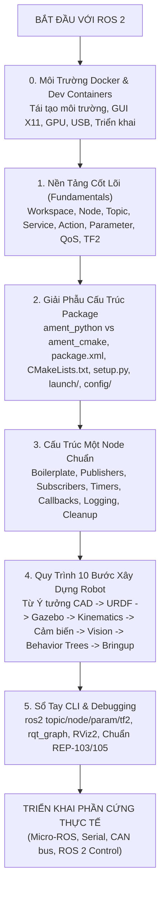

# Cẩm Nang Toàn Diện Về ROS 2 & Hướng Dẫn Xây Dựng Dự Án Robot Từ Số 0

Chào mừng bạn đến với bộ tài liệu hướng dẫn tổng quan và phổ quát (**Universal / Common ROS 2 Guide**) của dự án. 

Bộ tài liệu này được biên soạn với mục tiêu giúp bất kỳ ai—dù là người mới bắt đầu tiếp cận Robot Operating System (ROS 2), sinh viên nghiên cứu, hay kỹ sư phần mềm—đều có thể **nắm vững tư duy kiến trúc, hiểu rõ tác dụng của từng file/thư mục, cấu trúc một Node chuẩn, và biết cách tự tay xây dựng một dự án Robot hoàn chỉnh từ con số 0** (cho dù đó là robot Mecanum, xe tự hành 2 bánh vi sai, xe 4 bánh lái Ackermann, cánh tay robot hay thiết bị tự động hóa công nghiệp).

---

## 🗺️ Bản Đồ Lộ Trình Học Tập & Xây Dựng Dự Án (Roadmap)

---

## 📚 Mục Lục Tài Liệu Chi Tiết

| Tài Liệu | Nội Dung Trọng Tâm | Dành Cho Ai? |
| :--- | :--- | :---: |
| **[1. Nền Tảng & Khái Niệm Cốt Lõi ROS 2](01_ros2_fundamentals.md)** | Hiểu rõ kiến trúc phân tán DDS, Workspace (`src`, `build`, `install`, `log`), sự khác biệt và khi nào nên dùng Topic, Service, Action, Parameter, cơ chế QoS và cây tọa độ TF2. | Người mới bắt đầu |
| **[2. Cấu Trúc Package & Tác Dụng Từng File Thư Mục](02_package_structure_guide.md)** | Phân tích chi tiết cấu trúc thư mục của gói Python (`ament_python`) và C++/Resource (`ament_cmake`). Tác dụng và cú pháp của `package.xml`, `setup.py`, `CMakeLists.txt`, `launch/`, `config/`, `urdf/`, `resource/`. | Lập trình viên thiết kế kiến trúc gói |
| **[3. Giải Phẫu & Vòng Đời Của Một Node Chuẩn](03_node_anatomy_and_lifecycle.md)** | Mẫu code chuẩn hóa cho một ROS 2 Node (Python & C++). Chi tiết cách khởi tạo, tạo Publisher/Subscriber, Timer loop, xử lý đa luồng, Logging và ngắt an toàn. | Lập trình viên viết mã nguồn Node |
| **[4. Quy Trình 10 Bước Xây Dựng Dự Án Robot Từ Số 0](04_robot_project_roadmap.md)** | Cẩm nang phương hướng từng bước: Thiết kế CAD $\to$ URDF Xacro $\to$ Mô phỏng Gazebo $\to$ Base Kinematics $\to$ Tích hợp Cảm biến $\to$ Teleop $\to$ AI Vision $\to$ Tự hành (Nav2 / Behavior Trees) $\to$ Master Bringup $\to$ Triển khai phần cứng. | Kỹ sư trưởng / Người phát triển dự án |
| **[5. Sổ Tay Lệnh ROS 2 CLI & Debugging](05_cli_and_debugging_handbook.md)** | Bảng tra cứu đầy đủ các lệnh dòng lệnh `ros2`, công cụ đồ thị `rqt_graph`, trực quan hóa TF, `rviz2`, và các tiêu chuẩn quốc tế REP-103, REP-105. | Tra cứu & Xử lý sự cố hàng ngày |
| **[6. Cẩm Nang Sử Dụng Docker & Dev Containers](06_docker_and_devcontainers.md)** | Giải thích vì sao cần dùng Container, cơ chế VS Code Dev Containers, giải phẫu `Dockerfile` và `devcontainer.json`, cấu hình đồ họa X11, GPU NVIDIA, USB Gamepad và triển khai lên robot thật. | Thiết lập môi trường & Triển khai |

---

## 💡 Tư Duy Cốt Lõi Khi Làm Việc Với ROS 2

1. **Tính Module Hóa (Modularity):** Mỗi Node chỉ nên đảm nhận một nhiệm vụ duy nhất và làm thật tốt nhiệm vụ đó (Ví dụ: 1 Node đọc cảm biến, 1 Node tính động học, 1 Node lập kế hoạch đường đi).
2. **Không Ràng Buộc Phần Cứng (Hardware Abstraction):** Các thuật toán cấp cao (Navigation, Vision, Behavior Tree) chỉ giao tiếp qua các Topic/Action chuẩn (`/cmd_vel`, `/odom`, `/scan`, `/camera/image_raw`). Nhờ đó, bạn có thể chạy cùng một thuật toán trên mô phỏng Gazebo hay trên Robot thực tế mà không cần sửa code lõi.
3. **Quy Chuẩn Quốc Tế (Standards Compliance):** Luôn tuân thủ hệ đơn vị SI (mét, radian, giây) và quy ước trục tọa độ của ROS REP-103 (X-tiến, Y-trái, Z-lên).
