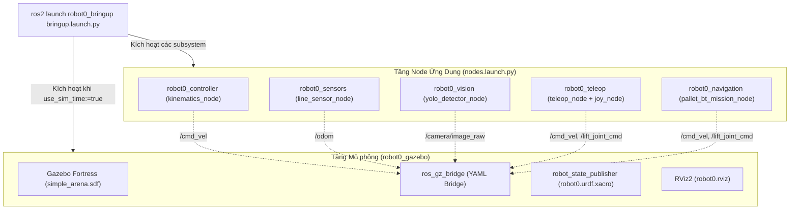

# robot0_bringup

Top-level Bringup & Master System Orchestration package cho **Robot0**.

Package này chịu trách nhiệm điều phối, quản lý vòng đời và khởi chạy đồng bộ toàn bộ các hệ thống con của robot (Mô phỏng vật lý Gazebo, Cầu nối ros_gz_bridge, Bộ điều khiển Động học Mecanum, Cảm biến dò line Vector Quad Array, Điều khiển Gamepad Teleop, Nhận diện thị giác YOLOv8, và Nhiệm vụ Tự hành Behavior Trees) theo chuẩn kiến trúc phân tầng của ROS 2.

---

## 🏛️ Kiến trúc Điều phối Hệ thống (System Orchestration)



---

## 🚀 Các Kịch bản Khởi chạy (Execution Recipes)

### 1. Khởi chạy Toàn bộ Hệ thống Mô phỏng (Simulation + Nodes + RViz2)
Khởi động đồng thời Gazebo, cầu nối Bridge, các node cảm biến, thị giác, điều khiển động học và giao diện RViz2:
```bash
ros2 launch robot0_bringup bringup.launch.py
```

### 2. Khởi chạy Toàn bộ kèm Tự động hóa Nhiệm vụ (Autonomous Mission Mode)
Bật toàn bộ hệ thống và tự động kích hoạt Cây Hành Vi (Behavior Tree) để tìm và gắp pallet:
```bash
ros2 launch robot0_bringup bringup.launch.py mission:=true
```

### 3. Chỉ Khởi chạy các Node Ứng Dụng (Không kèm Gazebo)
Dùng khi Gazebo đã được khởi động từ trước ở terminal khác, hoặc khi nạp trực tiếp lên **Robot Phần cứng Thực tế**:
```bash
ros2 launch robot0_bringup nodes.launch.py
```

### 4. Khởi chạy Chế độ Tiết kiệm Tài nguyên (Headless / Không mở RViz2)
```bash
ros2 launch robot0_bringup bringup.launch.py rviz:=false
```

---

## ⚙️ Bảng Tra cứu Tham số Launch (Launch Arguments)

| Tham số | Kiểu | Mặc định | Mô tả chi tiết |
| :--- | :---: | :---: | :--- |
| `use_sim_time` | `bool` | `true` | Sử dụng clock thời gian mô phỏng `/clock` từ Gazebo |
| `world` | `string` | `simple_arena.sdf` | Đường dẫn file thế giới sa bàn Gazebo cần nạp |
| `rviz` | `bool` | `true` | Mở giao diện trực quan hóa 3D RViz2 |
| `controller` | `bool` | `true` | Khởi chạy node động học bánh Mecanum (`robot0_controller`) |
| `joy` | `bool` | `true` | Khởi chạy cụm node điều khiển tay cầm (`robot0_teleop`) |
| `vision` | `bool` | `true` | Khởi chạy node nhận diện hình ảnh YOLOv8 (`robot0_vision`) |
| `line_sensor` | `bool` | `true` | Khởi chạy node mô phỏng cảm biến dò line (`robot0_sensors`) |
| `mission` | `bool` | `false` | Tự động khởi chạy nhiệm vụ Behavior Tree (`robot0_navigation`) |
| `conf` | `float`| `0.50` | Ngưỡng tin cậy nhận diện của YOLO detector |
| `imgsz` | `int` | `640` | Kích thước ảnh đầu vào mô hình YOLO ($640, 480, 320$) |

---

## 📂 Cấu trúc Launch Files

```text
robot0_bringup/
├── CMakeLists.txt
├── package.xml
├── README.md
└── launch/
    ├── bringup.launch.py       # Master launch file khởi chạy Gazebo + Nodes + RViz
    ├── sim_bringup.launch.py   # Alias cho bringup.launch.py
    └── nodes.launch.py         # Launch file gom toàn bộ các node ứng dụng
```
