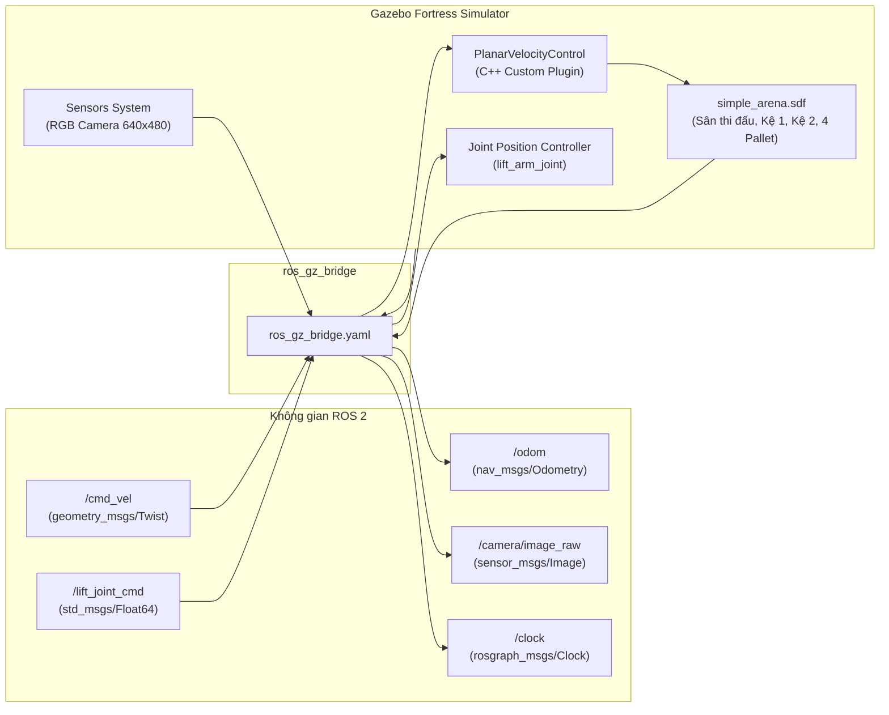

# robot0_gazebo

Package cấu hình môi trường mô phỏng vật lý trên **Gazebo Fortress (Ignition Gazebo)** cho robot Mecanum Robot0, bao gồm sa bàn nhà kho Robocon (`simple_arena.sdf`), các mô hình vật thể tương tác (kệ hàng, pallet, block vật liệu), C++ Plugin mô phỏng chuyển động mặt phẳng `PlanarVelocityControl`, và cầu nối dữ liệu `ros_gz_bridge`.

---

## 🏛️ Kiến trúc Hệ thống Mô phỏng



---

## 🧩 C++ System Plugin: `PlanarVelocityControl`

Trong mô phỏng vật lý truyền thống, việc mô phỏng chi tiết từng con lăn nhỏ (rollers) trên bánh Mecanum tốn rất nhiều tài nguyên tính toán va chạm vi mô, gây hiện tượng rung lắc và trượt không kiểm soát.

Plugin `PlanarVelocityControl.cpp` giải quyết triệt để vấn đề này bằng cách can thiệp trực tiếp vào `canonicalLink` của robot trong giai đoạn `PreUpdate`:
* **Điều khiển vận tốc mặt phẳng ($X, Y, \text{Yaw}$):** Đọc lệnh `/cmd_vel` từ ROS 2 và thiết lập vận tốc tịnh tiến $(v_x, v_y)$ cùng vận tốc xoay $\omega_z$ theo đúng hệ quy chiếu thân xe (Body Frame).
* **Bảo toàn tương tác trọng lực ($Z$) & góc nghiêng (Roll/Pitch):** Plugin **giữ nguyên** thành phần vận tốc $v_z$ từ engine vật lý (DART), cho phép robot vẫn rơi tự do theo trọng lực và phản ứng chính xác với mặt sàn mà không bị lơ lửng hay mất vật lý.

---

## 🗺️ Sa bàn Mô phỏng: `simple_arena.sdf`

Sa bàn được thiết kế tối ưu hóa với độ chính xác kích thước chuẩn:
* **Kích thước sàn:** $4.0\text{ m} \times 2.0\text{ m}$, bao quanh bởi tường bảo vệ $15\text{ mm}$.
* **Hệ thống vạch line:** Bề rộng $25\text{ mm}$, gồm 2 làn chính ($Y = +0.640\text{ m}$ và $Y = 0.000\text{ m}$), trục dọc nối chuyển làn ($X = -0.400\text{ m}$), trục dọc phân phối trung tâm ($X = 0.000\text{ m}$) và các vạch dừng (Stop Bars $150\text{ mm}$).
* **Kệ chứa hàng (Storage Racks):**
  * **Kệ 1 (`rack_1`):** Tọa độ $X = -1.894\text{ m}, Y = +0.640\text{ m}$.
  * **Kệ 2 (`rack_2`):** Tọa độ $X = -1.894\text{ m}, Y = 0.000\text{ m}$.
* **4 Pallet và Vật thể hàng hóa:**
  1. **`pallet_aluminum` (Pallet Nhôm):** Kệ 1, Tầng 1 (Dưới - Trái, $Z = 0.0285\text{ m}$).
  2. **`pallet_cpu` (Pallet CPU):** Kệ 1, Tầng 2 (Trên - Phải, $Z = 0.1485\text{ m}$).
  3. **`pallet_qr` (Pallet QR Code):** Kệ 2, Tầng 1 (Dưới - Trái, $Z = 0.0285\text{ m}$).
  4. **`pallet_chip` (Pallet Chip Bán Dẫn):** Kệ 2, Tầng 2 (Trên - Phải, $Z = 0.1485\text{ m}$).
* **4 Vùng giao hàng (Drop-off Zones):** Vùng 1 ($Y=+0.64\text{m}$), Vùng 2 ($Y=+0.22\text{m}$), Vùng 3 ($Y=-0.22\text{m}$), Vùng 4 ($Y=-0.64\text{m}$) tại $X = +0.70\text{ m}$.

---

## 🌉 Cấu hình Cầu nối `ros_gz_bridge.yaml`

| ROS 2 Topic | Gazebo Topic | Kiểu Message ROS 2 | Hướng truyền | Chức năng |
| :--- | :--- | :--- | :---: | :--- |
| `/cmd_vel` | `/cmd_vel` | `geometry_msgs/msg/Twist` | ROS $\to$ GZ | Vận tốc di chuyển khung gầm |
| `/lift_joint_cmd` | `/model/robot0/joint/lift_arm_joint/0/cmd_pos` | `std_msgs/msg/Float64` | ROS $\to$ GZ | Vị trí độ cao trục nâng ($0.0 \to 0.20\text{ m}$) |
| `/odom` | `/model/robot0/odometry` | `nav_msgs/msg/Odometry` | GZ $\to$ ROS | Tọa độ và vận tốc phản hồi từ Gazebo |
| `/clock` | `/clock` | `rosgraph_msgs/msg/Clock` | GZ $\to$ ROS | Đồng hồ thời gian mô phỏng (Sim Time) |
| `/camera/image_raw` | `/camera/image_raw` | `sensor_msgs/msg/Image` | GZ $\to$ ROS | Luồng hình ảnh RGB từ Camera ($640 \times 480$) |
| `/camera/camera_info` | `/camera/camera_info` | `sensor_msgs/msg/CameraInfo` | GZ $\to$ ROS | Thông số nội tại camera (Ma trận K, D) |
| `/joint_states` | `/world/simple_arena/model/robot0/joint_state` | `sensor_msgs/msg/JointState` | GZ $\to$ ROS | Trạng thái góc quay và vị trí các khớp |

---

## 🚀 Hướng dẫn Khởi chạy Mô phỏng

### 1. Khởi chạy Gazebo cơ bản (Kèm Bridge + RViz2)
```bash
ros2 launch robot0_gazebo gazebo.launch.py
```

### 2. Các tùy chọn tham số:
* `rviz:=false`: Tắt hiển thị RViz2 nếu chỉ muốn mở cửa sổ Gazebo GUI.
* `world:=<đường_dẫn>`: Chọn file SDF thế giới khác (mặc định: `simple_arena.sdf`, tùy chọn khác: `empty.sdf`).
* `use_sim_time:=true`: Bật sử dụng clock mô phỏng từ Gazebo.

### 3. Kiểm tra tương tác vật lý trực tiếp bằng CLI:
* **Nâng càng lên tầng 2 ($0.15\text{ m}$):**
  ```bash
  ros2 topic pub /lift_joint_cmd std_msgs/msg/Float64 "{data: 0.15}" -1
  ```
* **Hạ càng về vị trí xuất phát ($0.015\text{ m}$):**
  ```bash
  ros2 topic pub /lift_joint_cmd std_msgs/msg/Float64 "{data: 0.015}" -1
  ```
* **Cho robot dạt ngang sang trái:**
  ```bash
  ros2 topic pub /cmd_vel geometry_msgs/msg/Twist "{linear: {y: 0.3}}" -r 10
  ```

---

## 📂 Cấu trúc Thư mục

```text
robot0_gazebo/
├── CMakeLists.txt
├── package.xml
├── README.md
├── src/
│   └── PlanarVelocityControl.cpp   # Source code C++ plugin mô phỏng chuyển động
├── config/
│   └── ros_gz_bridge.yaml          # Mapping topics giữa ROS 2 và Gazebo
├── worlds/
│   ├── simple_arena.sdf            # Sân thi đấu 2 Kệ + 4 Pallet + 4 Drop Zones
│   └── empty.sdf                   # Thế giới phẳng trống cơ bản
├── models/                         # Thư viện mô hình SDF
│   ├── arena_floor/                # Mô hình sàn thi đấu
│   ├── storage_rack/               # Kệ hàng 2 tầng
│   ├── pallet_aluminum/            # Pallet khối nhôm
│   ├── pallet_cpu/                 # Pallet bo mạch CPU
│   ├── pallet_qr/                  # Pallet mã QR
│   └── pallet_chip/                # Pallet vi mạch bán dẫn
└── launch/
    └── gazebo.launch.py            # Launch khởi động Gazebo, Bridge, Spawner & RViz2
```
