# `robot0_navigation`: Behavior Trees Pallet Retrieval & Navigation

Gói ROS 2 điều khiển tự động hóa quy trình **Lấy Pallet từ Kệ và Vận chuyển đến Vị trí Đích** cho robot Mecanum (`robot0`) dựa trên kiến trúc **Behavior Trees (Cây hành vi)**.

---

## 🌲 Kiến trúc Cây Hành Vi (Behavior Tree Architecture)

Hệ thống cây hành vi được thiết kế theo cấu trúc module độc lập, điều phối luồng tuần tự qua **Blackboard** dùng chung:

```mermaid
graph TD
    Root["Sequence: Pallet Mission Master Tree"] --> S1["1. Sequence: Initialization"]
    Root --> S2["2. Sequence: Approach Rack"]
    Root --> S25["2.5. Sequence: Vision Scan (YOLO)"]
    Root --> S3["3. Sequence: Pick Pallet from Rack"]
    Root --> S4["4. Sequence: Deliver to Drop-off"]
    Root --> S5["5. Sequence: Place Pallet"]
    Root --> S6["6. Sequence: Return Home Base"]

    %% 1. Init
    S1 --> InitCoord["Action: Init Mission Coordinates"]
    S1 --> CheckOdom["Condition: Wait for Odometry"]
    S1 --> SetTransitLift["Action: Set Lift to Transit Height (1.5cm)"]

    %% 2. Approach
    S2 --> NavStaging["Action: Line Nav to Rack Approach Line (X=-1.500m)"]

    %% 2.5 Vision Scan
    S25 --> YoloScan["Action: Scan Rack Pallets with YOLOv8 (Identify Slot & Shelf)"]

    %% 3. Pick
    S3 --> ShiftSlot["Action: Shift to Detected Pallet Slot (+/- 60mm)"]
    S3 --> AlignFork["Action: Align Lift Height (Level 1: 2.95cm / Level 2: 14.95cm)"]
    S3 --> InsertFork["Action: Creep Forward & Insert Fork (-1.645m)"]
    S3 --> SettleLift["Action: Settle Delay (0.5s)"]
    S3 --> RaiseLift["Action: Raise Pallet (Level 1: 7.0cm / Level 2: 18.5cm)"]
    S3 --> RetractFork["Action: Retract from Shelf to Staging"]

    %% 4. Deliver
    S4 --> NavDropoff["Action: Line Nav to Dynamic Drop-off Zone (Theo loại hàng đã nhận diện)"]

    %% 5. Place
    S5 --> LowerLift["Action: Lower Lift to Ground (0.0cm)"]
    S5 --> SettleDrop["Action: Settle Delay (0.5s)"]
    S5 --> Backoff["Action: Linear Drive Back (-0.25m)"]

    %% 6. Return
    S6 --> LiftSafe["Action: Set Lift Safe Height (1.5cm)"]
    S6 --> NavHome["Action: Line Nav to Spawn Base (Qua trục giữa về Home Base)"]
```



---

## 🗺️ Tọa độ Sa bàn & Kệ Pallet (Single Source of Truth)

| Đối tượng | Vị trí | Tọa độ Thế giới $(X, Y, Z)$ | Tầng / Vị trí |
| :--- | :--- | :--- | :--- |
| **Start Base** | Xuất phát | `X = -0.985, Y = 0.640, Z = 0.080` ($Yaw = \pi$) | Sàn |
| **Rack 1** | Kệ dưới | `X = -1.894, Y = 0.640` ($Yaw = \pi/2$) | - |
| - *Pallet Nhôm* | Rack 1 | `X = -1.894, Y = 0.580, Z = 0.0285` | **Tầng 1 (Dưới - Trái)** |
| - *Pallet CPU* | Rack 1 | `X = -1.894, Y = 0.700, Z = 0.1485` | **Tầng 2 (Trên - Phải)** |
| **Rack 2** | Kệ giữa | `X = -1.894, Y = 0.000` ($Yaw = \pi/2$) | - |
| - *Pallet QR* | Rack 2 | `X = -1.894, Y = -0.060, Z = 0.0285` | **Tầng 1 (Dưới - Trái)** |
| - *Pallet Chip* | Rack 2 | `X = -1.894, Y = 0.060, Z = 0.1485` | **Tầng 2 (Trên - Phải)** |
| **Drop-off 1** | Vùng Nhôm | `X = 0.70, Y = 0.64` (Tiếp cận: `X = 0.55`) | Xanh lam |
| **Drop-off 2** | Vùng CPU | `X = 0.70, Y = 0.22` (Tiếp cận: `X = 0.55`) | Xanh lá |
| **Drop-off 3** | Vùng QR | `X = 0.70, Y = -0.22` (Tiếp cận: `X = 0.55`) | Vàng |
| **Drop-off 4** | Vùng Chip | `X = 0.70, Y = -0.64` (Tiếp cận: `X = 0.55`) | Đỏ |

---

## 🚀 Hướng Dẫn Sử Dụng

### 1. Build Package
```bash
colcon build --symlink-install --packages-select robot0_navigation
source install/setup.bash
```

### 2. Khởi chạy Mô phỏng Sa bàn (Gazebo)
```bash
ros2 launch robot0_gazebo gazebo.launch.py
```

### 3. Chạy Kịch bản Behavior Tree

#### Cách 1: Chọn theo loại Pallet (Tự động xác định Kệ, Tầng, Vị trí trả hàng)
* **Gắp Pallet Nhôm (Tầng 1, Kệ 1 $\to$ Vùng 1):**
  ```bash
  ros2 launch robot0_navigation pallet_mission_bt.launch.py pallet:=aluminum
  ```
* **Gắp Pallet CPU (Tầng 2, Kệ 1 $\to$ Vùng 2):**
  ```bash
  ros2 launch robot0_navigation pallet_mission_bt.launch.py pallet:=cpu
  ```
* **Gắp Pallet QR Code (Tầng 1, Kệ 2 $\to$ Vùng 3):**
  ```bash
  ros2 launch robot0_navigation pallet_mission_bt.launch.py pallet:=qr
  ```
* **Gắp Pallet Chip (Tầng 2, Kệ 2 $\to$ Vùng 4):**
  ```bash
  ros2 launch robot0_navigation pallet_mission_bt.launch.py pallet:=chip
  ```

#### Cách 2: Tùy chỉnh chi tiết Kệ, Tầng, Khay và Vị trí trả
```bash
ros2 launch robot0_navigation pallet_mission_bt.launch.py rack:=rack_1 shelf:=1 slot:=left dropoff:=dropoff_1
```
*(Hoặc `dropoff:=home` nếu muốn mang pallet về vị trí ban đầu).*

---

## 🛠️ Trực quan hóa Behavior Tree thời gian thực

Trong quá trình chạy, node sẽ tự động in trạng thái cây ra Terminal với mã màu:
- **`[SUCCESS]` (Xanh lá)**: Node đã hoàn thành mục tiêu.
- **`[RUNNING]` (Vàng)**: Node đang tích cực điều khiển robot.
- **`[FAILURE]` (Đỏ)**: Node gặp sự cố / timeout.
- **`[INVALID]` (Xám)**: Node chưa được kích hoạt tới.

---

## 🔮 Hướng Phát Triển Tự Động Hóa Nâng Cao

Do cây hành vi được thiết kế theo dạng **Blackboard & Modular Actions**, bạn có thể dễ dàng mở rộng:
1. **Tích hợp YOLO Vision (`robot0_vision`)**: Thêm node `VisionDetectPalletAction` trước bước `Insert_Fork` để bù trừ sai lệch góc hoặc vị trí thực tế của pallet.
2. **Tích hợp Dò Line (`line_sensor_node`)**: Thay thế `NavigateToPoseAction` bằng `FollowLineAction` trên các trục line chính.
3. **Tích hợp Nav2**: Thêm `Nav2GoalAction` khi môi trường có chướng ngại vật động.
