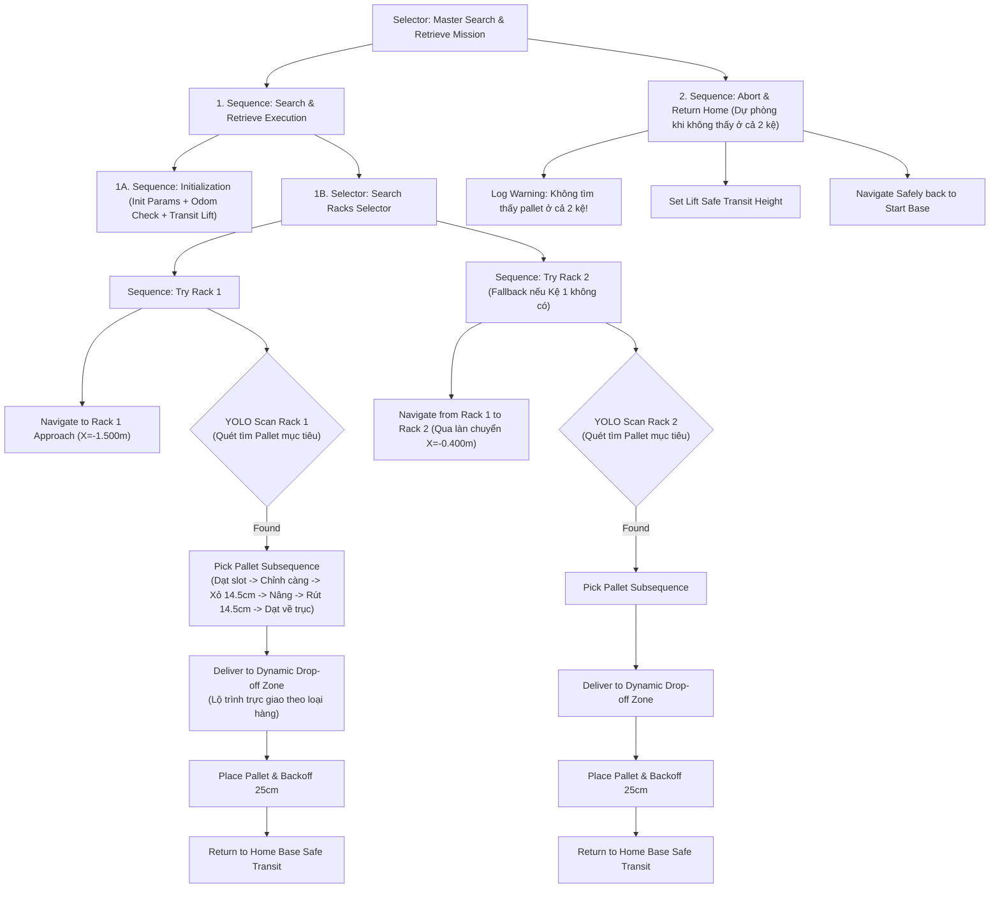

# robot0_navigation

Package ROS 2 điều khiển tự động hóa quy trình **Tìm kiếm, Nhận diện thị giác, Gắp Pallet từ Kệ và Vận chuyển đến Vị trí Đích** cho robot Mecanum `robot0` dựa trên kiến trúc **Behavior Trees (Cây Hành Vi)** và bộ nhớ dữ liệu dùng chung **Blackboard**.

---

## 🌲 Kiến trúc Cây Hành Vi (Behavior Tree Engine)

Package tích hợp một Behavior Tree engine thuần Python được tối ưu hóa riêng cho ROS 2:

* **Trạng thái Node (`NodeStatus`):** `SUCCESS` (Thành công), `FAILURE` (Thất bại), `RUNNING` (Đang thực thi), `INVALID` (Chưa kích hoạt).
* **Nút tổ hợp (Composites):**
  * `Sequence` ($\to$): Thực thi tuần tự các node con; trả về `FAILURE` ngay khi có 1 node con thất bại, trả về `SUCCESS` khi tất cả đều thành công.
  * `Selector` ($?$): Thử nghiệm các phương án dự phòng (Fallback); trả về `SUCCESS` ngay khi có 1 nhánh con thành công, chỉ trả về `FAILURE` khi toàn bộ các nhánh đều thất bại.
  * `Parallel` ($\rightrightarrows$): Kích hoạt đồng thời nhiều node con theo ngưỡng điều kiện.
* **Nút trang trí (Decorators):** `Inverter` (Đảo ngược kết quả), `RetryNode` (Thử lại hành động $N$ lần).
* **Bảng nhớ dùng chung (Blackboard):** Nơi lưu trữ trạng thái thế giới (Tọa độ $X, Y, \text{Yaw}$, kết quả nhận diện YOLO, độ cao càng nâng, lộ trình waypoints) để chia sẻ giữa các Action và Condition nodes.

---

## 🗺️ Sơ đồ Luồng Cây Hành Vi Nhiệm vụ (Mission BT Flow)



---

## 📍 Tọa độ Sa bàn & Kệ Pallet (Single Source of Truth)

Toàn bộ tọa độ được quản lý tập trung tại file cấu hình [`config/arena_coordinates.yaml`](config/arena_coordinates.yaml) và nạp qua module [`arena_coordinates.py`](robot0_navigation/arena_coordinates.py):

### 1. Vị trí Xuất phát & Kệ Chứa Hàng
| Đối tượng | Tọa độ Thế giới $(X, Y, Z)$ | Góc Hướng ($\text{Yaw}$) | Ghi chú |
| :--- | :--- | :--- | :--- |
| **Start Base** | $X = -0.985, Y = +0.640, Z = 0.080$ | $\pi\text{ rad } (180^\circ)$ | Điểm xuất phát của robot |
| **Rack 1** | $X = -1.894, Y = +0.640, Z = 0.0025$ | $\pi/2\text{ rad } (90^\circ)$ | Kệ hàng số 1 (Làn trên) |
| **Rack 2** | $X = -1.894, Y = 0.000, Z = 0.0025$ | $\pi/2\text{ rad } (90^\circ)$ | Kệ hàng số 2 (Làn giữa) |

### 2. Danh mục Pallet Hàng hóa
| Tên Pallet | Loại hàng (`pallet_type`) | Vị trí Kệ | Tầng Kệ | Vị trí Khay | Tọa độ $(X, Y, Z)$ |
| :--- | :--- | :--- | :--- | :--- | :--- |
| `pallet_aluminum` | `aluminum` (Nhôm) | Rack 1 | **Tầng 1 (Dưới)** | Trái (`left`) | $X=-1.894, Y=0.580, Z=0.0285$ |
| `pallet_cpu` | `cpu` (Vi xử lý) | Rack 1 | **Tầng 2 (Trên)** | Phải (`right`) | $X=-1.894, Y=0.700, Z=0.1485$ |
| `pallet_qr` | `qr` (Mã QR) | Rack 2 | **Tầng 1 (Dưới)** | Trái (`left`) | $X=-1.894, Y=-0.060, Z=0.0285$ |
| `pallet_chip` | `chip` (Bán dẫn) | Rack 2 | **Tầng 2 (Trên)** | Phải (`right`) | $X=-1.894, Y=0.060, Z=0.1485$ |

### 3. Vị trí Giao hàng (Drop-off Zones)
| Vùng đích | Loại hàng tương ứng | Tọa độ Trung tâm $(X, Y)$ | Tọa độ Tiếp cận $(X, Y)$ | Màu ô sa bàn |
| :--- | :--- | :--- | :--- | :--- |
| **Drop-off 1** | `aluminum` (Nhôm) | $X = 0.70, Y = +0.64$ | $X = 0.55, Y = +0.64$ | Xanh lam |
| **Drop-off 2** | `cpu` (Vi xử lý) | $X = 0.70, Y = +0.22$ | $X = 0.55, Y = +0.22$ | Xanh lá |
| **Drop-off 3** | `qr` (Mã QR) | $X = 0.70, Y = -0.22$ | $X = 0.55, Y = -0.22$ | Vàng |
| **Drop-off 4** | `chip` (Bán dẫn) | $X = 0.70, Y = -0.64$ | $X = 0.55, Y = -0.64$ | Đỏ |

---

## 🦾 Cơ cấu Nâng Hạ (Lift Heights Specification)

| Trạng thái cơ cấu | Độ cao lệnh ($Z_{\text{lift}}$) | Mô tả hành động |
| :--- | :--- | :--- |
| `transit` | $0.0150\text{ m}$ ($15.0\text{ mm}$) | Độ cao an toàn khi di chuyển tránh va quệt mặt sàn |
| `level1_insert` | $0.0295\text{ m}$ ($29.5\text{ mm}$) | Độ cao xỏ càng vào khe pallet Tầng 1 |
| `level1_carry` | $0.0700\text{ m}$ ($70.0\text{ mm}$) | Độ cao nhấc pallet Tầng 1 lên để mang đi |
| `level2_insert` | $0.1495\text{ m}$ ($149.5\text{ mm}$) | Độ cao xỏ càng vào khe pallet Tầng 2 |
| `level2_carry` | $0.1850\text{ m}$ ($185.0\text{ mm}$) | Độ cao nhấc pallet Tầng 2 lên để mang đi |
| `dropoff` | $0.0000\text{ m}$ ($0.0\text{ mm}$) | Hạ sát sàn để đặt pallet xuống vùng giao |

---

## 🚀 Hướng Dẫn Khởi Chạy Nhiệm Vụ

### 1. Build Package
```bash
colcon build --symlink-install --packages-select robot0_navigation
source install/setup.bash
```

### 2. Chạy tự hành theo Loại Pallet (Tự động nhận diện & tìm kiếm):
* **Gắp Pallet Nhôm (Kệ 1, Tầng 1 $\to$ Vùng 1):**
  ```bash
  ros2 launch robot0_navigation pallet_mission_bt.launch.py pallet:=aluminum
  ```
* **Gắp Pallet CPU (Kệ 1, Tầng 2 $\to$ Vùng 2):**
  ```bash
  ros2 launch robot0_navigation pallet_mission_bt.launch.py pallet:=cpu
  ```
* **Gắp Pallet QR Code (Kệ 2, Tầng 1 $\to$ Vùng 3):**
  ```bash
  ros2 launch robot0_navigation pallet_mission_bt.launch.py pallet:=qr
  ```
* **Gắp Pallet Chip (Kệ 2, Tầng 2 $\to$ Vùng 4):**
  ```bash
  ros2 launch robot0_navigation pallet_mission_bt.launch.py pallet:=chip
  ```

### 3. Tùy biến chi tiết Vị trí & Kịch bản:
```bash
ros2 launch robot0_navigation pallet_mission_bt.launch.py rack:=rack_1 shelf:=1 slot:=left dropoff:=dropoff_1 use_yolo:=true
```

---

## 🖥️ Trực quan hóa Behavior Tree thời gian thực (Terminal ASCII Tree)

Node tự động xuất cây trạng thái trực tiếp ra màn hình Terminal theo chu kỳ $3.0\text{ s}$ với mã ANSI:

```text
============================================================
Behavior Tree Snapshot (Tick #42):
[?] Master_Pallet_Search_And_Retrieve_Mission [RUNNING]
  --> [->] 1_Search_And_Retrieve_Flow [RUNNING]
        ├── [->] 1A_Initialization [SUCCESS]
        │     ├── [A] Init_Mission_Parameters [SUCCESS]
        │     ├── [C] Wait_For_Odometry [SUCCESS]
        │     └── [A] Set_Transit_Height [SUCCESS]
        └── [?] 1B_Search_Racks_Selector [RUNNING]
              └── [->] Try_Rack_1_Flow [RUNNING]
                    ├── [A] Log_Nav_Rack1 [SUCCESS]
                    ├── [A] Nav_To_Rack_1 [SUCCESS]
                    ├── [A] Log_Scan_Rack1 [SUCCESS]
                    ├── [A] Scan_Rack_1 [SUCCESS]
                    ├── [A] Log_Found_Rack1 [SUCCESS]
                    └── [->] R1_Pick_Deliver_Return [RUNNING]
                          ├── [A] R1_Insert_Fork [RUNNING]
                          └── ...
============================================================
```
