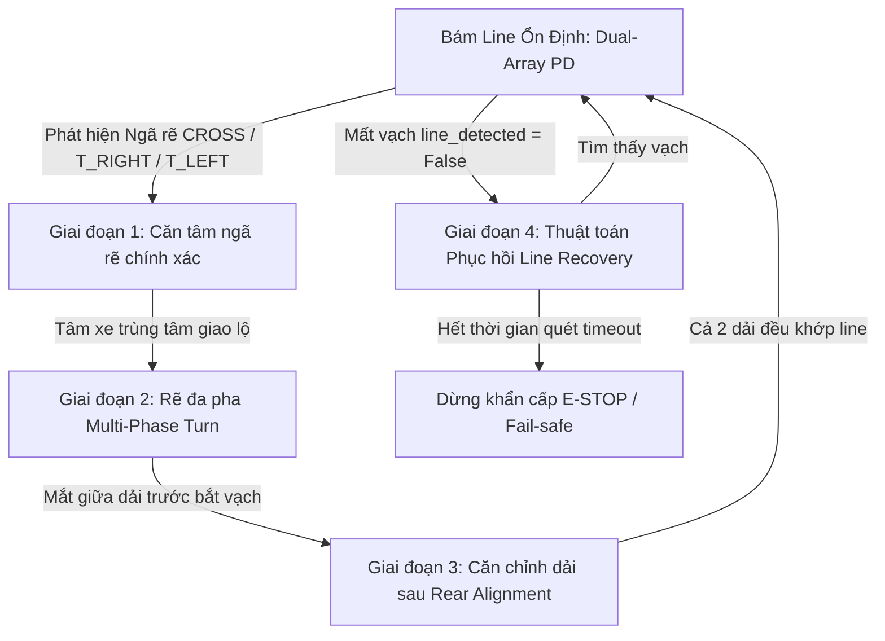
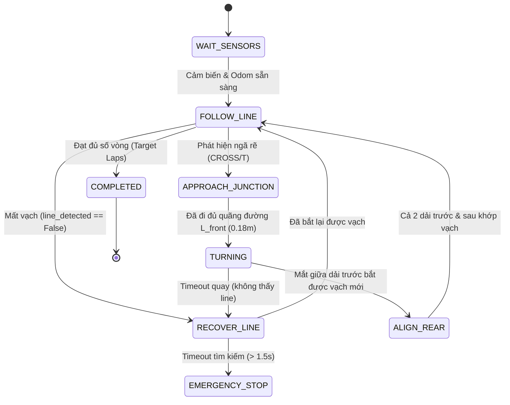

# Kỹ Thuật Điều Khiển Bám Line & Xử Lý Giao Lộ Cho Robot Mecanum

Tài liệu này tổng hợp nguyên lý, kỹ thuật và các bước xử lý chuẩn trong thực tế (Robocon, AGV/AMR công nghiệp) cho bài toán tự hành bám line (Line Following), xử lý giao lộ (Junction Turn) và phục hồi khi mất vạch (Line Recovery) trên robot dẫn động đa hướng 4 bánh Mecanum với hệ thống cảm biến quang học kép (Dual Array Line Sensor).

---

## 1. Tổng quan Phần cứng & Mô hình Toán học

### 1.1 Cấu hình Robot
* **Dẫn động:** 4 bánh Mecanum đa hướng (Holonomic / Omnidirectional drive).
* **Cụm cảm biến quang học kép (Dual Array):**
  * **Dải trước (Front Array):** $N = 8$ mắt đọc, cách tâm xe $L_f = +0.18\text{ m}$.
  * **Dải sau (Rear Array):** $N = 8$ mắt đọc, cách tâm xe $L_r = -0.18\text{ m}$.
  * **Khoảng cách 2 dải mắt (Baseline):** $L = L_f + |L_r| = 0.36\text{ m}$.
  * **Bề rộng vùng quét mỗi dải:** $(8 - 1) \times 18\text{ mm} = 126\text{ mm} = 12.6\text{ cm}$.

```
                 [ Dải cảm biến trước (Front Array: +18cm) ]
                        [0] [1] [2] [3] [4] [5] [6] [7]
                                      ▲
                                      │ +X (Hướng tiến)
             ┌────────────────────────┼────────────────────────┐
             │ 휠 FL                  │                  휠 FR │
             │                        │                        │
             │                        │                        │
             │                        ● (Tâm Robot / base_link)│ ────► +Y (Sang trái)
             │                        │                        │
             │                        │                        │
             │ 휠 RL                  │                  휠 RR │
             └────────────────────────┼────────────────────────┘
                        [0] [1] [2] [3] [4] [5] [6] [7]
                  [ Dải cảm biến sau (Rear Array: -18cm) ]
```

### 1.2 Nguyên lý Tính Toán Sai Lệch (Dual Array Kinematics)
Khi cả 2 dải trước và sau cùng nhận diện được vạch line với độ lệch tâm tương ứng là $e_{\text{front}}$ và $e_{\text{rear}}$ (mét):
* **Sai lệch vị trí ngang của tâm xe ($d_{\text{lateral}}$):**
  $$d_{\text{lateral}} = \frac{e_{\text{front}} + e_{\text{rear}}}{2}$$
* **Sai lệch góc hướng thân xe so với vạch ($\theta_{\text{heading}}$):**
  $$\theta_{\text{heading}} = \arctan\left(\frac{e_{\text{front}} - e_{\text{rear}}}{L_f + L_r}\right)$$

---

## 2. Các Hạn Chế Thường Gặp & Nguyên Nhân Thất Bại

| Vấn đề | Cơ chế sai sót (Naive Approach) | Hậu quả thực tế |
| :--- | :--- | :--- |
| **Căn tâm giao lộ sai** | Cho xe chạy tới theo **thời gian cố định (timer)** (ví dụ $0.35\text{s}$). | Xe chưa tới tâm ngã rẽ đã xoay hoặc chạy quá trớn do quán tính/trượt bánh, tâm quay bị lệch khỏi vạch mới $> 10\text{cm}$. |
| **Thoát khúc cua mù** | Quay theo góc Odometry + thoát bằng `timeout` hoặc cờ `detected` bất kỳ. | Mắt rìa quét thoáng qua vạch khác hoặc timeout khi xe đang lệch $\rightarrow$ xe dừng quay khi chưa khớp vạch. |
| **Mất vạch chạy thẳng** | Khi `line_detected == False`, phát lệnh tiến thẳng nhẹ $v_x = 0.08\text{ m/s}$. | Xe đâm thẳng ra ngoài sa bàn mãi mãi mà không bao giờ tìm lại được vạch. |

---

## 3. Các Kỹ Thuật Xử Lý Chuẩn Trong Thực Tế



### 3.1 Kỹ thuật 1: Căn Tâm Giao Lộ Chính Xác (Precise Junction Centering)
Khi dải cảm biến trước phát hiện vạch ngang (giao lộ `CROSS` hoặc `T`), tâm robot thực tế vẫn đang cách giao điểm một khoảng đúng bằng $L_f = 0.18\text{ m}$.

**Giải pháp:**
* **Cách 1 (Odometry Displacement - Khuyên dùng):**
  1. Ngay khi dải trước báo ngã rẽ, lưu tọa độ mốc ban đầu: $x_0 = x_{\text{robot}}, y_0 = y_{\text{robot}}$.
  2. Tiếp tục cho robot bám thẳng dọc theo line hiện tại với vận tốc giảm dần (Deceleration profile).
  3. Liên tục tính quãng đường đã đi: $s = \sqrt{(x - x_0)^2 + (y - y_0)^2}$.
  4. Khi $s \ge L_f$ ($0.18\text{ m}$): Phanh dừng hẳn ($v_x = 0, v_y = 0$). Lúc này tâm quay của robot nằm chính xác tại điểm giao cắt.
* **Cách 2 (Dual Array Confirmation):**
  * Cho xe tiến dọc vạch cho tới khi **dải cảm biến sau** chạm vào ngã rẽ (`rear_junction != NONE`).

---

### 3.2 Kỹ thuật 2: Thuật Toán Rẽ 90° Đa Giai Đoạn (Multi-Phase Turn & Line Lock)

Quá trình rẽ 90° không nên dừng đột ngột chỉ bằng Odometry hoặc timeout, mà chia làm 3 giai đoạn phối hợp:

```
[ Pha 1: Blind Turn (~45°-60°) ] ──► [ Pha 2: Seek & Decelerate ] ──► [ Pha 3: Lock & Rear Align ]
   Quay nhanh thoát vạch cũ              Giảm tốc độ quay,               Hãm phanh quay,
                                         bật quét mắt giữa 3, 4          dùng vy / wz chỉnh dải sau
```

1. **Pha 1 - Quay mù thoát vạch cũ (Blind Exit):**
   * Quay với tốc độ cao $\omega_z = \pm 1.0\text{ rad/s}$ trong khoảng $45^\circ - 60^\circ$ đầu tiên.
   * Mục đích: Đưa toàn bộ dải mắt đọc trước và sau thoát hoàn toàn khỏi vạch line cũ, tránh nhiễu tín hiệu.
2. **Pha 2 - Dò vạch mới & Giảm tốc (Seek & Decelerate):**
   * Giảm tốc độ quay xuống $\omega_z = \pm 0.3 - 0.4\text{ rad/s}$.
   * Theo dõi trạng thái của **2 mắt trung tâm dải trước** (`front_raw[3]` và `front_raw[4]`).
   * Ngay khi mắt 3 hoặc mắt 4 chạm vào vạch line mới $\rightarrow$ Chuyển ngay sang Pha 3.
3. **Pha 3 - Khóa góc & Căn chỉnh dải sau (Lock & Rear Alignment):**
   * Ngừng quay chính ($\omega_z = 0$).
   * Nếu dải trước đã bắt vạch nhưng dải sau chưa thấy (`rear_detected == False`), áp dụng một vận tốc góc nhỏ $\omega_z$ tỉ lệ với $\theta_{\text{heading}}$ hoặc dịch ngang nhẹ $v_y$ để đưa dải sau vào khớp vạch.

---

### 3.3 Kỹ thuật 3: Tận Dụng Ưu Thế Động Học Bánh Mecanum (Omnidirectional Strafe)

Robot Mecanum có bậc tự do phẳng $3\text{ DOF}$ độc lập $(v_x, v_y, \omega_z)$:
* **Bám line:**
  * $v_x$: Duy trì tốc độ hành trình mong muốn $v_{\text{cruise}}$.
  * $v_y$: Bộ điều khiển PD triệt tiêu sai lệch khoảng cách $d_{\text{lateral}}$:
    $$v_y = K_{p\_lat} \cdot d_{\text{lateral}} + K_{d\_lat} \cdot \dot{d}_{\text{lateral}}$$
  * $\omega_z$: Bộ điều khiển PD triệt tiêu góc lệch hướng $\theta_{\text{heading}}$:
    $$\omega_z = K_{p\_head} \cdot \theta_{\text{heading}} + K_{d\_head} \cdot \dot{\theta}_{\text{heading}}$$
* **Căn chỉnh sau cua:**
  * Nếu sau khi rẽ, thân xe song song với vạch nhưng bị lệch ngang $2 - 4\text{ cm}$, robot chỉ cần kích hoạt vận tốc ngang $v_y$ (Strafe) để trượt thân xe vào giữa vạch trong $0.2\text{s}$ mà không cần bẻ lái zigzag như xe vi sai (Differential Drive).

---

### 3.4 Kỹ thuật 4: Thuật Toán Phục Hồi Khi Mất Vạch (Line Recovery & Search Routine)

Khi `line_detected == False`, tuyệt đối không đâm thẳng mù mờ. Quy trình xử lý chuẩn gồm:

1. **Bộ nhớ sai số cuối (Memory of Last Known State):**
   * Trong suốt quá trình bám line bình thường, liên tục cập nhật biến `last_known_side`:
     * Nếu $e_{\text{front}} > 0 \rightarrow$ Line đang ở bên **Trái**.
     * Nếu $e_{\text{front}} < 0 \rightarrow$ Line đang ở bên **Phải**.
2. **Kích hoạt trạng thái `STATE_RECOVER_LINE`:**
   * Dừng chuyển động tiến $v_x = 0$.
   * Dịch chuyển ngang (Strafe) theo hướng đã nhớ:
     * Nếu vạch vừa mất về bên Trái $\rightarrow$ phát $v_y = +0.15\text{ m/s}$.
     * Nếu vạch vừa mất về bên Phải $\rightarrow$ phát $v_y = -0.15\text{ m/s}$.
3. **Bắt lại vạch hoặc Fail-Safe:**
   * Ngay khi `front_detected == True`, dừng dịch ngang và quay lại `STATE_FOLLOW_LINE`.
   * Nếu sau thời gian giới hạn $t > 1.5\text{s}$ vẫn không thấy vạch $\rightarrow$ Phanh dừng khẩn cấp và cảnh báo lỗi (E-Stop).

---

## 4. Bảng Thiết Kế Máy Trạng Thái FSM Chi Tiết



---

## 5. Mã Giả Thuật Toán Mẫu (Reference Pseudocode)

```python
def control_loop(self):
    now = get_current_time()
    
    # -------------------------------------------------------------
    # 1. STATE_FOLLOW_LINE
    # -------------------------------------------------------------
    if self.state == STATE_FOLLOW_LINE:
        if not self.line_detected:
            self.transition(STATE_RECOVER_LINE)
            return
            
        # Ghi nhớ phía của vạch
        if self.lateral_error > 0.005:
            self.last_known_side = "LEFT"
        elif self.lateral_error < -0.005:
            self.last_known_side = "RIGHT"
            
        # Phát hiện ngã rẽ
        if self.junction_detected and (now - self.last_junc_time > 2.0):
            self.junc_start_pose = (self.current_x, self.current_y)
            self.transition(STATE_APPROACH_JUNCTION)
            return
            
        # Điều khiển PD Mecanum
        vy = clamp(self.kp_lat * self.lateral_error + self.kd_lat * d_lat_dot, -0.15, 0.15)
        wz = clamp(self.kp_head * self.heading_error + self.kd_head * d_head_dot, -0.8, 0.8)
        self.publish_twist(vx=self.cruise_speed, vy=vy, wz=wz)

    # -------------------------------------------------------------
    # 2. STATE_APPROACH_JUNCTION (Đo quãng đường bằng Odometry)
    # -------------------------------------------------------------
    elif self.state == STATE_APPROACH_JUNCTION:
        dist_traveled = distance(self.junc_start_pose, (self.current_x, self.current_y))
        if dist_traveled >= 0.18: # L_front = 18cm
            self.target_yaw = normalize_angle(self.current_yaw - math.pi / 2.0)
            self.transition(STATE_TURNING)
        else:
            # Tiếp tục bám line thẳng với tốc độ thấp
            self.publish_twist(vx=0.12, vy=0.0, wz=0.0)

    # -------------------------------------------------------------
    # 3. STATE_TURNING (Rẽ đa giai đoạn)
    # -------------------------------------------------------------
    elif self.state == STATE_TURNING:
        yaw_diff = normalize_angle(self.target_yaw - self.current_yaw)
        
        # Giai đoạn 1: Quay mù (thoát vạch cũ)
        if elapsed < 0.4:
            self.publish_twist(vx=0.0, vy=0.0, wz=-1.0) # Rẽ phải
        # Giai đoạn 2: Quét bắt vạch bằng mắt giữa
        else:
            center_eyes_active = (self.front_raw[3] == 1 or self.front_raw[4] == 1)
            if center_eyes_active and abs(yaw_diff) < math.radians(25):
                self.publish_twist(0.0, 0.0, 0.0) # Khóa phanh
                self.transition(STATE_ALIGN_REAR)
            else:
                w_turn = clamp(yaw_diff * 2.0, -0.8, 0.8)
                self.publish_twist(vx=0.0, vy=0.0, wz=w_turn)

    # -------------------------------------------------------------
    # 4. STATE_ALIGN_REAR (Căn chỉnh dải sau)
    # -------------------------------------------------------------
    elif self.state == STATE_ALIGN_REAR:
        if self.front_detected and self.rear_detected:
            self.turns_completed += 1
            self.transition(STATE_FOLLOW_LINE)
        else:
            # Quay nhẹ căn dải sau
            self.publish_twist(vx=0.04, vy=0.0, wz=clamp(self.heading_error * 2.0, -0.4, 0.4))

    # -------------------------------------------------------------
    # 5. STATE_RECOVER_LINE (Dịch ngang tìm line theo trí nhớ)
    # -------------------------------------------------------------
    elif self.state == STATE_RECOVER_LINE:
        if self.front_detected:
            self.transition(STATE_FOLLOW_LINE)
        elif elapsed > 1.5:
            self.transition(STATE_EMERGENCY_STOP)
        else:
            vy_search = 0.15 if self.last_known_side == "LEFT" else -0.15
            self.publish_twist(vx=0.0, vy=vy_search, wz=0.0)
```

---

## 6. Tổng kết Quy trình Triển khai

1. **Luôn đo khoảng cách vào giao lộ bằng Odometry** thay vì dùng thời gian (timer cố định).
2. **Quay rẽ có điều kiện phản hồi cảm biến** (Sensor-based event trigger) kết hợp góc Odometry/IMU.
3. **Tận dụng khả năng tịnh tiến ngang $v_y$ của bánh Mecanum** để bù sai lệch tức thời và quét tìm vạch khi bị mất dấu.
4. **Luôn có cơ chế Fail-safe & Recovery** để robot không bị mất kiểm soát khi ra khỏi đường line.
