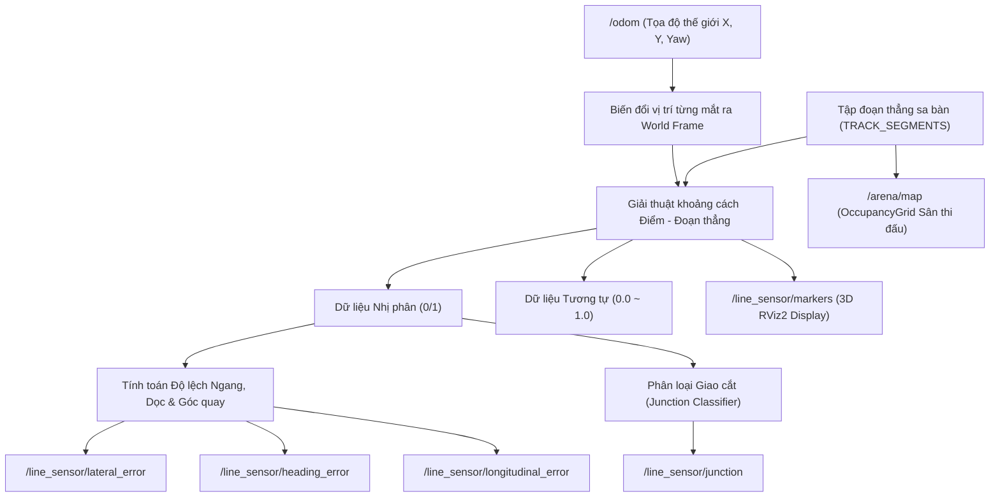

# robot0_sensors

Package ROS 2 chuyên trách quản lý, tính toán và mô phỏng hệ thống cảm biến quang học dò line đa hướng (**Vector Geometric Quad Array Line Sensor**) cho robot Mecanum `robot0`.

---

## 💡 Nguyên lý Cảm biến Dò Line Hình học Vector (Vector Geometric Array)

Khác với phương pháp truyền thống sử dụng camera sàn giả lập trong Gazebo (vốn rất tốn tài nguyên GPU, bị trễ khung hình và phụ thuộc vào ánh sáng mô phỏng), `robot0_sensors` sử dụng thuật toán **Hình học Vector thuần túy (Pure Vector Geometry)**:

1. **Hiệu năng cực cao & Không phụ thuộc GPU:** Tính toán khoảng cách ngắn nhất từ tọa độ từng mắt cảm biến đến tập hợp các đoạn thẳng vạch line trên sa bàn (`TRACK_SEGMENTS`) theo thời gian thực. Tần số xử lý đạt **$50\text{ Hz} \to 100\text{ Hz}$** với tải CPU $< 1\%$.
2. **Độ chính xác Sub-millimeter ($< 1\text{ mm}$):** Cho phép mô phỏng chính xác đáp ứng tương tự (analog reflectance) và nhị phân (digital 0/1) của cảm biến hồng ngoại thực tế.



---

## 🎛️ Cấu hình Bố trí 4 Dải Cảm biến (Quad Sensor Layout)

Robot được trang bị 4 mảng cảm biến bố trí đối xứng 4 phía quanh khung gầm:

```
                  [ Front Array: 8 mắt (+180mm X) ]
                                ▲ +X
                                │
[ Left Array: 8 mắt (+180mm Y) ] ◄───┼───► [ Right Array: 8 mắt (-180mm Y) ]
                                │
                                ▼ -X
                  [ Rear Array: 8 mắt (-180mm X) ]
```

* **Dải Trước (Front Array):** $+180\text{ mm}$ theo trục X, 8 mắt trải rộng từ $Y = +63\text{ mm}$ đến $Y = -63\text{ mm}$ (khoảng cách giữa các mắt $18\text{ mm}$).
* **Dải Sau (Rear Array):** $-180\text{ mm}$ theo trục X, 8 mắt đối xứng với dải trước.
* **Dải Trái (Left Array):** $+180\text{ mm}$ theo trục Y, 8 mắt bố trí dọc trục X từ $X = +63\text{ mm}$ đến $X = -63\text{ mm}$.
* **Dải Phải (Right Array):** $-180\text{ mm}$ theo trục Y, 8 mắt đối xứng với dải trái.

---

## 📐 Công thức Toán học Tính Sai số & Phân loại Giao cắt

### 1. Sai số Lệch ngang (Lateral Error) & Sai số Góc (Heading Error)
Dựa trên trọng tâm các mắt bắt được line của dải trước ($e_{\text{front}}$) và dải sau ($e_{\text{rear}}$):

$$e_{\text{lateral}} = \frac{e_{\text{front}} + e_{\text{rear}}}{2} \quad (\text{mét})$$

$$e_{\text{heading}} = \text{atan2}\left(e_{\text{front}} - e_{\text{rear}},\, L_{\text{baseline\_x}}\right) \quad (\text{rad}), \quad \text{với } L_{\text{baseline\_x}} = 0.360\text{ m}$$

### 2. Sai số Lệch dọc (Longitudinal Error)
Dựa trên dải cảm biến bên hông trái ($e_{\text{left}}$) và phải ($e_{\text{right}}$):

$$e_{\text{longitudinal}} = \frac{e_{\text{left}} + e_{\text{right}}}{2} \quad (\text{mét})$$

### 3. Phân loại Giao cắt (Junction Classification)
Node tự động nhận diện dạng giao lộ bên dưới robot:
* **`CROSS`**: Giao lộ ngã tư hoặc vạch ngang dừng xe ($\ge 5$ mắt cùng kích hoạt).
* **`T_LEFT`**: Ngã 3 rẽ trái (các mắt bên trái kích hoạt $\ge 3$, bên phải trống).
* **`T_RIGHT`**: Ngã 3 rẽ phải (các mắt bên phải kích hoạt $\ge 3$, bên trái trống).
* **`T_FRONT` / `T_REAR`**: Nhánh giao cắt bắt bởi cảm biến hông.
* **`NONE`**: Robot đang đi trên đường line thẳng tiêu chuẩn.
* **`LOST`**: Robot lệch hoàn toàn ra ngoài line (0 mắt kích hoạt).

---

## 📡 Danh sách ROS 2 Topics

### Topics Dữ liệu Tổng hợp

| Topic | Kiểu Message | Mô tả |
| :--- | :--- | :--- |
| `/line_sensor/raw` | `std_msgs/msg/Int32MultiArray` | Dữ liệu nhị phân (0/1) tổng hợp từ các mắt cảm biến |
| `/line_sensor/analog` | `std_msgs/msg/Float32MultiArray` | Dữ liệu cường độ phản xạ tương tự $[0.0 \to 1.0]$ |
| `/line_sensor/lateral_error` | `std_msgs/msg/Float32` | Độ lệch tịnh tiến ngang $e_{\text{lateral}}$ so với tim line (m) |
| `/line_sensor/longitudinal_error` | `std_msgs/msg/Float32` | Độ lệch tịnh tiến dọc $e_{\text{longitudinal}}$ từ dải hông (m) |
| `/line_sensor/heading_error` | `std_msgs/msg/Float32` | Góc lệch hướng thân xe $\theta_{\text{heading}}$ so với vạch line (rad) |
| `/line_sensor/line_detected` | `std_msgs/msg/Bool` | `True` nếu có ít nhất 1 mắt bắt được vạch |
| `/line_sensor/junction` | `std_msgs/msg/String` | Tên loại giao cắt (`CROSS`, `T_LEFT`, `T_RIGHT`, `NONE`, `LOST`) |

### Topics Riêng biệt theo từng dải

* Phía trước: `/line_sensor/front/raw`, `/line_sensor/front/analog`, `/line_sensor/front/error`, `/line_sensor/front/line_detected`, `/line_sensor/front/junction`
* Phía sau: `/line_sensor/rear/...`
* Phía trái: `/line_sensor/left/...`
* Phía phải: `/line_sensor/right/...`

### Topics Trực quan hóa (Visualization)

| Topic | Kiểu Message | Mô tả |
| :--- | :--- | :--- |
| `/line_sensor/markers` | `visualization_msgs/msg/MarkerArray` | Mô hình 3D dải cảm biến, các đèn LED trạng thái (Xanh lá = Bắt line, Xám = Không bắt) và mũi tên vector biểu diễn sai số trên RViz2 |
| `/arena/map` | `nav_msgs/msg/OccupancyGrid` | Bản đồ raster 2D độ phân giải $5\text{ mm}$ hiển thị toàn bộ vạch line, khung viền sân, chân kệ và vùng giao hàng |

---

## 🛠️ Tham số Cấu hình Node

| Tham số | Kiểu | Mặc định | Mô tả |
| :--- | :--- | :--- | :--- |
| `update_rate` | `double` | `50.0` | Tần số tính toán cảm biến (Hz) |
| `line_width` | `double` | `0.025` | Độ rộng vạch line sa bàn ($25\text{ mm}$) |
| `enable_front_array` | `bool` | `true` | Bật/tắt dải cảm biến trước |
| `num_sensors_front` | `int` | `8` | Số lượng mắt cảm biến trước |
| `sensor_spacing_front`| `double` | `0.018` | Khoảng cách giữa 2 mắt cạnh nhau ($18\text{ mm}$) |
| `offset_x_front` | `double` | `0.18` | Vị trí gắn dải trước theo trục X ($+180\text{ mm}$) |
| `enable_rear_array` | `bool` | `true` | Bật/tắt dải cảm biến sau |
| `offset_x_rear` | `double` | `-0.18` | Vị trí gắn dải sau theo trục X ($-180\text{ mm}$) |
| `enable_left_array` | `bool` | `true` | Bật/tắt dải cảm biến trái |
| `offset_y_left` | `double` | `0.18` | Vị trí gắn dải trái theo trục Y ($+180\text{ mm}$) |
| `enable_right_array` | `bool` | `true` | Bật/tắt dải cảm biến phải |
| `offset_y_right` | `double` | `-0.18` | Vị trí gắn dải phải theo trục Y ($-180\text{ mm}$) |

---

## 🚀 Hướng dẫn Sử dụng

### 1. Khởi chạy Node Cảm biến Dò Line:
```bash
ros2 launch robot0_sensors line_sensor.launch.py
```

### 2. Kiểm tra dữ liệu sai số thời gian thực:
```bash
# Xem độ lệch ngang (Lateral Error)
ros2 topic echo /line_sensor/lateral_error

# Xem góc lệch hướng (Heading Error)
ros2 topic echo /line_sensor/heading_error

# Xem nhận diện giao cắt
ros2 topic echo /line_sensor/junction
```
