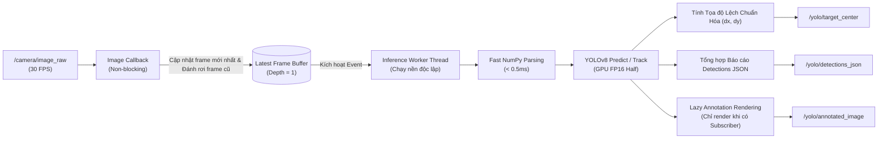

# robot0_vision

Package ROS 2 thị giác máy tính hiệu năng cao dựa trên **YOLOv8** phục vụ nhận diện Pallet hàng hóa và bám mục tiêu thời gian thực (**Real-time Visual Servoing / Target Tracking**) cho robot `robot0`.

---

## ⚡ Kiến trúc Xử lý Bất đồng bộ Không Độ trễ (Zero-Lag Worker Thread)

Khi xử lý các luồng camera tần số cao ($30\text{ FPS}$), nếu thực hiện suy luận (inference) trực tiếp trong Subscriber Callback sẽ gây nghẽn hàng đợi ROS 2 và làm tích lũy độ trễ nghiêm trọng.

`robot0_vision` giải quyết triệt để vấn đề này bằng kiến trúc **Decoupled Worker Thread**:



### Các tối ưu hóa cốt lõi:
1. **Zero-Lag Frame Dropping:** Luôn lấy frame mới nhất ngay khi worker thread sẵn sàng; tự động bỏ qua các frame trung gian cũ.
2. **Khởi động Nóng Mô hình (Model Warmup):** Chạy thử nghiệm dummy frame ngay khi khởi tạo node để nạp toàn bộ PyTorch CUDA kernels, loại bỏ độ trễ giật lag ở frame đầu tiên.
3. **Chuyển đổi Định dạng Siêu Tốc (Fast NumPy Parsing):** Đọc trực tiếp byte buffer từ ROS `sensor_msgs/msg/Image` sang `numpy.ndarray` mà không thông qua bản sao dữ liệu của CvBridge.
4. **Tăng tốc GPU FP16 Half Precision:** Tự động kích hoạt tính toán bán chính xác trên phần cứng GPU NVIDIA giúp tăng tốc độ suy luận gấp 2-3 lần.
5. **Lazy Rendering:** Bỏ qua hoàn toàn việc vẽ đồ họa bounding box lên ảnh nếu không có node nào đang subscribe `/yolo/annotated_image`.

---

## 🎯 Dữ liệu Bám Mục tiêu & Tọa độ Chuẩn Hóa (Normalized Target Center)

Node tự động lọc vật thể mục tiêu lớn nhất (hoặc theo class chỉ định) và xuất tọa độ lệch chuẩn hóa $(dx, dy)$ trên topic `/yolo/target_center` (`geometry_msgs/msg/PointStamped`):

$$dx = \frac{x_{\text{center}} - W / 2}{W / 2} \in [-1.0, +1.0]$$

$$dy = \frac{y_{\text{center}} - H / 2}{H / 2} \in [-1.0, +1.0]$$

$$z = \text{area\_ratio} = \frac{\text{Width}_{\text{box}} \times \text{Height}_{\text{box}}}{W \times H} \in [0.0, 1.0]$$

* $dx < 0$: Mục tiêu nằm lệch về bên **Trái** tâm camera.
* $dx > 0$: Mục tiêu nằm lệch về bên **Phải** tâm camera.
* $dy < 0$: Mục tiêu nằm lệch về phía **Trên** tâm camera.
* $z$: Tỷ lệ diện tích bounding box so với toàn khung hình (cho biết độ xa/gần của pallet).

---

## 📡 Danh sách ROS 2 Topics

| Topic | Kiểu Message | Vai trò | Mô tả |
| :--- | :--- | :---: | :--- |
| `/camera/image_raw` | `sensor_msgs/msg/Image` | Subscribed | Luồng ảnh RGB gốc từ camera robot |
| `/yolo/annotated_image` | `sensor_msgs/msg/Image` | Published | Ảnh kết quả đã vẽ Bounding Box, tên Class, độ tin cậy và FPS |
| `/yolo/target_center` | `geometry_msgs/msg/PointStamped` | Published | Tọa độ lệch chuẩn hóa $(dx, dy, \text{area})$ phục vụ bám mục tiêu |
| `/yolo/detections_json` | `std_msgs/msg/String` | Published | Chuỗi JSON chứa toàn bộ danh sách bounding box và chỉ số FPS |

### Cấu trúc dữ liệu JSON (`/yolo/detections_json`):
```json
{
  "timestamp": 1725000000.123,
  "fps": 28.5,
  "inference_ms": 14.2,
  "dropped_frames": 2,
  "processed_frames": 340,
  "count": 2,
  "detections": [
    {
      "class_id": 0,
      "class_name": "pallet_aluminum",
      "confidence": 0.94,
      "bbox": [120.5, 210.0, 310.2, 380.0],
      "center": [215.35, 295.0],
      "track_id": null
    }
  ]
}
```

---

## 🛠️ Tham số Cấu hình (`config/yolo_params.yaml`)

| Tham số | Kiểu | Mặc định | Mô tả |
| :--- | :--- | :--- | :--- |
| `model_path` | `string` | `models/best.pt` | Đường dẫn file trọng số mô hình YOLO |
| `confidence_threshold` | `double` | `0.50` | Ngưỡng độ tin cậy tối thiểu để chấp nhận phát hiện |
| `iou_threshold` | `double` | `0.45` | Ngưỡng IoU cho thuật toán lọc Non-Maximum Suppression (NMS) |
| `imgsz` | `int` | `640` | Kích thước ảnh resize đầu vào mô hình ($640, 480, 320$) |
| `device` | `string` | `""` (auto) | Thiết bị tính toán (`cuda:0` hoặc `cpu`) |
| `half` | `bool` | `true` | Sử dụng FP16 Half precision trên GPU |
| `target_class` | `string` | `""` | Tên class cụ thể cần lọc bám mục tiêu (để trống = bất kỳ) |
| `enable_tracking` | `bool` | `false` | Bật thuật toán ByteTrack theo dõi ID vật thể qua các khung hình |
| `max_fps` | `double` | `0.0` | Giới hạn FPS xử lý ($0.0$ = không giới hạn) |

---

## 🚀 Hướng dẫn Khởi chạy

### 1. Khởi chạy mặc định:
```bash
ros2 launch robot0_vision yolo_detector.launch.py
```

### 2. Khởi chạy với tham số tùy biến:
```bash
# Thay đổi ngưỡng tin cậy và kích thước ảnh suy luận
ros2 launch robot0_vision yolo_detector.launch.py conf:=0.65 imgsz:=480
```

### 3. Kiểm tra kết quả thị giác:
* **Xem luồng JSON phát hiện:**
  ```bash
  ros2 topic echo /yolo/detections_json
  ```
* **Xem tọa độ bám tâm:**
  ```bash
  ros2 topic echo /yolo/target_center
  ```
* **Mở xem ảnh trực tiếp trên RViz2:**
  Thêm display type `Image` và chọn topic `/yolo/annotated_image`.
